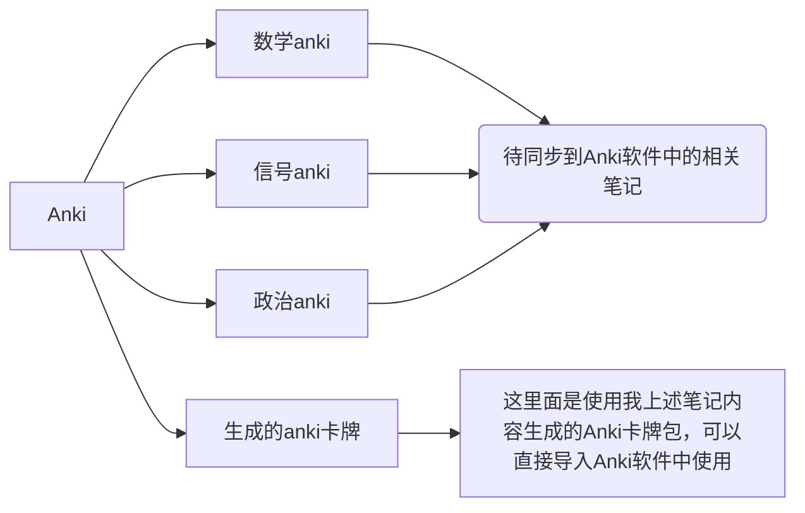

# Anki文件夹介绍

## Anki是什么
Anki是一款基于间隔重复（Spaced Repetition）学习方法的开源记忆软件。它的名字来源于日语“暗记”，意为“记忆”。Anki旨在帮助用户通过制作和使用数字化卡片（称为“卡片”）来记住各种主题的知识。

### Anki官网链接
[Anki - powerful, intelligent flashcards (ankiweb.net)](https://apps.ankiweb.net/)

### 演示一下：
PC端anki软件：
![[Pasted image 20230425173530.png|400]]![[Pasted image 20230425173601.png|400]]

手机端anki软件：
![[9331d96f32e5dfca36bc19253e4a0ed.png|270]]![[01edd555f817184b66ca4b1b683b4eb.png|270]]![[8628aa98242604628d576b16f6ef33f.jpg|270]]

相信这个演示可以让大家对于anki有更直观的了解，自己创建卡牌、设定学习目标和记忆模式，anki会在每天合理给你设定你的学习任务。很像记忆单词的墨墨背单词，但是anki不止可以背单词，你可以设计任何你所想要的卡牌，而且卡牌中支持markdown语法，非常便于显示公式。

## Obsidian和Anki的联动
在Obsidian中我们可以通过插件“Obsidian_to_anki”快速实现通过Obsidian笔记构建成Anki卡牌。
具体如何使用可上B站学习相关视频
[Obsidian_to_anki-哔哩哔哩_Bilibili](https://search.bilibili.com/all?keyword=Obsidian_to_anki&from_source=webtop_search&spm_id_from=333.1007&search_source=5)
![[Pasted image 20230428131132.png]]

## 文件夹结构

Anki卡牌包是需要先使用插件Obsidian_to_anki同步到PC端的Anki软件中，再使用Anki软件生成的。

[[README|点击跳转整体笔记介绍]]