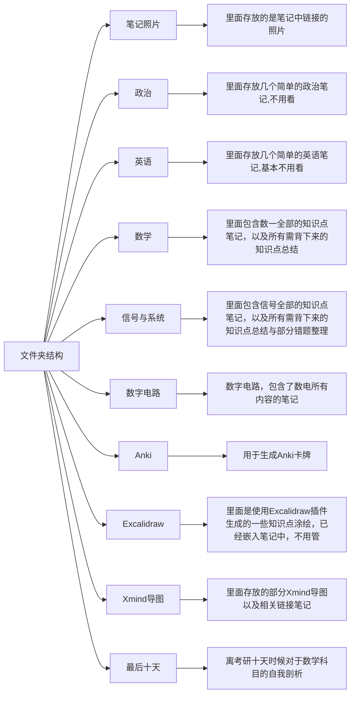

# 关于本笔记的使用
## 文件夹结构

### 详细介绍几个必要文件夹
### Anki
Anki是一款卡牌记忆软件，在obsidian中使用Obsidian-to-Anki插件可以将笔记转为Anki卡牌，然后导入Anki软件中实现辅助记忆功能。
具体如何使用，B站上有很多使用视频。具体需要不要使用Anki辅助记忆，视人而定，个人比较推荐，不是一定需要。

### Xmind导图
我习惯与使用导图形式将某些知识点进行串联学习，比如在高数中存在各类积分，我会使用导图进行分析各类积分之间的联系，示例如下：

并且我在其中链接了对应的文件，但是当时我版本的Xmind中没有找到选择使用相对路径链接附件的选项。所以各位可能点击附件会报错，请自行重新链接到对应路径。Xmind中所有需要链接的文件都存在于此份笔记的“Xmind导图”文件夹中。
因为链接文件之后是单独打开相应的markdown文件，所以你可能需要安装一个markdown编辑器，推荐Typora。

### 数学和信号
这两个文件夹是这份笔记中核心部分。数学一和信号与系统（858）分别是让当时的我最为头疼的公共课和专业课。花费最为多的时间，最终这两门课133，143也是得其所愿。

关于这两个文件夹中笔记，对于各章节的知识点的笔记，大家视自己情况而定需不需要观看。在这两个文件夹中大家都可以找一个笔记文件“整理背下来的东西”，这个两个是我个人建议的，也是这份笔记最重要的部分。里面整理了这两科几乎全部需要背下来的知识点，我在考研的最后一个月，每天必做的一件事就是默写这两个笔记。

### 最后十天
这个文件夹是在考研的最后，我做的模拟卷分数波动过于大，从而做的一场自我剖析。如果今天省流来说，就是规范自己考场做题习惯。其实这个文件现在看起来还是很有意思的，保留这个文件夹是觉得大家之后也可能遇到如当时的我一样的情况。

### 政治和英语
这两个文件夹其实没有多少东西，也可以看出我对于政治、英语的学习是缺乏一个合适的框架的，如果有可能希望遇到有缘人完善它。

### 数字电路
数电是我的复试专业课，当然也有很多学校会将其作为初试专业课。里面还是比较详尽的整理了数电的相关知识点。

## 介绍一些不那么必要的东西
- 当你下载Obsidian之后，用Obsidian打开这个软件，这份笔记核心部分都可以正常显示。
### Xmind与Typora
你需要下载Xmind软件，如果需要打开嵌入的笔记链接，可能需要Typora。
[免费下载 Xmind思维导图 | Xmind中文官方网站](https://xmind.cn/download/)
[Typora 官方中文站 (typoraio.cn)](https://typoraio.cn/)
目前这两个软件都是收费的，Xmind的免费版不支持插入公式与链接，Typora的历史版本好像是有一个免费的发行版。至于大家是选择购买还是另辟蹊径就看大家的意愿了，版权问题我不提供下载方式。

### Anki
使用Anki辅助记忆，你需要下载Anki。好消息是Anki完全免费，且手机端也有相应软件。
[Anki - powerful, intelligent flashcards (ankiweb.net)](https://apps.ankiweb.net/)

### Obsidian插件与主题
理论上来说，由于Obsidian的插件是和笔记仓库绑定的。所以当你们下载这份笔记之后，我现在使用的所有Obsidian插件也会出现在大家的仓库中。

Obsidian主题

由于Obsidian自身的默认主题不是那么切合我的感觉，所以我使用的是第三方主题。
Minimal，我最喜欢的一个主题，非常的简洁。
大家下载打开这份笔记之后，应该是默认为Minimal主题。
如果没有，可以打开设置，在如下位置选择

Obsidian插件

Minimal Theme setting
- 这个插件用于配合Minimal调节该主题的一些参数

Obsidian Git
- 这个插件可以用于将笔记提交到Github仓库，我通过这种方式备份自己笔记。

Remotely save
- 这个插件也是笔记备份的另一个方案，可以将笔记同步到各种云存储、坚果云网盘、OneDrive等

Obsidian_to_Anki
- 将Obsidian笔记同步至Anki中

### 字体
我很喜欢我现在在用的一款字体，它叫“霞鹜文楷”。Obsidian是支持自己切换字体的，微软默认的字体属实有些不太合我心意。“霞鹜文楷”在Gitee和Github上都已开源，大家可以自行选择下载安装。这名字取得倒是很有诗意，落霞与孤鹜齐飞，秋水共长天一色。

## 最后唠唠家常吧
不知道大家这个时候都复习到哪了，简单讲讲我备考的经历吧。
大约是2022.3.12那天我开始备考，每天大概复习十个小时左右。
到六月左右我结束一轮复习，步入强化，假期发生了一些事，不是那么想学习，那时候同学大多都回家，时常一个人在寝室学习。哈尔滨的天是真的热，又没有空调，全靠小风扇和凉汽水度日。
到九月多，开学的时候我强化阶段好像还是没有结束，大概九月中旬开始做真题。真题也是做的稀烂，整理错题，背公式之类的。我不太能起早床，八点多九点起床，然后随便吃一口就去图书馆，然后晚上九点五十图书馆闭馆，就去21A去找个教室再学会，在楼道背英语大小作文。然后十一点21A关门，有的时候会躲一些门卫大爷，偷摸学到12点在回寝，有时候也会去实验室和师兄们唠唠嗑吃点东西，有时候也就直接回寝了。然后就到了考试前两天，恰巧放开疫情管控，然后就得新冠了。考试前一天在宾馆开着30度的空调，裹着厚厚的棉被，睡了一下午，晚上发烧到了39.4°。第二天顺理成章的早上三点就醒了，然后背了一小时的肖四，四点躺床上到了六点，起来洗漱吃饭就去考场了。迷迷糊糊，第一天政治英语都试卷都没有写完，晚上一口没吃想着要不直接回家不考得了。不过还是又背了背公式，规划了一些做题计划，第二天真就盯着时钟做题的，策略上的胜利。
好啦，那我的故事就讲完了。

考研这件事在我们过去二十来年生活里确实算得上一件相对较难的事情，但没那么难。如果有唯一我可以给你的建议，那就是不要自我感动。我们的努力没有那么高尚，我们的痛苦没有那么沉重。

很感谢大家能看到这里，这份笔记并不那么完美，其中不乏存在错误之处，离我想象中的样子差了很多。朋友，既然已经在路上了，就享受这趟旅途吧。

