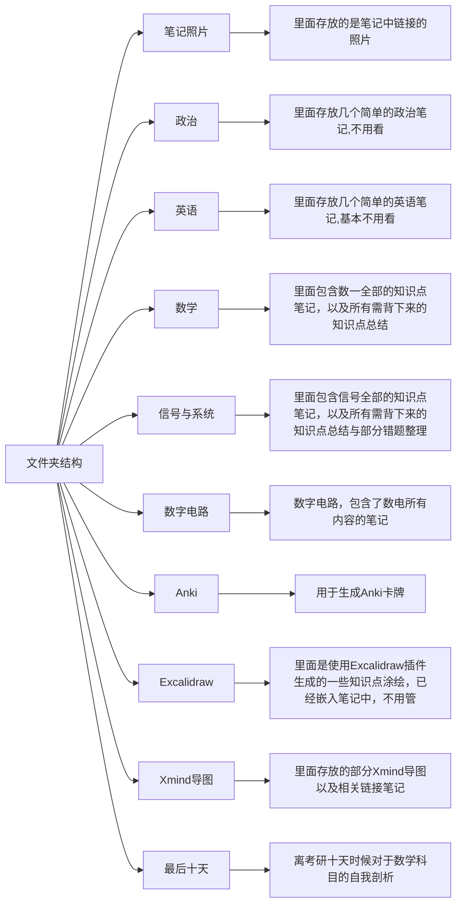

# 关于本笔记的使用
## 文件夹结构

## 重要文件夹介绍
### 数学
[[数学/README|点击跳转数学文件夹介绍]]

### 信号与系统
[[信号与系统/README|点击跳转信号与系统文件夹介绍]]

### 数字电路
[[数字电路/README|点击跳转数字电路文件夹介绍]]

### Anki
[[Anki/README|点击跳转至Anki文件夹介绍]]

### Xmind导图
[[Xmind导图/README|点击跳转至Xmind导图文件夹介绍]]

### 最后十天
[[最后十天-关于我为什么数学模考波动巨大的反思与总结/README|点击跳转到最后十天文件夹介绍]]

## 介绍Obsidian
  
Obsidian是一款使用Markdown语言、支持双向链接和插件扩展的个人知识管理和笔记应用程序。
[点击跳转Obsidian官网](https://obsidian.md/)
下载Obsidian后使用其打开你从github上下载的文件夹即可

### Obsidian插件与主题
理论上来说，由于Obsidian的插件是和笔记仓库绑定的。所以当你们下载这份笔记之后，我现在使用的所有Obsidian插件也会出现在大家的仓库中。

 #### Obsidian主题
由于Obsidian自身的默认主题不是那么切合我的感觉，所以我使用的是第三方主题。
Minimal，我最喜欢的一个主题，非常的简洁。
大家下载打开这份笔记之后，应该是默认为Minimal主题。
如果没有，可以打开设置，在如下位置选择

主题存在于./chen-pqe-notes/.obsidian/themes文件夹下，如果大家在主题中没有看到相应主题，查看对应文件夹目录下是否存在相应主题文件。

 #### Obsidian插件
点击Obsidian左下角的齿轮符号打开设置，点击左侧选项栏选择第三方插件可查看并启用第三方插件，浏览“社区插件市场”可下载第三方插件（需要魔法）。

插件存在于./chen-pqe-notes/.obsidian/plugins文件夹下，如果大家在在第三方插件中没有看到插件，查看对应文件夹目录下是否存在相应插件文件夹。

Minimal Theme setting
- 这个插件用于配合Minimal调节该主题的一些参数

Obsidian Git
- 这个插件可以用于将笔记提交到Github仓库，我通过这种方式备份自己笔记。

Remotely save
- 这个插件也是笔记备份的另一个方案，可以将笔记同步到各种云存储、坚果云网盘、OneDrive等

Obsidian_to_Anki
- 将Obsidian笔记同步至Anki中

## 介绍字体-霞鹜文楷
我很喜欢我现在在用的一款字体，它叫“霞鹜文楷”。Obsidian是支持自己切换字体的，微软默认的字体属实有些不太合我心意。“霞鹜文楷”在Gitee和Github上都已开源，大家可以自行选择下载安装。这名字取得倒是很有诗意，落霞与孤鹜齐飞，秋水共长天一色。
[点击跳转霞鹜文楷GitHub仓库](https://github.com/lxgw/LxgwWenKai)
在此对“霞鹜文楷”字体的作者团队表示诚挚的感谢

点击Obsidian左下角的齿轮小图标进入设置，点击选择右侧“外观”选项，找到字体对应部分，即可选择使用其他字体。

## 个人经历
以数学为主导，我的考研大致时间段安排如下：

这只是以数学为主导的时间轴序列，我整个考研大概流程如上图，当然有部分事件没有涉及到或者时间并非恰好落于其中。仅可供大家作为大致流程参照。

我有一句很喜欢的话：“道阻且长，行则将至。”这句话是一句组合语，前半句来自《诗经》：“溯洄从之，道阻且长。”后半句出自《荀子·修身》：“道虽迩，不行不至；事虽小，不为不成。”考研这一路亦是道阻且长，大家会遇到许许多多从未设想的麻烦，何况其本身对于大家来说就显得迷雾重重，我们都似盲人摸象。穿过这层迷雾，你们的远方就在眼前，不行不至，行则将至。

