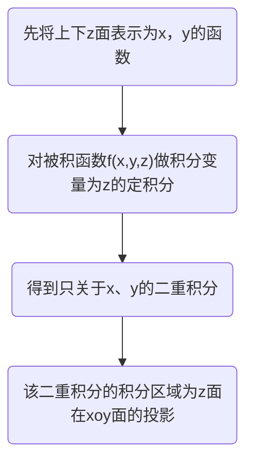
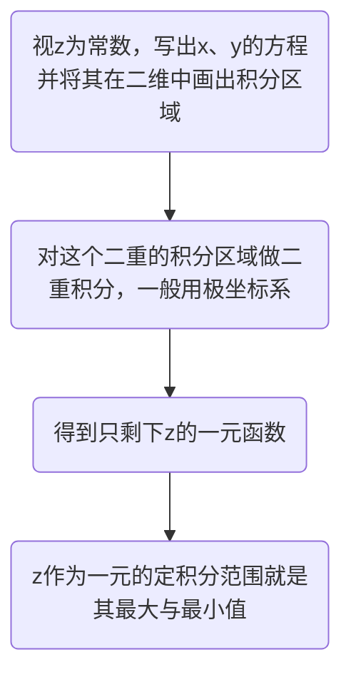

# 三重积分

### 对称性
普通对称性
轮换对称性

- 如果任意两个变量或三个对调之后，积分区域不发生改变，则替换被积函数中对应变量的变量后积分值保持不变。

#### 直角坐标系
##### 先一后二法
先一后二的意思就是先对一个变量（一般x y组队，落z单个）进行定积分，然后对剩余两个变量做二重积分
适合场合：

- 空间区域可由方便由z(x,y)的上下两面表示

##### 先二后一法
先做二重积分，再做定积分
适用场合：积分区域为旋转体

#### 柱面坐标系
先二后一法中，对二重积分采用极坐标形式积分。就被称之为柱面坐标系
#### 球坐标系
$$
\iiint_{\Omega}f(x,y,z)dxdydz=\iiint_{\Omega}f(rsin\varphi cos\theta,rsin\varphi sin\theta,rcos\varphi)r^2sin\varphi d\theta d\varphi dr
$$
打开一扇门，手撒两白花
乘他不注意，刺他小脑瓜

#### 三元函数的换元法

记得雅可比行列式
$$
\begin{align*}
&令
\begin{cases}
x=x(u,v,w)\\
y=y(u,v,w)\\
z=z(u,v,w)
\end{cases}
\\\\
&\iiint_{\Omega}f(x,y,z)dxdydz
\\
=&\iiint_{\Omega uvw}f[x(u,v,w),y(u,v,w),z(u,v,w)]
\begin{vmatrix}
\frac{\partial(x,y,z)}{\partial(u,v,w)}
\end{vmatrix}
dudvdw
\\
\\
&\frac{\partial(x,y,z)}{\partial(u,v,w)}
=\begin{vmatrix}
\frac{\partial x}{\partial u}&\frac{\partial x}{\partial v}&\frac{\partial x}{\partial w}
\\
\frac{\partial y}{\partial u}&\frac{\partial y}{\partial v}&\frac{\partial y}{\partial w}
\\
\frac{\partial z}{\partial u}&\frac{\partial z}{\partial v}&\frac{\partial z}{\partial w}
\end{vmatrix}
\end{align*}
$$