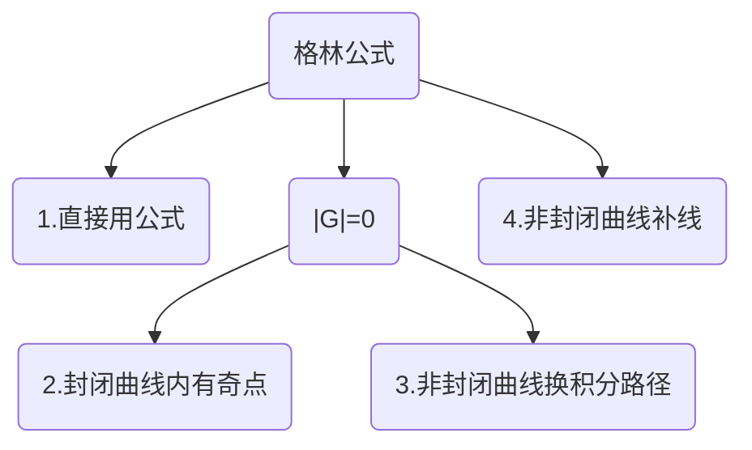

# 格林公式

---
使用条件:
	1.有界闭区域D由分段光滑曲线L围成
	2.P(x,y)、Q(x,y)在D上具有一阶连续偏导数
	3.L取正方向-人沿着这个方向走的时候，左手始终在L所围的D内部

---

格林公式：
$$
\oint_LP(x,y)dx+Q(x,y)dy=\iint_D(\frac{\partial Q}{\partial x}-\frac{\partial P}{\partial y})d\sigma
$$

重定义格林公式如下:
$$
\begin{align*}
&定义格林行列式|G|=
\begin{vmatrix}
\frac{\partial }{\partial x} & \frac{\partial }{\partial y} \\
P & Q \\
\end{vmatrix}
\\\\
&重写格林公式如下:
\\
&\oint_LP(x,y)dx+Q(x,y)dy=\iint_D|G|d\sigma
\end{align*}
$$

#### 1.直接用

曲线封闭且无奇点在其内部
要求L为D的边界，且正向：人沿着L的这个方向走时候，左手始终在L所围成的D内

#### 2.封闭有奇点

如果除奇点外恒有等式:$\frac{\partial Q}{\partial x}\equiv\frac{\partial P}{\partial y}$
则换一条封闭曲线$L_1$积分,通常取$L_1$：令分母为常数
此时不要求新路径的起点与终点与原路径重合。

理由：由于存在$\frac{\partial Q}{\partial x}\equiv\frac{\partial P}{\partial y}$所以，对该封闭曲线（除奇点外）的积分值恒为0。此时只需要考虑奇点位置的积分值。

#### 3.非封闭换积分路径

要求：$\frac{\partial Q}{\partial x}\equiv\frac{\partial P}{\partial y}$
以及“原路径-新路径”所围成的闭合区域应该是一个单连通区域
单连通区域D：该区域D中没有洞，专业术语：该区域D中任意封闭曲线所围成的区域只含有D中的点

要求新路径的起点与终点和原路径相同！！！
这是因为“原路径-新路径”恰好是一个闭合路径，由于$\frac{\partial Q}{\partial x}\equiv\frac{\partial P}{\partial y}$。所以此闭合路径的积分值为0

这个时候可以考虑换积分路径为折线段，先x不动，动y。或则先y不动，动x。
或者是原路径中含有奇点，用其他路径规避掉

#### 4.非封闭补线

补一条直线使之与原积分曲线构成满足格林公式条件的闭合区域，从而可以使用格林公式简化。

#### 5.积分与路径无关六个等价关系

前提：单连通区域D内P，Q具有一阶连续偏导数
有如下论据等价：

a.$\int_{L_{AB}}P(x,y)dx+Q(x,y)dy$与路径无关

b. $Pdx+Qdy$为某二元函数u(x,y)的全微分

c. $Pdx+Qdy=0$为全微分方程

d. $Pi+Qj$为某二元函数的梯度

e. 沿D内任意分段光滑闭曲线L都有$\oint_{L}Pdx+Qdy=0$

f. $\frac{\partial Q}{\partial x}\equiv\frac{\partial P}{\partial y}$在D内处处成立

