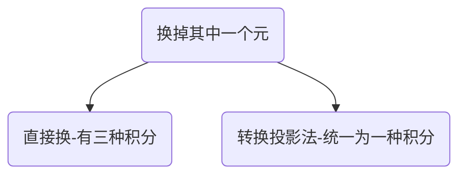

# 换元法求解第二型曲面积分

$$
\iint_{\sum}P(x,y,z)dydz+Q(x,y,z)dzdx+R(x,y,z)dxdy
$$

## 直接换元

---

将P(x,y,z)中的x用x(y,z)替换,Q中的y用y(z,x)替换,R中z用z(x,y)替换:
$$
\begin{align*}
&\iint_{\sum}P(x,y,z)dydz+Q(x,y,z)dzdx+R(x,y,z)dxdy
\\\\
=&\pm\iint_{D_{yz}}P[x(y,z),y,z]dydz\pm \iint_{D_{zx}}P[x,y(z,x),z]dzdx
\pm\iint_{D_{xy}}P[x,y,z(x,y)]dxdy
\end{align*}
$$
可见这样原本的“第二型曲面积分”-->三个“二重积分”
其中$D_{xy},D_{zx},D_{xy}$为原来的曲面向对应二维平面的投影

要求:
- 1.其投影面不能有任何重叠部分，如果有重叠的话，要分割处理投影
- 2.其中当“曲面的法向量”和“被消变量的正轴方向夹锐角时取+”

---

## 转换投影法

---

实质：$dydz,dzdx,dxdy$之间的转换

作用：通过转换积分变量，规避掉可能会出现的投影重叠问题

公式如下：
$$
\begin{align*}
&\iint_{\sum}P(x,y,z)dydz+Q(x,y,z)dzdx+R(x,y,z)dxdy
\\\\
=&\pm \iint_{D_{xy}}P[x,y,z(x,y)](-\frac{\partial z}{\partial x})
+Q[x,y,z(x,y)](-\frac{\partial z}{\partial y})+R[x,y,z(x,y)]dxdy
\end{align*}
$$
要求：
- 投影面不能有重叠
- $\pm$与直接换元法取法同

