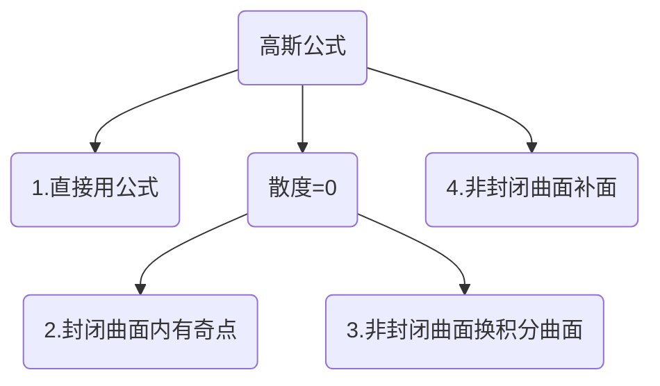

# 高斯公式

---

使用条件:

- 1.空间有界闭区域Ω由有向分片光滑曲面$\sum$围成
- 2.P(x,y,z)、Q(x,y,z)、R(x,y,z)在Ω上具有<mark>一阶连续偏导数</mark>
- 3.其中$\sum$取<mark>外侧</mark>

公式:
$$
\newcommand{\oiint}{\subset\kern{-3pt}\supset\kern{-16.5pt}\iint}

\oiint_{\sum} Pdydz+Qdzdx+Rdxdy=\iiint_{\Omega}(\frac{\partial P}{\partial x}+\frac{\partial Q}{\partial y}+\frac{\partial R}{\partial z})dv
$$

---

#### 1.直接用

曲面封闭且无奇点在其内部
要求$\sum$取外侧

#### 2.封闭有奇点

如果除奇点外恒有等式:$div \ F=0\Leftrightarrow (\frac{\partial P}{\partial x}+\frac{\partial Q}{\partial y}+\frac{\partial R}{\partial z})=0$
则换一条封闭曲面$\sum_1$积分,通常取：令$\sum_1$分母为常数
此时不要求新边界与原曲面重合。
$$
\oiint_{\sum} Pdydz+Qdzdx+Rdxdy=\oiint_{\sum_1} Pdydz+Qdzdx+Rdxdy
$$

#### 3.非封闭换积分面

要求：$div \ F=0\Leftrightarrow (\frac{\partial P}{\partial x}+\frac{\partial Q}{\partial y}+\frac{\partial R}{\partial z})=0$
取新积分曲面$\sum_1$，$\sum_1$与原积分面$\sum$的方向法向量夹锐角
考虑取$\sum_1$为平面
则:
$$
\iint_{\sum} Pdydz+Qdzdx+Rdxdy=\iint_{\sum_1} Pdydz+Qdzdx+Rdxdy
$$

#### 4.非封闭补面

补一个曲面$\sum_1$使之与原曲面$\sum$构成满足高斯定理条件

