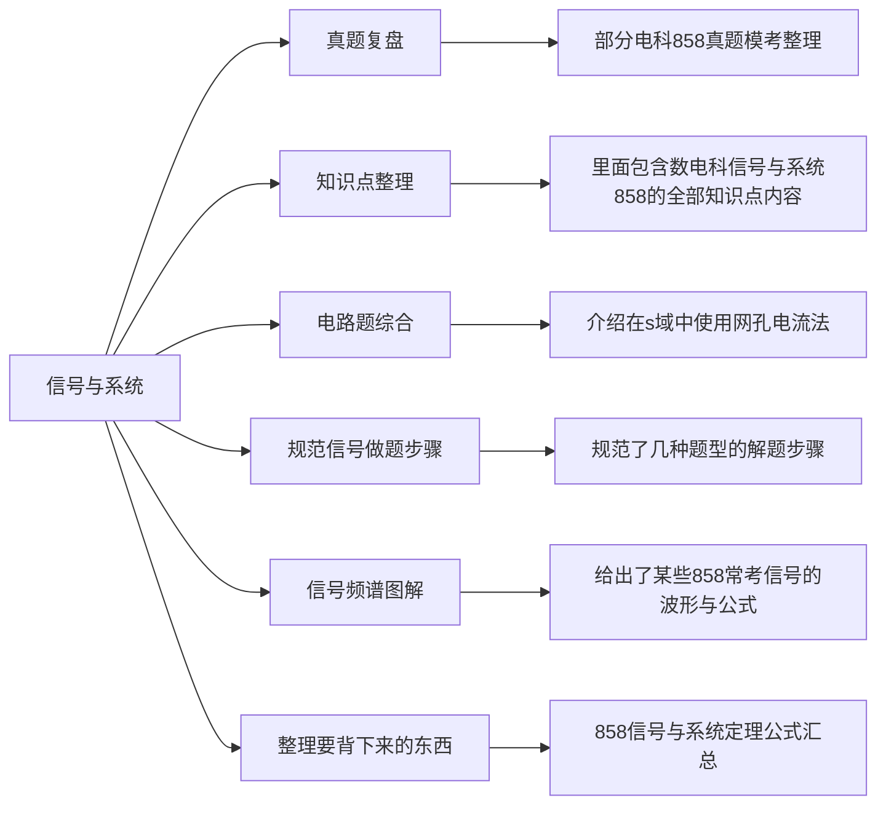

# 信号与系统文件夹介绍

## 前言
“信号与系统”同“数学”这个文件夹一样是这份笔记中的支柱之一，其中最为核心的笔记是这一个文件“整理要背下来的东西”[[信号与系统/整理要背下来的东西|点击跳转]]。在临近考研的前两个月，我也是一边不断完善这份笔记，也一边保持默写这份笔记。这份文件是从所有信号知识点笔记中浓缩而成的精华，里面的知识点基本涵盖了考研信号与系统公式定理的全部要求。

## 文件夹结构

[[README|点击跳转整体笔记介绍]]