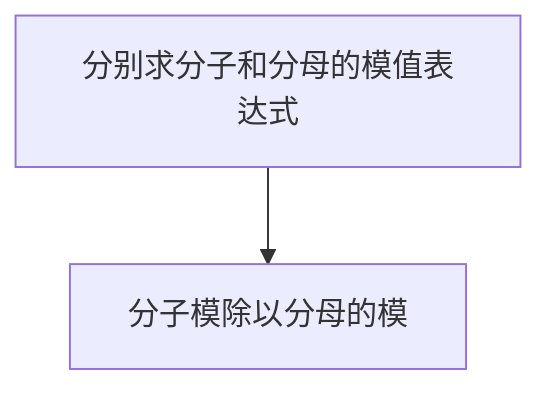
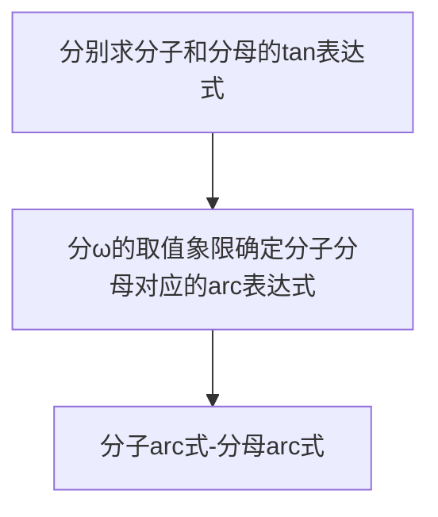
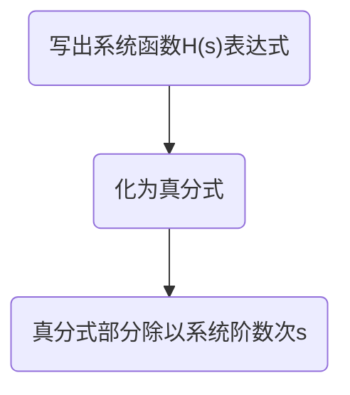
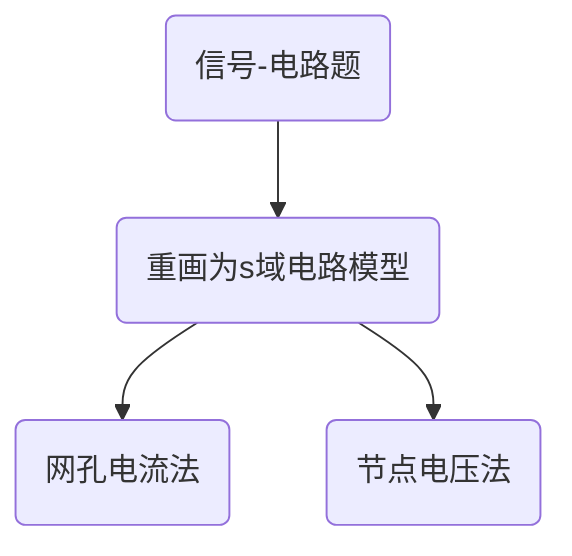

## 信号与系统特性判别
[TOC]

### 信号特性的判别

周期性：$f(t)=f(T+t)$或$f[n]=f[n+N]$
- 对于T，无特别要求。对于N，要求N是非零正整数
### 系统特性的判别
- h(t)<冲激响应>是δ(t)的系统响应,δ(t)只在t=0时有值
---
线性：输入$x(t)=ax_1(t)+bx_2(t)$,输出$y(t)=ay_1(t)+by_2(t)$
- 已知一组$x_1(t),y_1(t)$求$x_2(t)$或$y_2(t)$
- 这种题的关键就是:线性↔输入之间的关系=输出之间的关系
- 由线性特性有：输入信号的线性组合与输出信号的线性组合形式一样！！！

时不变性：输入$x(t)=x_1(t-t_0)$,输出$y(t)=y_1(t-t_0)$
- 对于分段的信号，如果时移改变了其分段区域，也视为时变

因果性：输出只取决于此时和此前的输入
- (t+1)是未来,(t-1)是过去
- 如果h(t)u(t)=h(t),则是因果

无记忆性：输出只取决于此时的输入
稳定性：输入有界，输出有界
可逆性：输入不同，输出不同
- $h(t)*h_{inv}(t)=\delta(t)$
- $h[n]*h_{inv}[n]=\delta[n]$

---
## 奇异信号
### 冲激函数的性质
在图上画冲激信号的时候，向上标正强度，向下标负强度 
对信号突变（跳跃）处求导时会有冲激出现
$$
\begin{align*}
&➊尺度变换:\delta(at-t_{0})=\frac{1}{\left| a\right|}\delta(t-\frac{t_{0}}{a})
\\\\
&➋筛选特性:\int_{-\infty }^{+\infty }f(t)\delta(t-t_{0})dt=f(t_{0})
\\\\
&➌ 由➊➋ \Rightarrow \int_{-\infty }^{+\infty }f(t)\delta(at-t_{0})dt=\frac{1}{|a|}f(\frac{t_{0}}{a})
\\\\
&➍冲激信号的能量:\begin{cases}
\int_{-\infty }^{\infty }\delta(at-t_{0})dt=\frac{1}{\left| a\right|}
\\\\
\int_{-\infty }^{\infty }\delta(f(t))dt=0; \Delta =b^{2}-4ac\le0; 
\\\\
\int_{-\infty }^{\infty }\delta (f(t))dt=\frac{2}{\sqrt{\Delta }};\Delta =b^{2}-4ac>0;
\end{cases}
\\\\
&➎将➌推广到更一般:\int_{-\infty }^{+\infty }f(t)\delta(g(t))dt=f(g^{-1}(0))\cdot \delta(g(t))的能量
\\\\
&➏冲激偶:\int_{-\infty}^{+\infty}f(t)\delta'(t-t_0)dt=-f'(t_0)
\\\\\
&➐f(t)\delta '(t-t_{0})=f(t_{0})\delta '(t-t_{0})-f'(t_{0})\delta '(t-t_{0}) \qquad (乘积函数的导数)
\end{align*}
$$

### 阶跃函数
用阶跃函数去表示分段函数 
$$
\begin{align*}
&u(t)*u(t)=tu(t)
\\\\
&u[n]*u[n]=(n+1)u[n+1]
\\\\
&\int_{-\infty}^{t}u(\tau-a)dt=(t-a)\cdot u(t-a)
\end{align*}
$$

### 卷积的性质
- 交换率：$y(t)=x(t)*h(t)=h(t)*x(t)$
- 分配律：$y(t)=x(t)*\{h_1(t)+h_2(t)\}=x(t)*h_1(t)+x(t)*h_2(t)$
- 结合律：$y(t)=x(t)*h_1(t)*h_2(t)=x(t)*\{h_1(t)*h_2(t)\}$

相关函数的卷积表示
- $r(t)=f_1(-t)*f_2(t)$
---
1.熟记卷积公式
2.熟悉卷积公式的逆用

---
$$
\begin{align*}
&卷积公式
\begin{cases}
f(t)*h(t)=\int_{-\infty}^{+\infty}f(\tau)\cdot h(t-\tau)d\tau=\int_{-\infty}^{+\infty}h(\tau)\cdot h(t-\tau)dt
\\\\
f[n]*h[n]=\sum_{k=-\infty}^{+\infty}f[k]*h[n-k]=\sum_{k=-\infty}^{+\infty}h[k]f[n-k]
\end{cases}
\\\\
&卷积逆用:
\\
&\sum_{k=-\infty}^{n}f[k]=f[n]*u[n]\qquad 
\{\sum_{k=0}^{n}f[k]\}\cdot u[n]=\{f[n]\cdot u[n]\}*u[n]
\\\\
&\{\sum_{k=0}^{n}x[k]\cdot h[n-k]\}\cdot u[n]=\{x[n]\cdot u[n]\}*\{h[n]\cdot u[n]\}
\\\\
&\int_{-\infty}^{t}f(\tau)d\tau=f(t)*u(t) 
\quad \{\int_{0}^{t}f(\tau)d\tau\}u(t) = [f(t)\cdot u(t)]*u(t)
\\\\
&\{\int_{0}^{t}x(\tau)\cdot h(t-\tau)d\tau\}u(t)=\{x(t)\cdot u(t)\}*\{h(t)\cdot u(t)\}
\\\\
&时移特性\begin{cases}
f(t-t_0)*h(t-t_1)=y(t-t_0-t_1)
\\\\
f[n-n_0]*h[n-n_1]=y[n-n_0-n_1]
\end{cases}
\\\\
&尺度变换:x(at)*h(at)=\frac{1}{|a|}y(at)
\end{align*}
$$
#### 有限长度卷积
有限卷积和的快速解法
注意一点就是：最后的结果中n=0的位置，利用的就是卷积的时移特性判断。
原理实际上就是z变换。

其中长度为L,M的两组序列相卷积，最后得到的序列长度最大为L+M-1

## 希尔伯特变换
$$
x(t) \leftrightarrow  \hat{x}(t)=x(t)*\frac{1}{\pi t}
$$
## 傅里叶
### 傅里叶级数的性质
傅里叶级数FS：
- 均方逼近
$$
\begin{align*}
\begin{cases}
x(t)=\sum_{k=-\infty}^{+\infty}a_ke^{jk\omega_0t}
\\\\
a_k=\frac{1}{T}\int_{T}x(t)e^{-jk\omega_0t}dt
\end{cases}
\end{align*}
$$
离散傅里叶级数DFS：
$$
\begin{align*} 
&x[n]=\sum_{k=<N>}a_ke^{jk\Omega_0n} 
\\
&a_k=\frac{1}{N}\sum_{n=<N>}x[n]e^{-jk\Omega_0n} 
\\\\ 
&\sum_{k=<N>}:表示一个周期里的累加
\end{align*}  
$$
$$
\begin{array}{|c|c|c|}
\hline
{ } & {周期信号} & {傅里叶级数系数}  \\
\hline
{信号} & {f(t)} & a_{k}\\
\hline
{共轭信号} & {f^*(t)} & a^*_{k}\\
\hline
{实数信号} & {f(t)} & a_{k}=a^*_{-k}\\
\hline
{实数偶信号} & {f(t)=f(-t)} & a_{k}=a_{-k} \quad a_{k}=a^*_{k} \\
\hline
{实数奇信号} & f(t)=-f(-t) & \quad a_{k}=-a_{-k} \quad a_{k}=-a^*_{k}\\
\hline
{时移} & f(t-t_{0}) & e^{-jk\omega_{0}t_{0}}a_{k} \\
\hline
{时间反转} & f(-t) & a_{-k}\\
\hline
{时域尺度变换} & f(at) & a_{k} \\
\hline
{时域相乘} & f(t)g(t) & \sum_{l=-\infty}^{+\infty}a_{l}b_{k-l}\\
\hline
\end{array}
$$

- 离散帕斯瓦尔定理是功率相等
- 连续帕斯瓦尔定理是能量相等
$$
帕斯瓦尔定理:\quad \frac{1}{T}\int_{T}|x(t)|^2dt=\sum_{k=-\infty}^{+\infty}|a_{k}|^2
$$
使用FT求FS
$$
\begin{align*}
&取一个周期的图像使用写出X(\omega)然后用\omega=k\omega_{0}代替
\\\\
&X(j\omega)=\int_{-\infty}^{+\infty}x(t)e^{-j\omega t}dt
\qquad \quad 
a_{k}=\frac{\omega_0}{2\pi}X(jk\omega_0)
\end{align*}
$$
### 傅里叶变换
- 模与相角

傅里叶变换FT：

$$
\begin{align*}
&\begin{cases}
x(t)=\frac{1}{2\pi}\int_{-\infty}^{+\infty}X(j\omega)e^{j\omega t}d\omega
\\\\
X(j\omega)=\int_{-\infty}^{+\infty}x(t)e^{-j\omega t}dt
\end{cases}
\end{align*}
$$
离散傅里叶变换DFT：

$$
\begin{align*} 
&X(\Omega)=\sum_{n=-\infty}^{\infty}x[n]e^{-j\Omega n} 
\\ 
&x[n]=\frac{1}{2\pi}\int_{2\pi}X(\Omega)e^{j\Omega n}d\Omega 
\end{align*}  
$$

#### 傅里叶变换性质
- 时同频异

$$
\begin{align*}
线性:a_{1}f_{1}(t)+a_{2}f_{2}(t) \leftrightarrow &a_{1}F_{1}(\omega)+a_{2}F_{2}(\omega)
\\
\\
时移特性:f(t-t_{0}) \leftrightarrow &e^{-j\omega t_{0}}F(j\omega)
\\
\\
频移特性:e^{j\omega_{0}t}f(t) \leftrightarrow &F(\omega-\omega_{0})
\\
\\
尺度变换:	f(at) \leftrightarrow &\frac{1}{|a|}F(\frac{\omega}{a})
\\
\\
共轭对称性:(和FS完全一样)
\\
f(t)是实信号: F(\omega)=F^*(-\omega) &\quad F(-\omega)=F^*(\omega)
\\
\\
f(t)是实偶信号:F(\omega)=F(-\omega)=&F^*(\omega) \quad F(\omega)实偶
\\
\\
f(t)是实奇信号:F(\omega)=-F(-\omega)=&-F^*(\omega) \quad F(\omega)虚奇
\\
\\
实信号f(t)的偶部:& Re\{F{(\omega)}\}
\\
\\
实信号f(t)的奇部: & jIm\{F{(\omega)}\}
\\
\\
对偶性:F(t) \leftrightarrow & 2\pi f(-\omega)
\\
\\
时域卷积:f(t)*h(t) \leftrightarrow & F(\omega)H(\omega)
\\
\\
时域微分:\frac{d^nf(t)}{dt^n} \leftrightarrow & (j\omega)^nF(\omega)
\\
\\
时域积分:\int_{-\infty}^{t}f(\tau)d\tau \leftrightarrow & \frac{F(\omega)}{j\omega}+\pi F(0)\delta(\omega)
\\
\\
帕斯瓦尔定理:\int_{-\infty}^{+\infty}|f(t)|^2dt =& \frac{1}{2\pi}\int_{-\infty}^{+\infty}|F(\omega)|^2d\omega
\\
\\
幅度调制特性:f_{1}(t)f_{2}(t) \leftrightarrow & \frac{1}{2\pi}F_{1}(\omega)*F_{2}(\omega)
\\
\\
频域微分:(-jt)^nf(t) \leftrightarrow & \frac{d^nF(\omega)}{d\omega^n}
\\
\\
频域积分:\frac{f(t)}{-jt}+\pi f(0)\delta(t) \leftrightarrow & \int_{-\infty}^{\omega}F(\theta)d\theta

\end{align*}
$$

#### 信号变换后最高频率
$$
\begin{align*}
&记信号x(t)和g(t)的最高频率分别为\omega_x,\omega_g
\\\\
&则x(at)的最高频率:\omega=a\omega_x
\\\\
&x(t)\cdot g(t)的最高频率:\omega=\omega_x+\omega_g
\\\\
&x(t)*g(t)的最高频率:\omega=min\{\omega_x,\omega_g\}
\end{align*}
$$

### 傅里叶常用变换对
$$
\begin{align*}
\delta(t) \leftrightarrow  1    \xRightarrow{微分特性}  &\delta^n(t) \leftrightarrow (j\omega)^n
\\
\\
\delta(t) \leftrightarrow  1   \xRightarrow{积分特性}& u(t) \leftrightarrow 
\frac{1}{j\omega}+\pi \delta(\omega)
\\
\\
 u(t) \leftrightarrow 
\frac{1}{j\omega}+\pi \delta(\omega)  \xRightarrow{sgn(t)=-u(-t)+u(t)}& sgn(t) \leftrightarrow 
\frac{2}{j\omega}
\\
\\
\delta(t) \leftrightarrow  1  \xRightarrow{对偶特性} &1 \leftrightarrow 2 \pi\delta(\omega)
\\
\\
1 \leftrightarrow  2 \pi\delta(\omega) \xRightarrow{频移特性}&e^{j\omega_{0}t}\leftrightarrow2\pi\delta(\omega-\omega_{0})
\\
\\
e^{j\omega_{0}t}\leftrightarrow 2\pi\delta(\omega-\omega_{0})  \xRightarrow{欧拉公式}&
sin(\omega_0 t) = \frac{1}{2j}(e^{j\omega_0 t}-e^{-j\omega_0 t}) 
\leftrightarrow \frac{\pi}{j}(\delta(\omega-\omega_{0})-\delta(\omega+\omega_{0}))
\\
\\
e^{j\omega_{0}t}\leftrightarrow 2\pi\delta(\omega-\omega_{0})   \xRightarrow{欧拉公式}&
cos(\omega_0 t) = \frac{1}{2}(e^{j\omega_0 t}+e^{-j\omega_0 t}) 
\leftrightarrow \pi(\delta(\omega-\omega_{0})+\delta(\omega+\omega_{0}))
\\
\\
e^{-\alpha t}u(t),Re\{\alpha\}>0\leftrightarrow  \frac{1}{j\omega+\alpha}
 \xRightarrow{频域微分特性} &
te^{-\alpha t}u(t)\leftrightarrow \frac{1}{(j\omega+\alpha)^2}
\\
\\
e^{-\alpha |t|},Re\{\alpha\}>0&\leftrightarrow \frac{2\alpha}{\omega^2+\alpha^2}
\\
\\
g_{\tau}(t)=
\begin{cases}
A, \quad
 & |t|<\frac{\tau}{2} 
 \\
 \\
0, \quad
 & |t|>\frac{\tau}{2} 
\end{cases}
\leftrightarrow 
A\tau Sa(\frac{\omega \tau}{2})
 \xRightarrow{对偶特性} &
\frac{1}{2 \pi}A\omega_{c} Sa(\frac{\omega_{c} t}{2})
\leftrightarrow 
g_{\omega_{c}}(\omega)= 
\begin{cases}
A, 
 & |\omega|<\frac{\omega_{c}}{2} 
 \\
 \\
0, 
 & |\omega|>\frac{\omega_{c}}{2} 
\end{cases}
\\
\\
周期信号:f(t)=\sum_{k=-\infty}^{+\infty}a_{k}&e^{jk\omega_{0}t}
\quad \leftrightarrow  \quad
2\pi\sum_{k=-\infty}^{+\infty}a_{k}\delta(\omega-k\omega_{0})
\end{align*}
$$

### 补充周期冲激串的傅里叶变换
$$
\begin{align*}
&f(t)=\sum_{k=-\infty}^{+\infty}\delta(t-kT) \leftrightarrow
F(j\omega)=\frac{2\pi}{T}\sum_{k=-\infty}^{+\infty}\delta(\omega-k\frac{2\pi}{T})
\\\\
&f(t)=\sum_{k=-\infty}^{+\infty}(-1)^{k}\delta(t-kT) \leftrightarrow
F(j\omega)=\frac{2\pi}{T}\sum_{k=-\infty}^{+\infty}\{1-(-1)^k\}\delta(\omega-k\frac{2\pi}{T})
\end{align*}
$$

### sa函数全时域积分
$$
\begin{align*}
&1.\int_{-\infty}^{+\infty}\frac{sin(\omega_ct)}{t}dt=\pi
\\\\
&2.\int_{-\infty}^{+\infty}\frac{sin^2(\omega_ct)}{t^2}dt=\pi\omega_c
\\\\
&3.\int_{-\infty}^{+\infty}\frac{sin^3(\omega_ct)}{t^3}dt=\frac{3}{4}\pi\omega_c^2
\\\\
&4.\int_{-\infty}^{+\infty}\frac{sin^4(\omega_ct)}{t^4}dt
=\frac{2}{3}\pi\omega_c^3
\end{align*}
$$
![[iPad-FT 1.png|800]]
### 方波与三角变换对
$$
\begin{align*}
&g_{\tau}(t)=
\begin{cases}
1, \quad
 & |t|<{\tau}
 \\
 \\
0, \quad
 & |t|>\tau
\end{cases}
\quad
\leftrightarrow
\quad
2 \frac{Sin(\omega \tau)}{\omega}
\\\\
&g(t)=k\frac{sin\ \omega_c t}{t}
\Rightarrow G(j\omega)=
\begin{cases}
{k\pi},&|\omega|<\omega_c
\\\\
0,&其他
\end{cases}
\\\\
&x(t)=k(\frac{sin\ \omega_c t}{t})^2 \Rightarrow
X(j\omega)=
\begin{cases}
a|\omega|+b,&|\omega|<2\omega_c
\\\\
0,&其他
\end{cases}
\\\\
&a=-\frac{\pi}{2}k \qquad \qquad b=\omega_c\pi k
\\\\
&x(t)=\begin{cases}
a|t|+b, &|t|<2\tau
\\\\
0,&其他
\end{cases}
\Rightarrow X(j\omega)=-4a·\frac{sin^2(\tau\omega)}{\omega^2}
\end{align*}
$$
频域梯形变换对
$$
\begin{align*}
&f(t)=k\frac{sin(\omega_1 t)sin(\omega_2 t)}{t^2} \qquad 其中:\omega_1\ge \omega_2
\\\\
&F(j\omega)=
\begin{cases}
k\pi \omega_2 &|\omega|< \omega_1-\omega_2
\\\\
-\frac{k\pi}{2}|\omega|+\frac{k\pi (\omega_1+\omega_2)}{2} &\omega_1-\omega_2\le |\omega|\le\omega_1+\omega_2
\\\\
0&其他
\end{cases}
\end{align*}
$$

## 信号的频域分析
### 无失真传输系统
$$
\begin{align*}
&h(t)=K\delta(t-t_{0})  \leftrightarrow  H(\omega)=Ke^{-j\omega t_{0}}
\\\\
&|H(\omega)|=K \qquad \varphi_{H}(\omega)=-\omega t_{0}
\end{align*}
$$
也就是无失真系统的幅频特性曲线是常数直线，相频特性曲线是过原点的斜线。

### 线性相位系统与系统的群时延
- 系统相频特性曲线是关于ω的线性函数称为线性相位系统
$$
\varphi_{H}(\omega)=-\omega \tau_{0}  \quad \tau_{0}为常数
$$
很明显无失真系统是线性相位系统

色散：系统对于信号的不同频率具有不同的延时的现象
群时延τ(ω)
$$
\tau(\omega)=-\frac{d\varphi_{H}(\omega)}{d\omega}
$$

### 求解频率响应表达式

幅度响应表达式

相频响应表达式

根据复数坐标确定其所在象限并以此限定$\angle H(j\omega)$的范围
1. $tan(\angle H(j\omega))=\omega$
![[Pasted image 20221116124850.png|800]]

2. $tan(\angle H(j\omega))=\frac{1}{\omega}$
![[Pasted image 20221116124249.png|800]]

3. $tan(\angle H(j\omega))=\frac{\omega}{\omega^2-a}$
![[Pasted image 20221116124658.png|800]]

### 采样与内插
对信号进行采样
从时域分析：
$$
\begin{align*}
冲激信号的特性: f(t)\delta(t-\tau)=&f(\tau)\delta(t-\tau)
\\
\\
\therefore 若有周期冲激串信号:p(t)=&\sum_{l=-\infty}^{\infty}\delta(t-lT_{s})
\\
\\
一系列间隔T_{s}的f(t)的冲激 \quad y(t)=f(t)p(t)=&\sum_{l=-\infty}^{\infty}f(lT_{s})\delta(t-lT_{s})
\end{align*}
$$
从频域分析：
$$
\begin{align*}
对于周期&信号的FT,应该先求FS:
\\\\
a_{k}=&\frac{1}{T_{s}}\int_{T}p(t)e^{-jk\omega_{0}t}dt
=\frac{1}{T_{s}}\int_{T}\sum_{l=-\infty}^{\infty}\delta(t-lT_{s})e^{-jk\omega_{0}t}dt
\\\\
=&\frac{1}{T_{s}}\sum_{l=-\infty}^{\infty}\int_{T}\delta(t-lT_{s})e^{-jk\omega_{0}t}dt
=\frac{1}{T_{s}}
\\\\
\therefore p(t)=&\sum_{k=-\infty}^{+\infty} a_{k}e^{jk\omega_{s}t}
=\frac{1}{T_{s}}\sum_{k=-\infty}^{+\infty}e^{jk\omega_{s}t}
\\\\
P(\omega)=&\frac{2\pi}{T_{s}}\sum_{k=-\infty}^{+\infty}\delta(\omega-k\omega_{s})
\\\\
时域相乘,&频域卷积性质
\\
Y(\omega)=&\frac{1}{2\pi}F(\omega)*P(\omega)=\frac{1}{T_{s}}\sum_{k=-\infty}^{+\infty}F(\omega-k\omega_{s})
\end{align*}
$$
所以可以看出，采样之后的频谱是无穷次原始信号==周期分之一倍==频移之后的叠加。

#### 采样定理
奈奎斯特采样定理：
- 采样频率$\omega_s \ge 2\omega_0$

带通采样定理：
- $\frac{2\omega_H}{m}\le \omega_s \le \frac{2\omega_L}{m-1}\quad m=[\frac{\omega_H}{B}]$,B为频谱带宽,$\omega_L,\omega_H$分别为最低与最高频率
- 当信号最低频率为0时，带通采样定理⇔奈奎斯特采样定理

对信号进行内插
- 只需要$\frac{\omega_s}{2}$截至频率的滤波器就可以还原信号x(t)
内插公式
$$
x(t)=\sum_{l=-\infty}^{\infty}f(lT_{s})sa[\frac{\pi(t-lT_{s})}{T_{s}}]
$$
从频域上看，当k=0时，其恰好只是大小为原频谱的$\frac{1}{T}$倍。所以如果使用一个恰当的低通滤波器就可以将原信号恢复出来。
$$
\begin{align*}
H(\omega)=&
\begin{cases}
T_{s}, &|\omega|<\frac{\omega_{s}}{2}
\\
\\
0,   &|\omega|>\frac{\omega_{s}}{2}
\end{cases}
\qquad \quad
X(\omega) = H(\omega)Y(\omega)
\\\\
频域相乘,时域卷积:
x(t)=&h(t)*y(t)
=h(t)*f(t)p(t)
\\\\
=&T_{s}\frac{sin(\frac{\omega_st}{2})}{\pi t}*\sum_{l=-\infty}^{\infty}f(lT_{s})\delta(t-lT_{s})
\\\\
=&T_{s}\sum_{l=-\infty}^{\infty}f(lT_{s})\frac{sin(\frac{\omega_s(t-lT_{s})}{2})}{\pi (t-lT_{s})}
\\\\
=&\sum_{l=-\infty}^{\infty}f(lT_{s})sa(\frac{\omega_s(t-lT_{s})}{2})
\\\\
=&\sum_{l=-\infty}^{\infty}f(lT_{s})sa[\frac{\pi(t-lT_{s})}{T_{s}}]
\end{align*}
$$

## 拉普拉斯变换
- 表达式一定要带上收敛域

$$
\begin{align*}
F(s)=&\int_{-\infty}^{+\infty}f(t)e^{-st}dt
\\
\\
f(t)=&\frac{1}{2\pi j}\int_{\sigma-j\infty}^{\sigma+j\infty}F(s)e^{st}ds
\end{align*}
$$
### 拉斯变换的性质
- 时同频异！！！
这里只列举几种常用性质
$$
\begin{align*}
时移性质:f(t-t_{0})\quad \leftrightarrow & \quad e^{-st_{0}}F(s)
\\\\
频移性质:f(t)e^{s_{0}t}\quad \leftrightarrow &\quad F(s-s_{0})
\\\\
尺度变换:f(at) \quad \leftrightarrow & \quad \frac{1}{|a|}F(\frac{s}{a})
\\\\
时域卷积:f(t)*h(t) \quad \leftrightarrow &\quad F(s)H(s)
\\\\
时域微分:\frac{df(t)}{dt} \quad \leftrightarrow &\quad sF(s)	\quad 对于双边成立
\\\\
时域积分:\int_{-\infty}^{t}f(\tau)d\tau \quad \leftrightarrow &\quad \frac{1}{s}F(s)	
\\\\
s域微分:-tf(t) \quad \leftrightarrow &\quad \frac{dF(s)}{ds}
\\\\
初值定理:f(0^+)=\lim_{t \to 0^+}f(t)=&\lim_{s\to \infty}sF(s) \quad 0时刻无冲激
\\\\
终值定理:f(\infty)=\lim_{t \to \infty}f(t)=&\lim_{s \to 0}sF(s) \quad sF(s)收敛域包含虚轴
\end{align*}
$$
### 拉斯变换表
#### 右边信号
可以看到，只要知道最简单的冲激变换对，加上一些性质就可以推出所有的变换对关系。以下都是右边信号的变换对。
$$
\begin{align*}
\delta(t) \leftrightarrow 1 
\xRightarrow{时移性质}&
\delta(t-t_{0}) \leftrightarrow e^{-st_{0}}
\\
\\
\delta(t) \leftrightarrow 1 
\xRightarrow{积分性质}&
u(t) \leftrightarrow \frac{1}{s}
\\
\\
u(t) \leftrightarrow \frac{1}{s}
\xRightarrow{频域微分}&
tu(t) \leftrightarrow \frac{1}{s^2}
\\
\\
u(t) \leftrightarrow \frac{1}{s}
\xRightarrow{频移性质}&
e^{s_{0}t}u(t) \leftrightarrow \frac{1}{s-s_{0}}
\\
\\
e^{-b|t|}=e^{-bt}u(t)&+e^{bt}u(-t)
\\
\\
e^{s_{0}t}u(t) \leftrightarrow \frac{1}{s-s_{0}}
\xRightarrow{频移性质}&
e^{-b|t|}\leftrightarrow \frac{-2b}{s^2-b^2} 
\quad -b<\sigma <b
\\
\\
cos{\omega t}=\frac{1}{2}\{e^{j\omega t}&+e^{-j\omega t}\}
\\
sin{\omega t}=\frac{1}{2j}\{e^{j\omega t}&-e^{-j\omega t}\}
\\
\\
e^{s_{0}t}u(t) \leftrightarrow \frac{1}{s-s_{0}}
\xRightarrow{欧拉公式}&
cos{(\omega t)}u(t) \leftrightarrow \frac{s}{s^2+\omega^2}
\\
\\
e^{s_{0}t}u(t) \leftrightarrow \frac{1}{s-s_{0}}
\xRightarrow{欧拉公式}&
sin{(\omega t)}u(t) \leftrightarrow \frac{\omega}{s^2+\omega^2}
\\\\
\end{align*}
$$

#### 左边信号
$$
\begin{align*}
利用尺度的变换的特例:&f(-t)\leftrightarrow F(-s)
\\
&u(-t) \leftrightarrow -\frac{1}{s}
\\\\
u(-t) \leftrightarrow -\frac{1}{s}
\xRightarrow{频移性质}&
e^{s_{0}t}u(-t) \leftrightarrow -\frac{1}{s-s_{0}}
\end{align*}
$$

<mark>补全一些不常见的拉斯变换</mark>
$$
\begin{align*}
&\sum_{k=0}^{\infty}\delta(t-kT) \leftrightarrow  \frac{1}{1-e^{-sT}} \qquad \sigma>0
\\\\
&\sum_{k=0}^{+\infty}(-1)^k\delta(t-kT)\leftrightarrow \frac{1}{1+e^{-sT}} \quad \sigma>0
\\\\
&\sum_{k=0}^{\infty}u(t-kT) \leftrightarrow  \frac{1}{s(1-e^{-sT})} \qquad \sigma>0
\\\\
&|sin\ \pi t|\cdot u(t)=sin\ \pi t\{u(t)-u(t-1)\}*\sum_{k=0}^{+\infty}\delta(t-k)
\end{align*}
$$

![[Pasted image 20221104162823.png]]

### 收敛域
- 如果H(s)是有理式，则收敛域不包含任何极点
- 如果f(t)是时限信号且绝对可积，则收敛域是全s域
 #### 收敛域的取值问题：
 ##### 右边信号
- 极点实部的右侧
 ##### 左边信号
- 极点实部的左侧
 ##### 通过LTI系统之后
- 通过LTI系统之后系统的输出信号y(t)收敛域一定包含输入信号X(s)的收敛域和H(s)收敛域的交集

 #### 收敛域与信号因果稳定关系
- 收敛域位于最右侧极点的右侧⇒右边信号⇏因果信号
- 收敛域包含虚轴⇒信号稳定

### 零极图
- 极点可以是复数根，所以不要使用函数作图判断
- 实数信号的零极点共轭出现
 #### 全通系统
- 零极点关于虚轴一一对称
$$
\begin{align*}
&形如:H(s)=\frac{(s+a_1)(s-a_2)}{(s-a_1)(s+a_2)}
\end{align*}
$$
 #### 最小相位系统
- 零极点都位于s的左半平面
$$
H(s)=\frac{N(s)}{(s+a_1)(s+a_2)(s+a_3)} \quad a_i>0
$$

### 复指数信号的LTI响应
$$
\begin{align*}
x(t)=&e^{s_{0}t}
\\\\
y(t)=&
\begin{cases}
e^{s_{0}t}H(s_0) &s_0位于H(s)收敛域内
\\
\\
\\
不存在  &s_0不在H(s)收敛域内
\end{cases}
\end{align*}
$$
### LTI系统的框图描述
- 不要在表达式中出现常数项，如果出现，就将其合并到某一有理式项当中
- 框图转换成流图的方法
	1. 将加法器合并之后画成节点
	2. 小方框都改写成横线箭头，其方框内容重写到箭头上
	3. 反馈支路画成曲线，其它支路画成直线。箭头不再线段尾端而是在线段中间

### 框图的三种形式
直接：H(s)直接当做整体画框图
级联：H(s)表示为两个部分相乘，各部分单独画框图，一路相连
并联：H(s)表示为两个部分相加，各部分单独画框图，分出n路，最后汇合为一路

![[Pasted image 20221104172505.png]]
### 梅森公式
- 对于$\Delta_k$只要和第k条前向通路有任何联系的回路都要去掉
$$
\begin{align*}
&H(s)=\frac{1}{\Delta}\sum_{k=1}^{n}p_k\Delta_k
\\\\
&n:从x(t)\to y(t)的单向路径条数
\\\\
&\Delta=1-\sum L_a+\sum L_bL_c -\sum L_dL_eL_f+\cdots
\\\\
&\sum L_a:所有单独回路增益之和; \quad \sum L_bL_c:两个互不接触的回路增益乘积之和
\\\\
&\sum L_dL_eL_f:三个互不接触的回路增益乘积之和
\\\\
&p_k:第k条从x(t)\to y(t)的单向路径的总增益
\\\\
&\Delta_k=\Delta-(\Delta中与第k条通路有接触的部分)
\end{align*}
$$

### 系统函数转化为微分方程
- N(s):方程右侧，与输入相应
- D(s):方程左侧，与输出相应
$$
\begin{align*}
&H(s)=\frac{N(s)}{D(s)}
\end{align*}
$$

## 信号中电路题综合

### 电路中各物理量关系式
$$
\begin{align*}
\begin{cases}
v_{R}(t)=R·i_{R}(t)
\\\\
v_L(t)=L\frac{di_{L}(t)}{dt}
\\\\
v_{C}(t)=\frac{1}{C}\int_{-\infty}^{t}i_{C}(t)dt
\end{cases}
\end{align*}
$$
### 从s域看电路中各物理量关系
$$
\begin{align*}
\begin{cases}
V_{R}(s)=R·I_{R}(s)
\\\\
V_L(s)=sL·I_{L}(s)-L·i_{L}(0^-)
\\\\
V_{C}(s)=\frac{1}{sC}·I_{C}(s)+\frac{v_{c}(0^-)}{s}
\end{cases}
\end{align*}
$$

$$
\begin{align*}
\begin{cases}
I_{R}(s)=\frac{1}{R}·V_{R}(s)
\\\\
I_{L}(s)=\frac{1}{sL}·V_L(s)+\frac{i_{L}(0^-)}{s}
\\\\
I_{C}(s)=sC·V_{C}(s)-C·v_{c}(0^-)
\end{cases}
\end{align*}
$$
### 无初始条件下的简单替换
$$
\begin{align*}
&R_c=\frac{1}{sC}  \qquad R_{L}=sL
\end{align*}
$$
### 电容与电感在s域的等价模型
并联等价适合节点分析法
串联等价适合网孔分析法
![[Pasted image 20221105154319.png]]
![[Pasted image 20221105154336.png]]

#### 网孔电流法
- 以网孔的电流为待求量
- 电路中独立网孔的数量=方程的数量
- 所有网孔选择同一个方向，同顺时针或同逆时针

核心公式
- 自回路电阻×自回路电流-互回路电阻×互回路电流=电压提升值
- 电压提升：由"-"→"+"流过电压源为提升值

## Z变换
Z变换表达式由于常写作负幂次，所以要特别注意在零极图原点处可能出现的零点 
$$
\begin{align*}
&F(z)=\sum\limits_{n=-\infty}^{+\infty}f[n]z^{-n}\\
&f[n]=\frac{1}{ 2 \pi j}\oint F(z)z^{n-1}dz
\end{align*}
$$
筛除非整数倍的点
$$
\begin{align*}
&f[m]=f[m]\frac{1}{M}\sum_{k=0}^{M-1}e^{-\frac{2\pi}{M}jmk}
\\\\
&表示只有m=kM  \qquad k=0,\pm1,\cdots的点非零
\end{align*}
$$

### Z变换性质
$$
\begin{align*}\\
&时移性质:f[n-n_{0}] \leftrightarrow z^{-n_0}F(z)\\\\
&z域尺度变换:z_{0}^{n}f[n] \leftrightarrow F(\frac{z}{z_{0}})\\\\
&时域反转特性:f[-n] \leftrightarrow F(\frac{1}{z})\\\\
&时域展宽特性:f_{1}[n]\leftrightarrow F(z^N)
\\\\&f_1[n]=
\begin{cases}
f[\frac{n}{N}],&n为N的整数倍\\
\\
0,&其他
\end{cases}\\
&
\\
&时域卷积特性:f[n]*h[n] \leftrightarrow F(z)H(z)
\\
\\
&时域差分:f[n]-f[n-1]\leftrightarrow (1-z^{-1})F(z)
\\
\\
&时域累加:\sum_{m=-\infty}^{n}f[m] \leftrightarrow 
\frac{1}{1-z^{-1}}F(z)
\\
\\
&z域微分性质:-nf[n] \leftrightarrow z\frac{dF(z)}{dz}
\\
\\
&初值定理:f[n_0]=\lim_{z \to \infty}[z^{n_0}F(z)],\quad f[n]=0,n<n_0
\\
\\
&终值定理:f[\infty]=\lim_{z \to 1}[(1-z^{-1})F(z)],
\quad (1-z^{-1})F(z)收敛域包含单位圆
\end{align*}
$$

### Z变换常用变换对
$$
\begin{align*}
1 \leftrightarrow \delta[n] \quad  时域累加& \Rightarrow \frac{1}{1-z^{-1}} \leftrightarrow u[n]
\\
\\
\frac{1}{1-z^{-1}}  \leftrightarrow u[n]\quad z域尺度变换& \Rightarrow \frac{1}{1-az^{-1}}  \leftrightarrow a^{n}u[n]
\\
\\
\frac{1}{1-az^{-1}} \leftrightarrow a^{n}u[n]\quad 频域微分性质& \Rightarrow \frac{z^{-1}}{(1-az^{-1})^2} \leftrightarrow na^{n-1}u[n]
\\
\\
\frac{z^{-1}}{(1-az^{-1})^2} \leftrightarrow na^{n-1}u[n] \quad 时移特性& \Rightarrow \frac{1}{(1-az^{-1})^2} \leftrightarrow (n+1)a^{n}u[n+1] 
\\
\\
1 \leftrightarrow \delta[n] \quad  时移特性& \Rightarrow 
z^{-n_{0}} \leftrightarrow \delta[n-n_0]
\\
\\
\frac{1}{1-e^{j \Omega}z^{-1}} \leftrightarrow e^{j \Omega n}u[n] \quad 欧拉公式& \Rightarrow
\frac{1-cos(\Omega)z^{-1}}{1-2cos(\Omega)z^{-1}+z^{-2}}
\leftrightarrow cos(\Omega n)u[n]
\\
\\
\frac{1}{1-e^{-j \Omega}z^{-1}} \leftrightarrow e^{-j \Omega n}u[n] \quad 欧拉公式& \Rightarrow
\frac{sin(\Omega)z^{-1}}{1-2cos(\Omega)z^{-1}+z^{-2}}
\leftrightarrow sin(\Omega n)u[n]
\end{align*}
$$

### 长除法
$$
\begin{align*}
&F(z)=\sum_{n=-\infty}^{\infty}f[n]z^{-n}
\\
\\
&F(z)=…f[-n]z^{n}+…f[-1]z+f[0]+f[1]z^{-1}+…f[n]z^{-n}…
\end{align*}
$$
可以看到如果我们使用长除法将F(z)写成了一堆关于z的幂次表达式，则其前系数与函数值是一一对应的，对于有限值点的求解将十分便捷。

不同情况下的长除
- ==右降左升==
- 右边信号：将被除数和除数写做降幂形式
- 左边信号：将被除数和除数写做升幂形式

### 使用Z变换求DFT与DFS
求DFT：
$$
\begin{align*}
&Tips:z变换的收敛域包含单位圆\Rightarrow 其离散傅里叶变换存在
\\\\
&➊做该函数的Z变换:F(z)=\sum_{n=-\infty}^{+\infty}f[n]z^{-n}
\\
&➋令z=e^{j\Omega} \Rightarrow F(e^{j\Omega})=\sum_{n=-\infty}^{+\infty}f[n]e^{-j\Omega n}
\end{align*}
$$
求DFS：
$$
\begin{align*}
&➊取一个周期的函数做z变换:F(z)=\sum_{k=-\infty}^{+\infty}f[n]z^{-n}
\\\\
&➋令z=e^{jk\Omega_0},并除N得:a_k=\frac{1}{N}\sum_{k=<N>}f[n]e^{-jk\Omega_0n}
\end{align*}
$$
## 系统稳定性的判别
---
1.对于连续时间系统,拉斯变换收敛域包含虚轴
	h(t)绝对可积$\int_{-\infty}^{+\infty}|h(t)|dt<+\infty$

2.对于离散时间系统,z变换收敛域包含单位圆
	h[n]绝对可和$\sum_{-\infty}^{+\infty}|h[t]|dt<+\infty$

$$
\begin{align*}
&系统稳定 \Leftrightarrow
\begin{cases}
离散时间系统:收敛域包含单位圆
\\\\
连续时间系统:收敛域包含虚轴
\end{cases}
\end{align*}
$$
---
### 劳斯-赫尔维茨准则
- 前提要求特征多项式各个系数为正
---
关键字：
	系统特征多项式
	劳斯-赫尔维茨准则
	双线性变换
	
---
$$
\begin{align*}
&1.系统特征多项式:系统函数的分母部分D(s)或D(z),要求正幂次
\\
&2.对于拉斯变换D(s)=a_{n}s^{n}+a_{n-1}s^{n-1}+\cdots+a_0
\\
&3.写出罗斯-霍维茨阵列:
\begin{matrix}
a_n &a_{n-2}&a_{n-4} &\cdots \\
a_{n-1} &a_{n-3}&a_{n-5} &\cdots \\
-\frac{\begin{vmatrix}
a_n &a_{n-2}  \\
a_{n-1} & a_{n-3} \\
\end{vmatrix}}{a_{n-1}}
&-\frac{\begin{vmatrix}
a_n &a_{n-4}  \\
a_{n-1} & a_{n-5} \\
\end{vmatrix}}{a_{n-1}}
&\cdots
\\
\cdots&\cdots&\cdots
\end{matrix}
\\\\
&一共有n+1行,如果第一列元素不变号,则系统稳定
\\\\
&对于Z变换需要多一步,先进行双线性变换z=\frac{\lambda+1}{\lambda-1},剩余相同
\end{align*}
$$
---
如果第一列出现0,用ε代替该0,且$\varepsilon \to 0^{+}$

---

## 离散傅里叶变换
---
离散傅里叶级数或变换未必有基波分量！！！
对于正弦信号求解傅里叶级数，直接用欧拉公式展开

### 信号震荡频率
  信号频率越靠近奇数倍的$\pi:\pm \pi,\pm 3\pi \cdots$，其震荡频率越高
  信号频率越靠近偶数倍的$\pi:0,\quad \pm 2\pi \cdots$，其震荡频率越低

---

## 频谱

## 三角波卷积三角波

$$
\begin{align*}
&f(t)=
\begin{cases}
-|t|+1 &|t|<1
\\\\
0 &其它
\end{cases}
\\\\\\\
&g(t)=f(t)*f(t)=
\begin{cases}
-\frac{|t|^3}{6}+t^2-2|t|+\frac{4}{3} &1<|t|<2
\\\\
\frac{|t|^3}{2}-t^2+\frac{2}{3} &0<|t|\le 1
\\\\
0& 其他
\end{cases}
\end{align*}
$$
![[Pasted image 20221103175506.png|700]]

