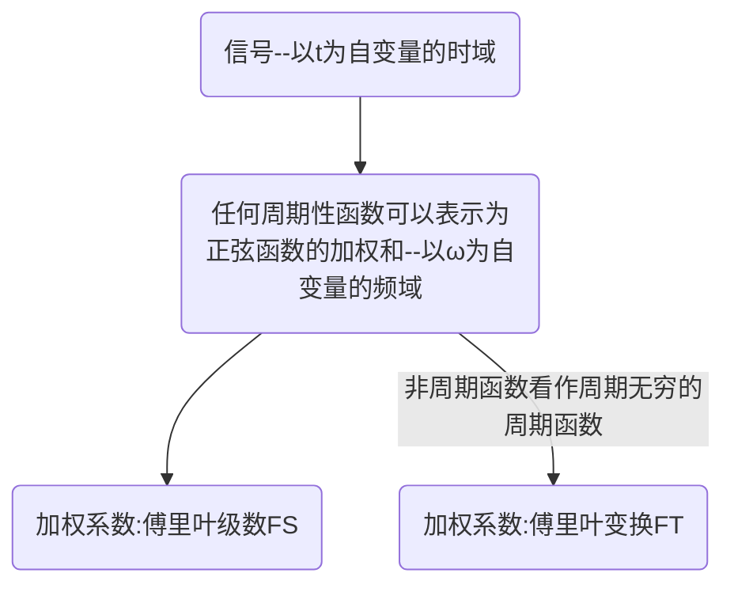

# 傅里叶级数与傅里叶变换

## 傅里叶级数
[[1-16无穷级数#狄利克雷收敛条件]]
在信号与系统这么课程中，正弦函数与复指数函数意义相同，因为可以使用欧拉公式将其联系起来。
$$
e^{j\omega t}=cos(\omega t)+jsin(\omega t)
$$
$$
sin(\omega t) = \frac{1}{2j}(e^{j\omega t}-e^{-j\omega t})
\qquad 
cos(\omega t) = \frac{1}{2}(e^{j\omega t}+e^{-j\omega t})
$$

证明周期性信号可以表示为一系列复指数的加权和：
$$
\begin{align*}
假设周期信号f(t)可以表示为:&\quad f(t)=\sum_{k=-\infty}^{+\infty}a_{k}e^{jk\omega_{0} t}	\quad 其中\omega=\frac{2\pi}{T}
\\
\\
有:\int_{0}^{T}f(t)e^{-jm\omega_{0}t}dt=&\int_{0}^{T}\sum_{k=-\infty}^{+\infty}a_{k}e^{j(k-m)\omega_{0} t}dt=\sum_{k=-\infty}^{+\infty}a_{k}\int_{0}^{T}e^{j(k-m)\omega_{0} t}dt
\\
\\
又\int_{0}^{T}e^{j(k-m)\omega_{0} t}dt=&
\begin{cases}
\frac{1}{j(k-m)\omega_{0}}e^{j(k-m)\omega_{0} t}\big|_{0}^{T}=0 \quad 复指数的周期性
 \quad & k\neq m 
 \\
 \\
t\big|_{0}^{T} =T& k= m 
\end{cases}

\\
\\
所以\int_{0}^{T}f(t)e^{-jm\omega_{0}t}dt=&T·a_{m}
\\\\
即证明:a_{k}=\frac{1}{T}\int_{0}^{T}f(t)&e^{-jk\omega_{0}t}dt
\end{align*}
$$
### 傅里叶级数对

$$
\begin{align*}
f(t)=&\sum_{k=-\infty}^{+\infty}a_{k}e^{jk\omega_{0} t}
\\
\\
a_{k}=&\frac{1}{T}\int_{t_{1}}^{t_{1}+T}f(t)e^{-jk\omega_{0}t}dt
\end{align*}
$$

### 三角形式傅里叶变换对

$$
\begin{align*}
f(t)=&\sum_{k=-\infty}^{+\infty}a_{k}e^{jk\omega_{0} t}=
a_{0}
+
\sum_{k=-\infty}^{-1}a_{k}e^{jk\omega_{0} t}
+
\sum_{k=1}^{+\infty}a_{k}e^{jk\omega_{0} t}
\\
\\
=&
a_{0}
+
\sum_{k=1}^{+\infty}a_{-k}e^{-jk\omega_{0} t}
+
\sum_{k=1}^{+\infty}a_{k}e^{jk\omega_{0} t}
\\
\\
=&
a_{0}
+
\sum_{k=1}^{+\infty}a^*_{k}e^{-jk\omega_{0} t}
+
\sum_{k=1}^{+\infty}a_{k}e^{jk\omega_{0} t}
\\
\\
记a_{k}=&A_{k}e^{j\phi_{k}} \quad a^*_{k}=A_{k}e^{-j\phi_{k}}
\\
\\
=&
a_{0}
+
\sum_{k=1}^{+\infty}A_{k}e^{-j\phi_{k}}e^{-jk\omega_{0} t}
+
\sum_{k=1}^{+\infty}A_{k}e^{j\phi_{k}}e^{jk\omega_{0} t}
\\
\\
=&
a_{0}
+
A_{k}\sum_{k=1}^{+\infty}(e^{-j(\phi_{k}+k\omega_{0} t)}+
e^{j(\phi_{k}+k\omega_{0} t)})
\\
\\
=&
a_{0}
+
2A_{k}\sum_{k=1}^{+\infty}cos(k\omega_{0} t+\phi_{k})

\end{align*}
$$
第二种三角形式：
$$
\begin{align*}
f(t)=&a_{0}+\sum_{k=1}^{+\infty}b_{k}cos(k\omega_{0}t)+\sum_{k=1}^{+\infty}a_{k}sin(k\omega_{0}t)
\\
\\
b_{k}=&2A_{k}cos\varphi_{k},\quad c_{k}=-2A_{k}sin\varphi_{k}
\end{align*}
$$
为什么说傅里叶引入了频域的概念呢？

实际上得先明白，凡是概念，都是人定义的东西。

在最开始信号的表达式中f(t)，我们以t为自变量研究信号的性质，这种以t为研究对象**的研究方式，我们称之为**信号的时域分析。

而在将f(t)表示为复指数的加权和之后，我们以ω为自变量研究信号的性质，这种 以ω为研究对象的研究方式，我们称之为信号的频域分析 。

### 狄利克雷收敛条件
了解就行,引入冲激函数之后，某些不满足狄利克雷条件的信号也可以做FT
1. FS周期绝对可积，FT无穷区间绝对可积
2. FS周期有限个最值，FT无穷区间有限个最值
3. FS周期有限个非无穷间断点，FT无穷区间有限个非无穷间断点

### 吉布斯现象
- 现象：在间断点处会出现无法消除的波纹
- 原因是：狄利克雷收敛条件中采用的是均方收敛而不是逐点收敛

连续点处，傅里叶级数=信号，间断点处，傅里叶级数=信号左右极限之和的一半。数一会考！
### 傅里叶级数的性质

$$
\begin{array}{|c|c|c|}
\hline
{ } & {周期信号} & {傅里叶级数系数}  \\
\hline
{信号} & {f(t)} & a_{k}\\
\hline
{共轭信号} & {f^*(t)} & a^*_{k}\\
\hline
{实数信号} & {f(t)} & a_{k}=a^*_{-k}\\
\hline
{实数偶信号} & {f(t)=f(-t)} & a_{k}=a_{-k} \quad a_{k}=a^*_{k} \\
\hline
{实数奇信号} & f(t)=-f(-t) & \quad a_{k}=-a_{-k} \quad a_{k}=-a^*_{k}\\
\hline
{时移} & f(t-t_{0}) & e^{-jk\omega_{0}t_{0}}a_{k} \\
\hline
{时间反转} & f(-t) & a_{-k}\\
\hline
{时域尺度变换} & f(at) & a_{k} \\
\hline
{时域相乘} & f(t)g(t) & \sum_{l=-\infty}^{+\infty}a_{l}b_{k-l}\\
\hline
\end{array}
$$
$$
帕斯瓦尔定理:\quad \frac{1}{T}\int_{T}|f(t)|^2dt=\sum_{k=-\infty}^{+\infty}|a_{k}|^2
$$
实信号，幅频特性偶对称，相频特性奇对称。

### 傅里叶级数通过LTI系统
$$
\begin{align*}
&如果LTI系统的系统函数H(j\omega)是实函数，a_k是f(t)的傅里叶级数
\\
&则输出y(t)=\sum_{k=-\infty}^{+\infty}a_kH(jk\omega_0)e^{jk\omega_0t}
\end{align*}
$$
<mark style="background: #ADCCFFA6;">EXAMPLE</mark>
$$
\begin{align*}
&h(t)=e^{-2|t|},输入:f(t)=\sum_{k=-\infty}^{+\infty}(-1)^k[u(t-k)-u(t-k-1)]
\\
&求系统对各输入信号的响应y(t)的傅里叶级数表达式
\end{align*}
$$

## 傅里叶变换

### 推导过程：
$$
\begin{align*}
对于周期函数：f(t)=&\sum_{k=-\infty}^{+\infty}a_{k}e^{jk\omega_{0}t} 
\qquad a_{k}=\frac{1}{T}\int_{-\frac{T}{2}}^{\frac{T}{2}}f(t)e^{-jk\omega_{0}t}dt
\\
\\
假设有非周期信号x(t)&,如果我们把它看作T=\infty的周期信号,对其展开为傅里叶级数
\\
\\
有:x(t)=&\sum_{k=-\infty}^{+\infty}a_{k}e^{jk\omega_{0}t} 
\qquad a_{k}=\displaystyle \lim_{T \to \infty}\frac{1}{T}\int_{-\frac{T}{2}}^{\frac{T}{2}}x(t)e^{-jk\omega_{0}t}dt
\\
\\
记X(jk\omega_0)=&a_{k}T	\quad k\omega_{0}=\frac{2\pi k}{T}  \quad离散连续化\rightarrow \omega
\\
\\
X(j\omega)=&\displaystyle \lim_{T \to \infty}a_{k}T=\int_{-\infty}^{+\infty}x(t)e^{-j\omega t}dt
\\
\\
x(t)=&\sum_{k=-\infty}^{+\infty}a_{k}e^{jk\omega_{0}t}=\displaystyle \lim_{T \to \infty}\sum_{k=-\infty}^{+\infty}\frac{X(j\omega)}{T}e^{jk\omega_{0}t}
\\
\\
x(t)=&\sum_{k=-\infty}^{+\infty}\displaystyle \lim_{T \to \infty}\frac{X(j\omega)}{T}e^{jk\omega_{0}t}
\\
\\
\because T \to \infty \quad \frac{1}{T}=&\frac{\omega_{0}}{2\pi}	 	 \quad \therefore 
\frac{1}{T}=\frac{d\omega}{2\pi}
\\
\\
x(t)=&\frac{1}{2\pi}\int_{-\infty}^{+\infty}{X(j\omega)}e^{j\omega t}d\omega
\end{align*}
$$

### 傅里叶变换对：

$$
\begin{align*}
F(j\omega)=&\int_{-\infty}^{+\infty}f(t)e^{-j\omega t}dt
\\
\\
f(t)=&\frac{1}{2\pi}\int_{-\infty}^{+\infty}{F(j\omega)}e^{j\omega t}d\omega
\end{align*}
$$

---

$F(j\omega)=|F(j\omega)|e^{j\phi(\omega)}$  其中$|F(j\omega)|$称为幅度谱、幅频特性曲线$\phi(\omega)$称为相位谱、相频特性曲线
 实数信号的傅里叶变换后，幅频特性偶对称，相频特性奇对称 

### 周期信号的傅里叶变换：
对于周期信号来说，他是不满足狄利克雷收敛条件的，但是我们可以引入冲激函数。
$$
\begin{align*}
&周期函数可以表示为:f(t)=\sum_{k=-\infty}^{+\infty}a_{k}e^{jk\omega_{0}t}  \quad \omega_{0} = \frac{2 \pi}{T}
\\
\\
&又:e^{jk\omega_{0}t}  \leftrightarrow 2\pi\delta(\omega-k\omega_{0})
\\
\\
&\therefore F(\omega)=2\pi\sum_{k=-\infty}^{+\infty}a_{k}\delta(\omega-k\omega_{0})
\end{align*}
$$
可以看出，周期函数的傅里叶变换是一系列在谐波位置处的冲激，强度为原来谐波的2π倍。

所以如果要求周期信号的傅里叶变换，**先求周期信号的傅里叶级数，在套公式带入**。
[[3.傅里叶变换#傅里叶级数#傅里叶级数对]]

### 傅里叶变换性质：

$$
\begin{align*}

线性:a_{1}f_{1}(t)+a_{2}f_{2}(t) \leftrightarrow &a_{1}F_{1}(\omega)+a_{2}F_{2}(\omega)
\\
\\
时移特性:f(t-t_{0}) \leftrightarrow &e^{-j\omega t_{0}}F(j\omega)
\\
\\
频移特性:e^{j\omega_{0}t}f(t) \leftrightarrow &F(\omega-\omega_{0})
\\
\\
尺度变换:	f(at) \leftrightarrow &\frac{1}{|a|}F(\frac{\omega}{a})
\\
\\
共轭对称性:（和FS完全一样）
\\
f(t)是实信号: F(\omega)=F^*(-\omega) &\quad F(-\omega)=F^*(\omega)
\\
\\
f(t)是实偶信号: F(\omega)=F(-\omega)=&F^*(\omega) \quad F(\omega)实偶
\\
\\
f(t)是实奇信号: F(\omega)=-F(-\omega)=&-F^*(\omega) \quad F(\omega)虚奇
\\
\\
实信号f(t)的偶部: & Re\{F{(\omega)}\}
\\
\\
实信号f(t)的奇部:& jIm\{F{(\omega)}\}
\\
\\
对偶性:F(t) \leftrightarrow & 2\pi f(-\omega)
\\
\\
时域卷积:f(t)*h(t) \leftrightarrow & F(\omega)H(\omega)
\\
\\
时域微分:\frac{d^nf(t)}{dt^n} \leftrightarrow & (j\omega)^nF(\omega)
\\
\\
时域积分:\int_{-\infty}^{t}f(\tau)d\tau \leftrightarrow & \frac{F(\omega)}{j\omega}+\pi F(0)\delta(\omega)
\\
\\
帕斯瓦尔定理:\int_{-\infty}^{+\infty}|f(t)|^2dt =& \frac{1}{2\pi}\int_{-\infty}^{+\infty}|F(\omega)|^2d\omega
\\
\\
幅度调制特性:f_{1}(t)f_{2}(t) \leftrightarrow & \frac{1}{2\pi}F_{1}(\omega)*F_{2}(\omega)
\\
\\
频域微分:(-jt)^nf(t) \leftrightarrow & \frac{d^nF(\omega)}{d\omega^n}
\\
\\
频域积分:\frac{f(t)}{-jt}+\pi f(0)\delta(t) \leftrightarrow & \int_{-\infty}^{\omega}F(\theta)d\theta

\end{align*}
$$

### 傅里叶常用变换对：

$$
\begin{align*}
\delta(t) \leftrightarrow  1    \xRightarrow{微分特性}  &\delta^n(t) \leftrightarrow (j\omega)^n
\\
\\
\delta(t) \leftrightarrow  1   \xRightarrow{积分特性}& u(t) \leftrightarrow 
\frac{1}{j\omega}+\pi \delta(\omega)
\\
\\
 u(t) \leftrightarrow 
\frac{1}{j\omega}+\pi \delta(\omega)  \xRightarrow{sgn(t)=-u(-t)+u(t)}& sgn(t) \leftrightarrow 
\frac{2}{j\omega}
\\
\\
\delta(t) \leftrightarrow  1  \xRightarrow{对偶特性} &1 \leftrightarrow 2 \pi\delta(\omega)
\\
\\
1 \leftrightarrow  2 \pi\delta(\omega) \xRightarrow{频移特性}&e^{j\omega_{0}t}\leftrightarrow2\pi\delta(\omega-\omega_{0})
\\
\\
e^{j\omega_{0}t}\leftrightarrow 2\pi\delta(\omega-\omega_{0})  \xRightarrow{欧拉公式}&
sin(\omega t) = \frac{1}{2j}(e^{j\omega t}-e^{-j\omega t}) 
\leftrightarrow \frac{\pi}{j}(\delta(\omega-\omega_{0})-\delta(\omega+\omega_{0}))
\\
\\
e^{j\omega_{0}t}\leftrightarrow 2\pi\delta(\omega-\omega_{0})   \xRightarrow{欧拉公式}&
cos(\omega t) = \frac{1}{2}(e^{j\omega t}+e^{-j\omega t}) 
\leftrightarrow \pi(\delta(\omega-\omega_{0})+\delta(\omega+\omega_{0}))
\\
\\
e^{-\alpha t}u(t),Re\{\alpha\}>0\leftrightarrow  \frac{1}{j\omega+\alpha}
 \xRightarrow{频域微分特性} &
te^{-\alpha t}u(t)\leftrightarrow \frac{1}{(j\omega+\alpha)^2}
\\
\\
e^{-\alpha |t|},Re\{\alpha\}>0&\leftrightarrow \frac{2\alpha}{\omega^2+\alpha^2}
\\
\\
g_{\tau}(t)=
\begin{cases}
A, \quad
 & |t|<\frac{\tau}{2} 
 \\
 \\
0, \quad
 & |t|>\frac{\tau}{2} 
\end{cases}
\leftrightarrow 
A\tau Sa(\frac{\omega \tau}{2})
 \xRightarrow{对偶特性} &
\frac{1}{2 \pi}A\omega_{c} Sa(\frac{\omega_{c} t}{2})
\leftrightarrow 
g_{\omega_{c}}(\omega)= 
\begin{cases}
A, 
 & |\omega|<\frac{\omega_{c}}{2} 
 \\
 \\
0, 
 & |\omega|>\frac{\omega_{c}}{2} 
\end{cases}
\\
\\
周期信号:f(t)=\sum_{k=-\infty}^{+\infty}a_{k}&e^{jk\omega_{0}t}
\quad \leftrightarrow  \quad
2\pi\sum_{k=-\infty}^{+\infty}a_{k}\delta(\omega-k\omega_{0})
\end{align*}
$$

这种形式门函数的傅里叶变换可能用的多一点，而且规律性更强 
$$
\begin{align*}
g_{\tau}(t)=
\begin{cases}
1, \quad
 & |t|<{\tau}
 \\
 \\
0, \quad
 & |t|>\tau
\end{cases}
\quad
\leftrightarrow
\quad
2 \frac{Sin(\omega \tau)}{\omega}
\\
\\
 \frac{sin\Omega t}{\pi t}
\quad
\leftrightarrow
G(\omega)=
\begin{cases}
1, \quad
 & |\omega|<\Omega
 \\
 \\
0, \quad
 & |\omega|>\Omega
\end{cases}

\end{align*}
$$
#### 使用傅里叶变换性质解题还是定义
- 如果信号是时限信号，可以用性质求解
- 如果信号中含有不绝对可积部分，用定义做
<mark style="background: #ADCCFFA6;">EXAMPLE</mark>
- 这里的阶跃部分是不绝对可积的，所以不能用性质求解
$$
\begin{align*}
&求以下信号的傅里叶变换
\\
&f(t)=e^{3t}u(-t+1)
\end{align*}
$$

<mark style="background: #FFB8EBA6;">answer</mark>
$$
\begin{align*}
F(j\omega)=&\int_{-\infty}^{+\infty}f(t)e^{-j\omega t}dt
\\\\
=&\int_{-\infty}^{+\infty}e^{3t}u(-t+1)e^{-j\omega t}dt
\\\\
=&\int_{-\infty}^{1}e^{-(j\omega-3) t}dt
\\\\
=&-\frac{1}{j\omega-3}e^{-(j\omega-3) t}\big|_{-\infty}^{1}
\\\\
=&-\frac{e^{-(j\omega-3)}}{j\omega-3}
\end{align*} 
$$

