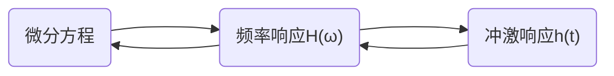
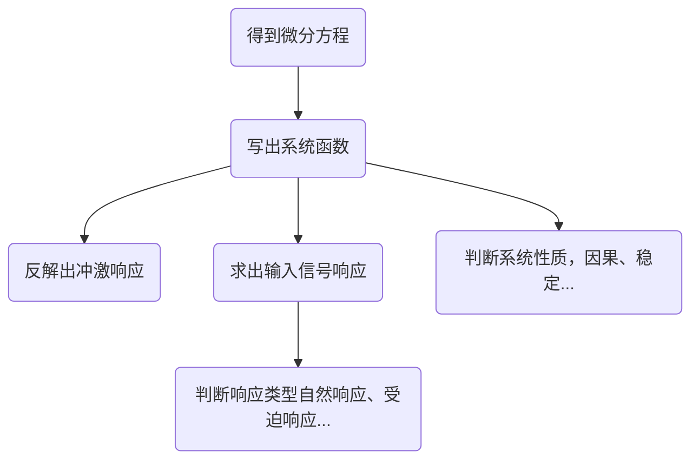
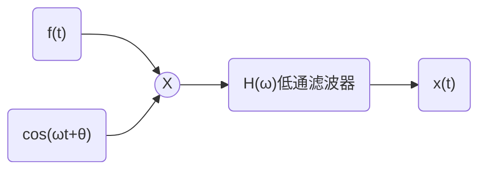

# 频域分析法
[[3.傅里叶变换]]
## LTI系统频率响应

**通过微分方程可以直接写出H(ω)，对H(ω)做傅里叶逆变换则可以得到h(t)**

在拉斯变换和Z变换中也是一样，通过微分方程直接写出系统函数，然后对系统函数做拉斯反变换或z反变换就可以得到冲激响应。

**信号通过LTI连续时间系统的实质，就是“幅度乘幅度”、“相角加相角”**

所以对于正弦信号与复指数信号，只用求出H(ω)在信号频率位置的幅值与相角进行简单的乘法和加法就ok

在也是在电路基础里面的矢量法的理论依据。
$$
\begin{align*}  

  Y(j\omega) &= H(j\omega)X(j\omega)\\\\
    &= |H(j\omega)|e^{j\varphi_{H}(\omega)}·|X(j\omega)|e^{j\varphi_{X}(\omega)}  \\\\

    &= |H(j\omega)|·|X(j\omega)|e^{j(\varphi_{H}(\omega)+\varphi_{X}(\omega))}    \\
\end{align*}
$$
**电路分析题解题流程**

### 无失真传输系统

定义：如果输出响应y(t)相对于输入信号x(t)只有固定的延时与幅值变化，则认为信号在传输过程中没有失真，该系统也叫做无失真系统。

无失真系统的要求:
$$
\begin{align*}
&h(t)=K\cdot\delta(t-t_{0}) \quad H(\omega)=Ke^{-j\omega t_{0}}
\\\\
&|H(\omega)|=K \quad \varphi_{H}(\omega)=-\omega t_{0}
\end{align*}
$$
也就是无失真系统的幅频特性曲线是常数直线，相频特性曲线是过原点的斜线。

### 线性相位系统与系统的群时延

定义：系统相频特性曲线是关于ω的线性函数
$$
\varphi_{H}(\omega)=-\omega \tau_{0}  \quad \tau_{0}为常数
$$
很明显无失真系统是线性相位系统

##### 色散

**定义：系统对于信号的不同频率具有不同的延时的现象**

##### 群时延τ(ω)

$$
\tau(\omega)=-\frac{d\varphi_{H}(\omega)}{d\omega}
$$

<mark style="background: #ADCCFFA6;">EXAMPLE</mark>
$$
\begin{align*}
&因果LTI系统连续时间系统频率响应为:H(\omega)=\frac{3-j\omega}{3+j\omega}
\\\\
&(1)求该系统的冲激响应和微分方程
\\
&(2)该系统是否为无失真传输系统,是否为线性相位系统?
\\
&(3)求系统的群时延
\end{align*}
$$
<mark style="background: #FFB8EBA6;">ANSWER</mark>
$$
\begin{align*}
怎么判断系统无失真、线性相位
\end{align*}
$$

## 滤波器

分类：频率成形滤波器、频率选择滤波器

### 频率选择滤波器
##### 低通
$$
H(\omega)=
\begin{cases}
1,	&|\omega|<\omega_{c}
\\
\\
0,	&|\omega|>\omega_{c}
\end{cases}
\\
\\
\qquad h(t)=\frac{sin(\omega_{c}t)}{\pi t}
$$
##### 高通
- 在频谱上1-低通
##### 带通
- 在频谱上两个低通相减
##### 带阻
- 在频谱上1-带通

## 幅度调制与解调
### 调制

调制：用包含信息的信号f(t){调制信号}去控制另一个信号c(t){载波信号}的某一个参量，使其携带f(t)信息的过程。

为什么要调制：高频信号容易传播、可以实现多路复用、增强抗干扰能力等等

可以调那些参量：幅度、频率、相位

所以模拟调制相应有：幅度调制AM、频率调制FM、相位调制PM

对应数字调制：振幅键控ASK、频率键控FSK、相位键控PSK

解调：调制的逆过程

**实现的理论依据：**

复指数信号与正弦信号可实现频谱搬移
$$
\begin{align*}
f(t)e^{j\omega_{0} t} \leftrightarrow & F(\omega-\omega_{0})
\\
\\
f(t)cos(\omega_{0}t) \leftrightarrow & \frac{1}{2}\{F(\omega-\omega_{0})+F(\omega+\omega_{0})\}
\\
\\
f(t)sin(\omega_{0}t) \leftrightarrow & \frac{1}{2j}\{F(\omega-\omega_{0})-F(\omega+\omega_{0})\}
\end{align*}
$$

### 解调

包络检波与同步检波

其中cos(ωt+θ)叫做本振信号，当θ=0时，输出信号x(t)幅值最大，称为同步解调。工程中常用锁相环实现。

## 采样与内插
### 采样
利用第一章学过的冲激信号的采样特性可知
从时域分析：
$$
\begin{align*}
冲激信号的特性: f(t)\delta(t-\tau)=&f(\tau)\delta(t-\tau)
\\
\\
\therefore 若有周期冲激串信号:p(t)=&\sum_{l=-\infty}^{\infty}\delta(t-lT_{s})
\\
\\
一系列间隔T_{s}的f(t)的冲激 \quad y(t)=f(t)p(t)=&\sum_{l=-\infty}^{\infty}f(lT_{s})\delta(t-lT_{s})
\end{align*}
$$
从频域分析：
$$
\begin{align*}
对于周期&信号的FT,应该先求FS:
\\\\
a_{k}=&\frac{1}{T_{s}}\int_{T}p(t)e^{-jk\omega_{0}t}dt
=\frac{1}{T_{s}}\int_{T}\sum_{l=-\infty}^{\infty}\delta(t-lT_{s})e^{-jk\omega_{0}t}dt
\\\\
=&\frac{1}{T_{s}}\sum_{l=-\infty}^{\infty}\int_{T}\delta(t-lT_{s})e^{-jk\omega_{0}t}dt
=\frac{1}{T_{s}}
\\\\
\therefore p(t)=&\sum_{k=-\infty}^{+\infty} a_{k}e^{jk\omega_{s}t}
=\frac{1}{T_{s}}\sum_{k=-\infty}^{+\infty}e^{jk\omega_{s}t}
\\\\
P(\omega)=&\frac{2\pi}{T_{s}}\sum_{k=-\infty}^{+\infty}\delta(\omega-k\omega_{s})
\\\\
时域相乘,&频域卷积性质
\\
Y(\omega)=&\frac{1}{2\pi}F(\omega)*P(\omega)=\frac{1}{T_{s}}\sum_{k=-\infty}^{+\infty}F(\omega-k\omega_{s})
\end{align*}
$$
所以可以看出，采样之后的频谱是无穷次原始信号周期分之一倍频移之后的叠加。

<mark style="background: #ADCCFFA6;">EXAMPLE</mark>
- 关于采样一个重点：将原始信号的频谱×采样周期的倒数，然后以采样角频率无穷次周期叠加。
- 像这道题的话，就是先画出临界采样频率的波形，然后慢慢移动，看滤波器频率内波形是否可以保持完整
$$
\begin{align*}
&如图(a)所示频谱的信号f(t)称为带通信号,图(b)是对其采样和恢复的系统
\\
&采样冲激串为:p(t)=\sum_{l=-\infty}^{\infty}\delta(t-lT_s)
\\\\
&(1)根据奈奎斯特采样定理,采样角频率\omega_s应该满足什么条件?
\\\\
&(2)如果滤波器H(\omega)为图(c)所示的带通滤波器,且信号频谱中\omega_2=2\omega_1,当
\\
&采样频率\omega_s不满足奈奎斯特采样定理时,能否使y(t)等于信号f(t)?如果可以
\\
&求出采样角频率\omega_s
\end{align*}
$$
![[采样定理题目01.jpg|700]]

<mark style="background: #FFB8EBA6;">answer</mark>
$$
\begin{align*}
&(1)\quad \omega_s \geq 2\omega_2
\\\\
&(2)画出采样后的频谱,使之在带通滤波器的范围内出现完整波形
\end{align*}
$$
### 内插

内插公式
$$
x(t)=\sum_{l=-\infty}^{\infty}f(lT_{s})sa[\frac{\pi(t-lT_{s})}{T_{s}}]
$$
从频域上看，当k=0时，其恰好只是大小为原频谱的$\frac{1}{T}$倍。所以如果使用一个恰当的低通滤波器就可以将原信号恢复出来。
$$
\begin{align*}
H(\omega)=&
\begin{cases}
T_{s}, &|\omega|<\frac{\omega_{s}}{2}
\\
\\
0,   &|\omega|>\frac{\omega_{s}}{2}
\end{cases}
\qquad \quad
F(\omega) = H(\omega)Y(\omega)
\\\\
频域相乘,时域卷积:
x(t)=&h(t)*y(t)
=h(t)*f(t)p(t)
\\\\
=&T_{s}\frac{sin(\frac{\omega_st}{2})}{\pi t}*\sum_{l=-\infty}^{\infty}f(lT_{s})\delta(t-lT_{s})
\\\\
=&T_{s}\sum_{l=-\infty}^{\infty}f(lT_{s})\frac{sin(\frac{\omega_s(t-lT_{s})}{2})}{\pi (t-lT_{s})}
\\\\
=&\sum_{l=-\infty}^{\infty}f(lT_{s})sa(\frac{\omega_s(t-lT_{s})}{2})
\\\\
=&\sum_{l=-\infty}^{\infty}f(lT_{s})sa[\frac{\pi(t-lT_{s})}{T_{s}}]
\end{align*}
$$

### 采样定理

奈奎斯特采样定理也叫香农采样定理
$$
\begin{align*}
&\omega_{s}为信号频率 \quad \omega_{M}为采样频率
\\\\
&采样定理:\omega_{s} \geq 2\omega_{M}
\end{align*}
$$
带通采样定理：
- $\frac{2\omega_H}{m}\le \omega_s \le \frac{2\omega_L}{m-1}\quad m=[\frac{\omega_H}{B}]$,B为频谱带宽,$\omega_L,\omega_H$分别为最低与最高频率
- 当信号最低频率为0时，带通采样定理⇔奈奎斯特采样定理

## 具有零阶保持电路的采样与恢复

### 零阶保持电路

$$
h_{0}(t)=g_{T_{s}}(t-\frac{T_{s}}{2})=
\begin{cases}
1,	&0<t<T_{s}
\\
\\
0,	&其他
\end{cases}
$$

具有具有零阶保持电路的采样就是指，在采样结束之后级联一个具有上述冲激响应的系统。

其作用就是让采样值保持一个周期不变，方便AD进行采样。

但是引入零阶采样电路之后，单纯使用一个低通滤波器是无法将其恢复出来的。具体原因可以自行推导，就是在Y(ω)乘上零阶保持电路系统函数就ok

所以零阶保持电路需要采用**重构滤波器**实现,就是对引入零阶保持电路所带来的幅度变化与相位变化进行补偿
$$
H_{r}=
\begin{cases}
\frac{1}{Sa(\frac{\omega T_{s}}{2})}e^{j\frac{T_{s}\omega}{2}}, & |\omega|<\frac{\omega_{s}}{2}
\\
\\
0,& |\omega|>\frac{\omega_{s}}{2}
\end{cases}
$$
<mark style="background: #ADCCFFA6;">EXAMPLE</mark>
![[一些信号的频谱图解#时域三角波]]
$$
\begin{align*}
&在连续时间信号的采样中，除零阶保持电路外，还有一阶保持电路，如图P4.23
\\
&为具有一阶保持电路h_1(t)的采样系统
\\\\
&(1)求h_1(t)的频率响应
\\
&(2)画出y_1(t)的波形
\\
&(3)求y_1(t)的频谱表达式
\end{align*}
$$
![[fdc17b49f01e3b909b60fab448dc06b.jpg]]
