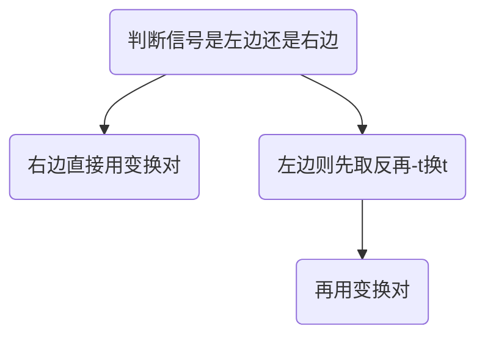
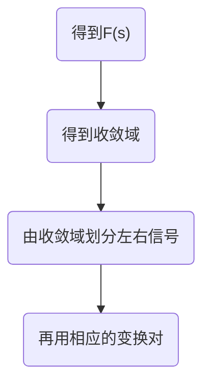
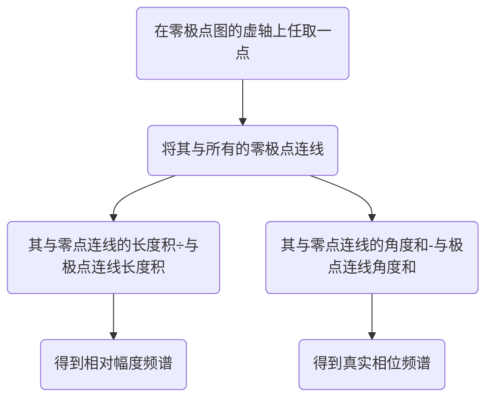
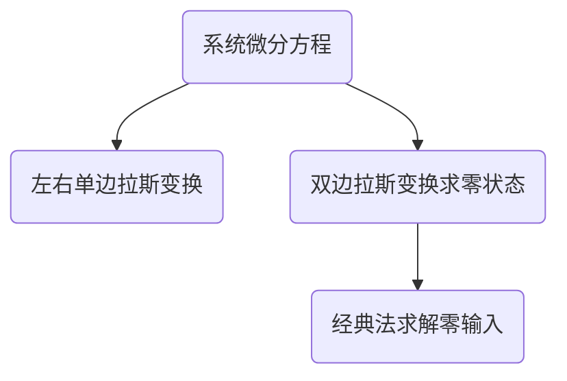
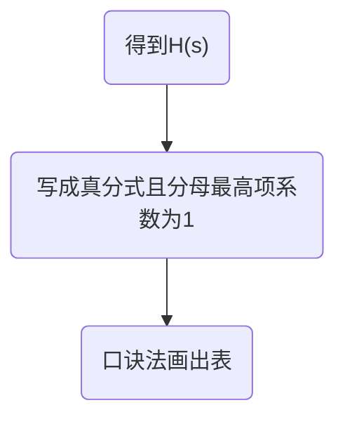

# 信号的拉普拉斯变换
[[3.傅里叶变换]]
## 拉斯变换的概念
### 拉斯变换定义
$$
\begin{align*}
F(s)=&\int_{-\infty}^{+\infty}f(t)e^{-st}dt
\\
\\
f(t)=&\frac{1}{2\pi j}\int_{\sigma-j\infty}^{\sigma+j\infty}F(s)e^{st}ds
\end{align*}
$$
<mark style="background: #ADCCFFA6;">EXAMPLE</mark>
$$
\begin{align*}
&f(t)=e^{-2t}sin(3t)u(t)
\end{align*}
$$
<mark style="background: #FFB8EBA6;">answer</mark>
$$
\begin{align*}
F(s)=&\int_{-\infty}^{+\infty}f(t)e^{-st}dt
\\\\
=&\int_{0}^{+\infty}e^{-2t}sin(3t)e^{-st}dt
\\\\
=&\int_{0}^{+\infty}e^{-2t}\{\frac{1}{2j}(e^{3jt}-e^{-3jt})\}e^{-st}dt
\\\\
=&\frac{1}{2j}\int_{0}^{+\infty}\{e^{[(3j-2)-s]t}-e^{[-(3j+2)-s]t}\}dt
\\\\
&有表达式可知，如果要求积分存在 \Leftrightarrow -2-Re\{s\}<0
\end{align*}
$$


### 收敛域
拉斯变换引入了收敛域的概念，只有在收敛域内拉斯变换才存在

右边信号：收敛域大于某个值
左边信号：收敛域小于某个值
双边信号：收敛域介于两个值之间
**当收敛域包含虚轴时，FT存在，系统稳定。**

### 零极点
H(s)中，使得分子为零的s值称之为零点，使得分母为零的s值称之为极点。零极点可以是实数，也可以是虚数。

可以看到，如果已知所有的零极点，则H(s)只剩下系数K不知道，可以说零极图几乎与H(s)一一对应。
$$
\begin{align*}
H(s)=&\frac{N(s)}{D(s)}
=\frac{b_{M}s^{M}+b_{M-1}s^{M-1}······+b_{0}s+b_{0}}
{a_{N}s^{N}+a_{N-1}s^{N-1}······+a_{0}s+a_{0}}
\\
\\
=&K\frac{(s-z_{1})(s-z_{2})······(s-z_{M})}{(s-p_{1})(s-p_{2})······(s-p_{N})}
\end{align*}
$$
在一个坐标系中，描绘出一个系统的所有零点与极点，这就是系统的零极图。对了，即使在H(s)的有理式当中，出现了相同的极点与零点，是不可以约掉的！！！因为H(s)的极点包含系统零输入的自然频率信息。


由零极图也可以推导出频谱图以及之后的两个特殊系统“全通系统”与“最小相位系统”

## 拉斯变换的性质
   	时同频异！！！
这里只列举几种常用性质
$$
\begin{align*}
时移性质：f(t-t_{0})\quad \leftrightarrow & \quad e^{-st_{0}}F(s)
\\\\
频移性质：f(t)e^{s_{0}t}\quad \leftrightarrow &\quad F(s-s_{0})
\\\\
尺度变换：f(at) \quad \leftrightarrow & \quad \frac{1}{|a|}F(\frac{s}{a})
\\\\
时域卷积：f(t)*h(t) \quad \leftrightarrow &\quad F(s)H(s)
\\\\
时域微分：\frac{df(t)}{dt} \quad \leftrightarrow &\quad sF(s)	\quad 对于双边成立
\\\\
时域积分：\int_{-\infty}^{t}f(\tau)d\tau \quad \leftrightarrow &\quad \frac{1}{s}F(s)	\quad 对于因果信号成立
\\\\
s域微分：-tf(t) \quad \leftrightarrow &\quad \frac{dF(s)}{ds}
\\\\
初值定理：f(0^+)=\lim_{t \to 0^+}f(t)=&\lim_{s\to \infty}sF(s) \quad 0时刻无冲激
\\\\
终值定理：f(\infty)=\lim_{t \to \infty}f(t)=&\lim_{s \to 0}sF(s) \quad sF(s)收敛域包含虚轴
\end{align*}
$$
<mark style="background: #ADCCFFA6;">EXAMPLE</mark>
	用性质求解具体信号的拉斯变换
$$
\begin{align*}
&求f(t)=e^{-t}cos(3t-4)u(t)的拉斯变换
\end{align*}
$$
<mark style="background: #FFB8EBA6;">answer</mark>
$$
\begin{align*}
f(t)=&e^{-t}cos(3t-4)u(t)
\\\\
=&e^{-t}[cos4·cos3t+sin4·sin3t]u(t)
\\\\
cos3tu(t) \leftrightarrow& \frac{s}{s^2+9} 
\Rightarrow  e^{-t}cos3tu(t) \leftrightarrow \frac{(s+1)}{(s+1)^2+9}
\end{align*}
$$
<mark style="background: #ADCCFFA6;">EXAMPLE</mark>
$$
\begin{align*}
&已知f(t) \leftrightarrow F(s) \quad 收敛域\sigma>\sigma_0>0
\\
&试求信号:2t\int_{-\infty}^{2t+1}f(\tau)d\tau的拉斯变换并写出收敛域
\end{align*}
$$
<mark style="background: #FFB8EBA6;">answer</mark>
$$
\begin{align*}
由F(s)的收敛域可知，& f(t)是因果信号
\Rightarrow \int_{-\infty}^{t}f(\tau)d\tau \leftrightarrow \frac{1}{s}F(s)
\\
\int_{-\infty}^{t+1}f(\tau)d\tau \leftrightarrow& e^{s}\frac{1}{s}F(s)
\quad \sigma>\sigma_0>0
\\
\int_{-\infty}^{2t+1}f(\tau)d\tau 
\leftrightarrow &
\frac{1}{2}\frac{1}{\frac{s}{2}}e^{\frac{s}{2}}F(\frac{s}{2})
\quad \sigma>2\sigma_0>0
\\
-t\int_{-\infty}^{2t+1}f(\tau)d\tau
\leftrightarrow&
\frac{-F(\frac{s}{2})+\frac{1}{2s}F(\frac{s}{2})+\frac{1}{2s}F'(\frac{s}{2})}{s^2}e^{\frac{s}{2}} \quad \sigma>2\sigma_0
\\
2t\int_{-\infty}^{2t+1}f(\tau)d\tau
\leftrightarrow&
\frac{2F(\frac{s}{2})-sF(\frac{s}{2})-sF'(\frac{s}{2})}{s^2}e^{\frac{s}{2}} \quad \sigma>2\sigma_0
\end{align*}
$$

## 拉斯变换表
#### 右边信号
可以看到，只要知道最简单的冲激变换对，加上一些性质就可以推出所有的变换对关系。以下都是右边信号的变换对。


$$
\begin{align*}
\delta(t) \leftrightarrow 1 
\xRightarrow{时移性质}&
\delta(t-t_{0}) \leftrightarrow e^{-st_{0}}

\\
\\
\delta(t) \leftrightarrow 1 
\xRightarrow{积分性质}&
u(t) \leftrightarrow \frac{1}{s}

\\
\\
u(t) \leftrightarrow \frac{1}{s}
\xRightarrow{频域微分}&
tu(t) \leftrightarrow \frac{1}{s^2}

\\
\\
u(t) \leftrightarrow \frac{1}{s}
\xRightarrow{频移性质}&
e^{s_{0}t}u(t) \leftrightarrow \frac{1}{s-s_{0}}
\\
\\
e^{-b|t|}=e^{-bt}u(t)&+e^{bt}u(-t)
\\
\\
e^{s_{0}t}u(t) \leftrightarrow \frac{1}{s-s_{0}}
\xRightarrow{频移性质}&
e^{-b|t|}\leftrightarrow \frac{-2b}{s^2-b^2} 
\quad -b<\sigma <b

\\
\\
cos{\omega t}=\frac{1}{2}\{e^{j\omega t}&+e^{-j\omega t}\}
\\
sin{\omega t}=\frac{1}{2j}\{e^{j\omega t}&-e^{-j\omega t}\}
\\
\\
e^{s_{0}t}u(t) \leftrightarrow \frac{1}{s-s_{0}}
\xRightarrow{欧拉公式}&
cos{(\omega t)}u(t) \leftrightarrow \frac{s}{s^2+\omega^2}
\\
\\
e^{s_{0}t}u(t) \leftrightarrow \frac{1}{s-s_{0}}
\xRightarrow{欧拉公式}&
sin{(\omega t)}u(t) \leftrightarrow \frac{\omega}{s^2+\omega^2}


\end{align*}
$$

#### 左边信号
$$
\begin{align*}
利用尺度的变换的特例:&f(-t)\leftrightarrow F(-s)
\\
&u(-t) \leftrightarrow -\frac{1}{s}
\\\\
u(-t) \leftrightarrow -\frac{1}{s}
\xRightarrow{频移性质}&
e^{s_{0}t}u(-t) \leftrightarrow -\frac{1}{s-s_{0}}
\end{align*}
$$
<mark style="background: #ADCCFFA6;">EXAMPLE</mark>
$$
\begin{align*}
&求信号f(t)=2e^{-3t}u(-t)+e^{-t}cos(2t)u(t)的拉斯变换
\end{align*}
$$

<mark style="background: #FFB8EBA6;">answer</mark>
$$
\begin{align*}
&2e^{3t}u(t) \leftrightarrow 2\frac{1}{s-3}
\\
&尺度变换: 2e^{-3t}u(-t) \leftrightarrow 2\frac{1}{-s-3}=-\frac{2}{s+3} \quad \sigma<-3
\\
&e^{-t}cos(2t)u(t) \leftrightarrow \frac{2}{(s+1)^2+4} \quad \sigma>-1
\\\\
&综上:由于收敛域不存在交集，所以F(s)不存在
\end{align*}
$$


#### 收敛域问题
##### 右边信号
- 满足分母s有理式为0的实部的右侧
 ##### 左边信号
- 满足分母s有理式为0的实部的左侧
##### 通过LTI系统之后
- 通过LTI系统之后系统的输出信号y(t)收敛域一定包含输入信号x(t)的收敛域和H(s)收敛域的交集

[[信号与系统错题集#收敛域]]
## 拉斯正变换求解



## 拉斯逆变换求解
### 留数法
不学，但如果你会用的话就可以不记变换对了。
### 部分分式分解法
目的：将复杂的F(s)分解成若干简单变换对组合，其中简单变换对可利用变换对表查找。
本质：初中学的因式分解
技巧：不要用待定系数确定参数，用特殊点得到参数方程




## LTI系统的s域描述
````mermaid
graph LR
A("微分方程")-->B("系统函数H(S)")-->C("冲激函数h(t)")-->D("零极图")-->E("系统框图")
B-->A
C-->B
D-->C
E-->D
````
可以看到以上五个几乎是完全可以互推的，因为“零极图”还差一个系数
### 从s域来看系统的性质
**因果性：** 从零极图上看，收敛域位于最右侧极点的右侧s面（必要条件）
**稳定性：** 从零极图上看，收敛域包含虚轴 （充要条件）
**可逆性：** H(s)H(s)^(-1)=1
### 用零极图来推测频谱图
前提：当收敛域包含虚轴时，即系统稳定时，频率响应H(ω)存在
$$
H(\omega)=H(s)\big|_{s=j\omega}
$$

### 全通系统
零极点关于虚轴一一对称
$$
\begin{align*}
&形如:H(s)=\frac{(s+a_1)(s-a_2)}{(s-a_1)(s+a_2)}
\end{align*}
$$
### 最小相位系统
零极点都位于s的左半平面
$$
H(s)=\frac{N(s)}{(s+a_1)(s+a_2)(s+a_3)} \quad a_i>0
$$

<mark style="background: #ADCCFFA6;">EXAMPLE</mark>
$$
\begin{align*}
&将F(s)=\frac{s-1}{(s^2+4s+7)(s-2)}表示为全通系统与最小相位系统的级联
\end{align*}
$$
<mark style="background: #FFB8EBA6;">answer</mark>
$$
\begin{align*}
&\because (s^2+4s+7)的解实部小于零，所以这部分不用管
\\\\
&如果(s-a)其中a>0则要凑(s+a)使之成为全通系统
\\\\
&F(s)=\frac{s-1}{(s^2+4s+7)(s-2)}=\frac{s+1}{(s^2+4s+7)(s+2)}·
\frac{(s+2)(s-1)}{(s-2)(s+1)}
\end{align*}
$$
## 单边拉斯变换
$$
\begin{align*}
F(s)=&\int_{0^-}^{+\infty}f(t)e^{-st}dt
\\
\\
f(t)=&\{\frac{1}{2\pi j}\int_{\sigma-j\infty}^{\sigma+j\infty}F(s)e^{st}ds\}u(t)
\\
\\
时域微分:&\frac{f(t)}{dt} \leftrightarrow sF(S)-f(0^-)
\end{align*}
$$

## 拉斯变换求解LTI系统响应


### 复指数信号的LTI响应
$$
\begin{align*}
x(t)=&e^{s_{0}t}
\\\\
y(t)=&
\begin{cases}
e^{s_{0}t}H(s_0) &s_0位于H(s)收敛域内
\\
\\
\\
不存在  &s_0不在H(s)收敛域内
\end{cases}
\end{align*}
$$
## LTI系统的框图描述
### 框图的三种形式
直接：H(s)直接当做整体画框图
级联：H(s)表示为两个部分相乘，各部分单独画框图，一路相连
并联：H(s)表示为两个部分相加，各部分单独画框图，分出n路，最后汇合为一路



口诀：
我有一个求和器，后面跟着小积分
要问积分多少个，分母最高阶来定
跟着求和饿九顿，分母层层来讨伐
从右往左下限升，各自取反干他妈
搞定旧王立新王，分子层层来祝贺
从右往左下限升，献上正值来道贺
最后一笔满分题，左添输入右输出
（现在来看这个好好笑，我自己都不知道是啥意思了，哈哈哈哈哈哈。2023.4.16）


<mark style="background: #ADCCFFA6;">EXAMPLE</mark>
$$
\begin{align*}
&画出H(s)的直接、并联、级联实现形式方框图H(s)=\frac{s^3+6}{s^2+3s+2}
\end{align*}
$$
<mark style="background: #FFB8EBA6;">answer</mark>
**直连型**
$$
\begin{align*}
&首先要保证:➊ 分子的阶数不大于分母的阶数\qquad ➋分母最高阶前系数为1
\\
&H(s)=\frac{s^3+6}{s^2+3s+2}=s+\frac{-3s^2-2s+6}{s^2+3s+2}
\\
&s单做一条支路，主要研究H_2(s)=\frac{-3s^2-2s+6}{s^2+3s+2}
\\
&分子分母同除分母最高阶:H_2(s)=\frac{-3-2s^{-1}+6s^{-2}}{1+3s^{-1}+2s^{-2}}
\\\\
&先画一个求和器，后面画积分器(共有分母最高阶个数);
\\\\
&s^{-i}前的系数代表经过i个积分器后的支路的系数(向下取相反值,向上取原值)
\end{align*}
$$

![[Pasted image 20220920162642.png]]

**并联型**
$$
\begin{align*}
首先要&把表达式拆分为多项式相加
\\
H(s)=&\frac{s^3+6}{s^2+3s+2}=(s-3)+\frac{5}{s+1}+\frac{2}{s+2}
\\\\
=&s+\frac{5}{s+1}+\frac{-3s-4}{s+2}
\\
每一部分&按照直接型画出，然后相加
\end{align*}
$$
![[Pasted image 20220920181700.png]]
**级联型**
$$
\begin{align*}
首先要把&表达式写作多项式的乘积形式
\\
H(s)=&\frac{s^3+6}{s^2+3s+2}=\frac{s^3+(\sqrt[3]{6})^3}{(s+1)(s+2)}
\\
=&\frac{(s+\sqrt[3]{6})(s^2+\sqrt[3]{6}s+\sqrt[3]{36})}{(s+1)(s+2)}
\\
=&\frac{s+\sqrt[3]{6}}{s+2}·[s+\frac{-(\sqrt[3]{6}+1)s+\sqrt[3]{36}}{s+1}]
\\
每一部分&按照直接型画出，然后直接相连接在一起
\end{align*}
$$
![[Pasted image 20220920185822.png]]
#### 框图总结
- 不要在表达式中出现常数项，如果出现，就将其合并到某一有理式项当中
- 框图转换成流图的方法
	1. 将加法器合并之后画成节点
	2. 小方框都改写成横线箭头，其方框内容重写到箭头上
	3. 反馈支路画成曲线，其它支路画成直线。箭头不再线段尾端而是在线段中间


## 小综合题
<mark style="background: #ADCCFFA6;">EXAMPLE</mark>
$$
\begin{align*}
&已知LTI连续时间系统冲激响应h(t)和系统函数H(s)满足下列条件:
\\\\
&(1)H(s)是有理式 
\\
&\color{red}\Rightarrow H(s)=\frac{N(s)}{D(s)}
\\
&(2)信号h''(t)+2h'(t)+2h(t)为时限信号
\\
&\color{red}\Rightarrow D(s)=d(s^2+2s+2)
\\
&(1)H(s)是稳定的全通系统 
\\
&\color{red}\Rightarrow \sigma>-1;N(s)=n(s^2-2s+2)
\\
&(1)系统对输入f(t)=e^{t}的响应为y(t)=3e^{t} 
\\
&\color{red}\Rightarrow H(1)=3
\\
&求系统函数H(s)及其收敛域
\end{align*}
$$

