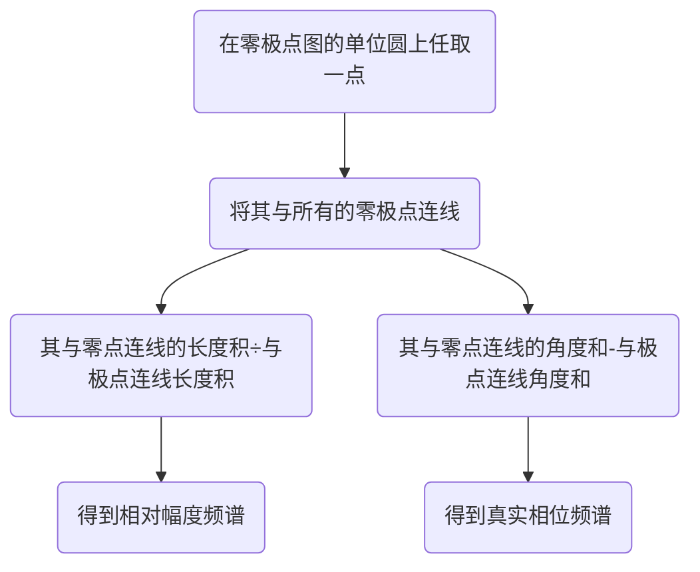
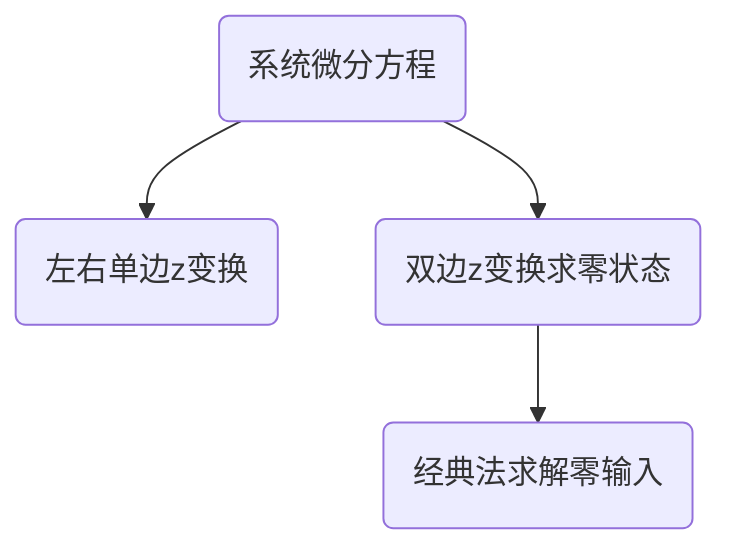

# Z变换
[[3.傅里叶变换]]
[[1-16无穷级数]]z变换就属于一种无穷级数

在用变换推导公式时，无论什么变换一定是对于所有变量而言的
实信号的极点是共轭出现的
z变换为卷积“多项式乘法”提供理论依据

## Z变换的定义
$$
\begin{align*}
&F(z)=\sum\limits_{n=-\infty}^{+\infty}f[n]z^{-n}\\
&f[n]=\frac{1}{ 2 \pi j}\oint F(z)z^{n-1}dz
\end{align*}
$$
### 收敛域
z变换引入了收敛域的概念，只有在收敛域内z变换才存在

右边信号：收敛域大于某个值
左边信号：收敛域小于某个值
双边信号：收敛域介于两个值之间
**当收敛域包含单位圆时，离散时间傅里叶变换存在，系统稳定。**
## Z变换性质
- 时同频异
$$
\begin{align*}
\\
&时移性质:f[n-n_{0}] \leftrightarrow z^{-n_0}F(z)
\\\\
&z域尺度变换:z_{0}^{n}f[n] \leftrightarrow F(\frac{z}{z_{0}})
\\\\
&时域反转特性:f[-n] \leftrightarrow F(\frac{1}{z})
\\\\
&时域展宽特性:f_{1}[n]\leftrightarrow F(z^N)
\\\\&f_1[n]=
\begin{cases}
f[\frac{n}{N}],&n为N的整数倍
\\
\\
0,&其他
\end{cases}\\
&
\\
&时域卷积特性:f[n]*h[n] \leftrightarrow F(z)H(z)
\\
\\
&时域差分:f[n]-f[n-1]\leftrightarrow (1-z^{-1})F(z)
\\
\\
&时域累加:\sum_{m=-\infty}^{n}f[m] \leftrightarrow 
\frac{1}{1-z^{-1}}F(z)
\\
\\
&z域微分性质:-nf[n] \leftrightarrow z\frac{dF(z)}{dz}
\\
\\
&初值定理:f[n_0]=\lim_{z \to \infty}[z^{n_0}F(z)],\quad f[n]=0,n<n_0
\\
\\
&终值定理:f[\infty]=\lim_{z \to 1}[(1-z^{-1})F(z)],
\quad (1-z^{-1})F(z)收敛域包含单位圆
\end{align*}
$$

<mark style="background: #ADCCFFA6;">EXAMPLE</mark>
$$
\begin{align*}
&f[n]=\sum_{k=0}^{n}(-1)^k=\{(-1)^ku[n]\}*u[n]
\\\\
&u[n] \leftrightarrow \frac{1}{1-z^{-1}}  \quad |z|>1
\\
&(-1)^ku[n] \leftrightarrow \frac{1}{1+z^{-1}} \quad |z|>1
\\\\
&F(z)=\frac{1}{1-z^{-1}}\frac{1}{1+z^{-1}}=\frac{1}{1-z^{-2}} \quad |z|>1
\end{align*}
$$
## Z变换常用公式
$$
\begin{align*}
1 \leftrightarrow \delta[n] \quad  时域累加& \Rightarrow \frac{1}{1-z^{-1}} \leftrightarrow u[n]
\\
\\
\frac{1}{1-z^{-1}}  \leftrightarrow u[n]\quad z域尺度变换& \Rightarrow \frac{1}{1-az^{-1}}  \leftrightarrow a^{n}u[n]
\\
\\
\frac{1}{1-az^{-1}} \leftrightarrow a^{n}u[n]\quad 频域微分性质& \Rightarrow \frac{z^{-1}}{(1-az^{-1})^2} \leftrightarrow na^{n-1}u[n]
\\
\\
\frac{z^{-1}}{(1-az^{-1})^2} \leftrightarrow na^{n-1}u[n] \quad 时移特性& \Rightarrow \frac{1}{(1-az^{-1})^2} \leftrightarrow (n+1)a^{n}u[n+1] 
\\
\\
1 \leftrightarrow \delta[n] \quad  时移特性& \Rightarrow 
z^{-n_{0}} \leftrightarrow \delta[n-n_0]
\\
\\
\frac{1}{1-e^{j \Omega}z^{-1}} \leftrightarrow e^{j \Omega n}u[n] \quad 欧拉公式& \Rightarrow
\frac{1-cos(\Omega)z^{-1}}{1-2cos(\Omega)z^{-1}+z^{-2}}
\leftrightarrow cos(\Omega n)u[n]
\\
\\
\frac{1}{1-e^{-j \Omega}z^{-1}} \leftrightarrow e^{-j \Omega n}u[n] \quad 欧拉公式& \Rightarrow
\frac{sin(\Omega)z^{-1}}{1-2cos(\Omega)z^{-1}+z^{-2}}
\leftrightarrow sin(\Omega)u[n]
\end{align*}
$$

### 左边信号的z变换
$$
\begin{align*}
&利用时域反转特性将右边信号转换为左边信号
\\
&f[-n] \leftrightarrow F(\frac{1}{z})
\\
&u[n] \leftrightarrow \frac{1}{1-z^{-1}} \Rightarrow u[-n] 
\leftrightarrow \frac{1}{1-z} 
\\
&u[-n] \leftrightarrow \frac{1}{1-z} 
\Rightarrow
u[-u-1] \leftrightarrow \frac{1}{z^{-1}-1} 
\\\\
&\begin{cases}
u[n] \leftrightarrow \frac{1}{1-z^{-1}}  &|z|>1
\\\\
u[-u-1] \leftrightarrow -\frac{1}{1-z^{-1}}  &|z|<1
\end{cases}
\end{align*}
$$

## Z逆变换求解
### 部分分式分解法
不知道怎么回事，我z变换总是分不明白
其实和拉斯变换流程一样，只不过要加上一步，先对等式两边同除z，再去因式分解
<font color = red>2022.11.4回顾，不用先除z，z变换全改用z负幂次方</font>
2023.4.16再回顾，我记得这讲的什么意思，就是说太复杂了，一时半会说不明白。除z是由于使用正幂次带来的结果，后面H(z)的表示我都采用负幂次就没这个问题了。
### 长除法
$$
\begin{align*}
&F(z)=\sum_{n=-\infty}^{\infty}f[n]z^{-n}
\\
\\
&F(z)=…f[-n]z^{n}+…f[-1]z+f[0]+f[1]z^{-1}+…f[n]z^{-n}…
\end{align*}
$$
可以看到如果我们使用长除法将F(z)写成了一堆关于z的幂次表达式，则其前系数与函数值是一一对应的，对于有限值点的求解将十分便捷。
#### 不同情况下的长除
- 右边信号：将被除数和除数写做降幂形式
- 左边信号：将被除数和除数写做升幂形式

<mark style="background: #ADCCFFA6;">EXAMPLE</mark>
$$
\begin{align*}
&右边序列f[n]的z变换F(z)为:F(z)=\frac{2z^{-7}+z^{-3}-4z^{-2}+1}
{z^{-6}-2z^{-4}+z^{-3}}
\\
&求n<0时信号f[n]的值。用初值定理验证所求信号初值是否正确
\end{align*}
$$
<mark style="background: #FFB8EBA6;">answer</mark>
$$
\begin{align*}
&右边序列降幂长除:得到f[-3]=1 \quad f[-2]=2
\\
&初值定理:f[n_0]=\lim_{n \to \infty}z^{n_0}F(z)
\end{align*}
$$


## LTI离散时间系统的z域描述
````mermaid
graph LR
A("差分方程")-->B("系统函数H(z)")-->C("冲激函数h[t]")-->D("零极图")-->E("系统框图")
B-->A
C-->B
D-->C
E-->D
````
### 从z域来看系统的性质
**因果性：** 从零极图上看，收敛域位于离原点最远的圆外平面（必要条件）
**稳定性：** 从零极图上看，收敛域包含单位圆 （充要条件）
**可逆性：** H(z)H(z)^(-1)=1
### 用零极图来推测频谱图
前提：当收敛域包含单位圆时，即系统稳定时，频率响应H(Ω)存在
$$
H(\Omega)=H(z)\big|_{z=e^{j\Omega}}
$$

区别，这是离散系统的频谱信息，画频谱图时注意从“单位圆最右侧与实轴交点θ=0开始，绕圈到θ=pi”
对于幅度频谱：偶对称
相位频谱：奇对称
只需要画出[-pi,pi]区间的图像即可，因为其以2pi为周期

### 全通系统
零极点关于单位圆镜像对称，零极点成共轭倒数关系
### 最小相位系统
零极点都位于单位圆内部
## 单边Z变换
$$
\begin{align*}
F(z)=&\sum_{n=0}^{\infty}f[n]z^{-n}
\\
\\
f[n]=&\{\frac{1}{2 \pi j}\oint F(z)z^{n-1}dz\}u[n]
\\
\\
时移特性：&
\\
\\
f[n-n_0]\leftrightarrow& z^{-n_0}F(z)+f[-n_0]+z^{-1}f[-n_0+1]+……+z^{-n_0+1}f[-1]
\\
\\
f[n+n_0]\leftrightarrow& z^{n_0}F(z)-z^{n_0}f[0]-z^{n_0-1}f[1]-……-zf[n_0-1]

\end{align*}
$$
## Z变换求解LTI系统响应

### 复指数信号的LTI响应
$$
\begin{align*}
x[n]=&z_0^{n}
\\\\
y[n]=&
\begin{cases}
z_0^{n}H(z_0) &z_0位于H(z)收敛域内
\\
\\
\\
不存在  &z_0不在H(z)收敛域内
\end{cases}
\end{align*}

$$

## LTI系统的框图描述
[[5.拉斯变换#LTI系统的框图描述]]

