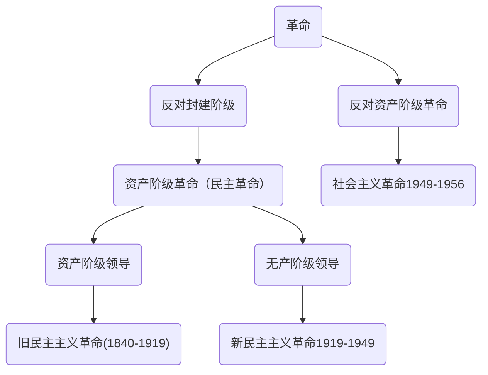

# 毛中特
![[Pasted image 20220829123656.png]]
# 毛泽东思想
## 形成条件
	历史条件：战争年代的国际背景
	实践基础：革命与建设
	过程：
		1.开始形成标志：农村包围城市，武装夺取政权理论的阐述
		2.成熟的标志：新民主主义革命理论的系统阐述（时间：遵义会议-抗战）
		3.进一步发展：解放战争时期和新中国成立之后
## 活的灵魂
	1.实事求是：思想路线的核心、毛泽东思想的精髓
	2.群众路线：党的生命线和根本工作路线，党永葆青春活力和战斗力的重要传家宝
	3.独立自主：我们党全部理论和实践的立足点
## 意义与评价
	1.马克思主义中国化第一次飞跃/第一个重大理论成果
	2.中国革命和建设的科学指南
	3.党的集体智慧结晶、党和国家的指导思想
	4.核心为实事求是的思想路线，根据是马克思主义
## 内容
	1.新民主主义革命理论
	2.社会主义改造理论
	3.社会主义建设道路初步探索的理论成果

### 新民主主义革命的总路线
	毛泽东领导
	新民主主义革命实质就是党领导下的农民革命
	1939《中国革命和中国共产党》第一次提出
	1948《在晋绥干部会议上的讲话》完整表述
	分清敌友是革命首要问题
##### 革命对象-敌人
	1.帝国主义
	2.封建主义
	3.官僚资本主义
**不同历史阶段革命对象有所不同**
![[新民主主义革命的对象.jpg]]
##### 革命动力-朋友
	1.无产阶级-最基本动力
		半殖半封后最早出现的新社会阶级
		领导力量
	2.农民阶级-革命主力军
		农民问题是中国革命的基本问题
		新民主主义革命实质就是党领导下的农民革命
	3.城市小资产阶级-可靠同盟者
	4.民族资产阶级-动力之一
		经济上保护、政治上争取
		又斗争又联合

##### 革命的领导力量
	1.无产阶级的领导权是中国革命的中心问题，也是新民主主义革命理论的核心问题
		 区别新旧民主革命的根本标志就是看领导阶级
	2.中国无产阶级的特点和优点
		a.受三座大三压迫，革命性强
		b.分布集中，有利于革命思想的传播
		c.大部分是破产农民，有利于结成联盟
	3.领导权是争取来的
		a.向着共同敌人作坚决斗争，取得胜利
		b.对被领导者给予物质福利，至少不损害其利益
		c.关键：建立以工农联盟为基础的统一战线

##### 区分革命性质

###### 新民主主义与旧民主主义革命相比特点
	1.时代处于世界无产阶级社会主义革命时代
	2.中国共产党领导
	3.指导思想是马列
	4.革命前途是社会主义

###### 新民主主义和社会主义革命
	新民主主义属于资产阶级民主主义革命，社会主义革命是无产阶级革命
	新民主主义：推翻封建帝国官僚资本
	社会主义：消灭资本主义剥削制度，改造小生产私有制
	新民主主义+社会主义=中国革命

###### 中国革命分两步走
	新民主主义与社会主义革命相互联系
		1.民主主义革命是社会主义革命的必要条件
		2.社会主义革命是民主主义革命的必然趋势

#### 新民主主义的基本纲领
	1940年《新民主主义论》阐述了新民主主义的政治、经济和文化
	1945年《论联合政府》将其与党基本纲领联系起来，经行了具体阐述

##### 新民主主义的政治纲领
	建立无产阶级领导的、以工农联盟为基础的、各革命阶级联合专政的新民主主义的共和国
	国体：各革命阶级联合专政
	政体：民主集中制的人民代表大会
##### 新民主主义的经济纲领
	1.主要内容：没收封建地主阶级土地归农民所有---个体经济
	2.应有之义：没收官僚资本归新民主主义国家所有---国营经济
		双重性质：
			新民主主义革命性质
			社会主义革命性质
	3.极具特色：保护民族工商业，非无条件---私人资本主义经济

##### 新民主主义的文化纲领
	1.民族的
		内容：主张中华民族的尊严和独立
		形式：中国作风和中国气派
	2.科学的
		反对一切封建思想和迷信思想
		传统文化剔除糟粕、取其精华
	3.民主的-人民大众的
	
#### 新民主主义革命的道路
	文章：逐步形成农村包围城市的革命道路
	《中国红色政权为什么能够存在？》
	《井冈山的斗争》
	《星星之火，可以燎原》
	六届六中全会：先占乡村，后取城市，最后夺取全国胜利的革命道路

##### 道路形成必然性
	具体国情
		1.内无民主受封建、外无独立受帝国
		2.农业大国，农民占全国人口的绝大多数
	特殊国情
		1.根本原因：社会政治经济发展极端不平衡
		2.客观条件：全国革命形势的继续向前发展
		3.坚强后盾：相当力量正式红军的存在
		4.主观条件：党的领导的有力量及其政策的不错误
		5.革命的群众基础好	

##### 革命道路的内容
	根本在于处理好的土地革命、武装斗争、农村革命根据地建设之间的关系
	基本内容：土地革命
	主要形式（有利保证）：武装斗争
	依托：革命根据地
#### 新民主主义革命的经验-三大法宝
	《<共产党人>发刊词》提出：统一战线、武装斗争、党的建设

##### 统一战线
	原因：
	1.阶级状况
	2.中国革命长期性质
	3.诸多矛盾
	经验：
	1.最根本：处理好同资产阶级关系，既斗争又联合
	2.建立巩固工农联盟
	3.采用区别对待，发展进步势力、争取中间势力、孤立顽固势力
	4.坚持独立自主

##### 武装斗争
	中国革命的特点和优势
	坚持党对军队的绝对领导
		1.建设新型人民军队的根本原则
		2.保持人民军队无产阶级性质和建军宗旨的根本前提
		3.毛泽东思想的核心
	人民军队必须以全心全意为人民服务为唯一宗旨
	坚持正确的战略战术原则

##### 党的建设
	1.必须把思想建设始终放在党的建设的首位
	2.根本的是要贯彻民主集中制这一根本组织原则
	3.必须重视党的作风建设
	关键要求：以无产阶级思想克服和改造各种其它思想
	区别我党与其他政党的显著标志：三大优良作风
		a.理论联系实际
		b.密切联系群众
		c.批评与自我批评
	区别我党与其他政党的根本标志：人民
	区别我党与其他政党的最显著标志：自我革命 

#### 新民主主义革命理论的意义
	1.理论意义 
		马克思主义中国化（马克思主义内在要求）
		毛泽东思想
	2.实践意义
		推翻了三座大山，彻底结束了旧中国半殖民地半封建社会的历史
		为实现民族伟大复兴创造了根本社会条件

### 社会主义改造阶段
	时间：1949-1956（新民主主义社会时期/社会主义革命时期）
	确定社会主义制度：在经济基础上要求变一切私有制为公有制
	1949-1952：完成民主遗留任务和恢复国民经济
	1953-1956：
		社会主义三大改造-基本确立公有制
		进行工业化，基本确立比较完整独立的国民经济体系和工业化体系
	1956：基本确立社会主义制度

#### 新中国成立
##### 新中国成立初期现状
	1.解放全中国任务没有完成
	2.经济十分落后
	3.以美为首的西方资本主义对华政策强硬
	4.中国共产党能不能经受住执政的考验

##### 完成民主革命的遗留任务
	1.军事上：追缴国民党
	2.政治上：给人们民主权利
	3.经济上：
		1950-1953土改《中华人民共和国土地改革法》
		发展农业生产、为新中国工业开辟道路
		保存富农经济政策
		规模最大、做的最好的一次土改
	4.文化上：废除封建婚姻制度

##### 恢复和发展国民经济
	1950.6中共七届三中全会：中心任务：三年时间争取国家财政经济基本好转
	没收官僚主义，恢复国营经济

##### 维护国家主权和安全
	废除不平等条约，签订《中苏友好同盟条约》
	“另起炉灶”、“打扫屋子再请客”、“一边倒”
	1950年抗美援朝

##### 加强党的自身建设
	“三反”-反贪污、反浪费、反官僚主义
	“五反”

##### 为社会主义改造创造条件
	1.没收官僚资本，确定社会主义国营经济的领导地位
	2.开始将资本主义纳入国家资本主义轨道
	3.引导个体农民在土改之后逐步走上互助合作的道路

#### 社会背景
	新民主主义社会
	是阶级社会
	经济成分:
		1.国营经济（比重小，但居于领导地位）
		2.私人资本主义经济
		3.个体经济（十字路口经济，占绝对优势）
		4.国家资本主义经济（私人->国营）
		5.合作社经济（个体->集体）
	主要矛盾：
		随着土改完成，工人阶级和资产阶级的矛盾成为主要矛盾
	特点：
		1.社会主义因素占主导地位，但非社会主义因素比重很大
		2.过渡性质，非独立，属于社会主义体系
		3.过渡关键：生产资料所有制变化（私有->公有）
		4.改造和建设并举

#### 过渡时期的总路线
	经过三年的努力，到1952年国民经济得以恢复，民主遗留任务完成
	一化三改：工业化与三大改造（一体两翼）
		实现社会主义工业化
		实现国家对农业、手工业、资本主义工商业的社会主义改造

![[Pasted image 20220904095238.png]]

##### 个体经济改造
	1.互助合作道路
	2.自愿互利、典型示范、国家帮助原则
	3.坚持积极领导、稳步前进的方针

##### 资本主义工商改造
	和平赎买：不是支付补偿金而是允许一定年限获得利润
	原因：
		1.民族资产阶级具有两面性
		2.中国共产党与民族资产阶级长期保持着统一战线的关系
		3.国营经济已经掌握经济命脉，对粮食和工业原材料实现统购统销
	表现：委托加工、计划订货、统购包销、经销代销
#### 社会主义改造的历史经验
	1.坚持社会主义工业化建设与社会主义改造同时并举
	2.积极引导、逐步过渡
	3.和平方式-和平赎买

#### 确立社会主义制度
	时间：1956年
	确立社会主义制度-进入社会主义初级阶段
	意义：
		1.阶级剥削制度结束--广大农民翻身做主
		2.最深刻最伟大的社会变革，为中国特色社会制度的创新和发展提供了重要前提
		3.极大促进了我国社会生产力的发展
		4.实现了中华民族由不断衰落到扭转命运、持续走向繁荣富强的伟大飞跃
		5.丰富和发展科学社会主义的理论与实践

### 社会主义建设道路初步探索的理论成果
#### 《论十大关系》
	时间：1956年
	基本方针：调动国内外一切积极因素，为社会主义服务
	第一大关系：重工业、轻工业和农业的关系。农业为基础、工业为指导。农轻重顺序
	口号：向外国学习，“两条腿走路”
	以苏为鉴
	提出马克思主义与中国实际的“第二次结合”
	意义：
		标志着中国自己开始探索社会主义建设道路
		为中共八大召开作了理论准备

#### 《关于正确处理人民内部矛盾的问题》
	内容：
		1.社会主义仍然存在矛盾
		2.基本矛盾：生产力与生产关系，经济基础与上层建设
		3.性质：非对抗性、可以在社会制度内自我解决
		4.明确提出走一条有别于苏联的中国工业化道路
		5.两种矛盾：
			敌我矛盾（对抗性的）--用专政的方法解决
			人民内部矛盾（非对抗性）--民主的方法解决
			可以相互转换
	具体表现
		政治思想领域：团结--批评--团结
		物质利益分配：统筹兼顾、适当安排
		科学文化领域：百花齐放、百家争鸣
		党派矛盾领域：长期共存、互相监督

#### 插叙-党的会议
##### 党的N大
	党的第N次全国代表大会
		一大，二大，三大--1921，1922，1923
		七大、八大--1945，1956
		十二大--1982.之后每隔五年开一届
		
	党的N届n中全会
		由全国代表大会选取出的一部分人参会--每年一届
		三中--经济相关
		四中--政治相关
		五中--社会相关
		六中--党建或文化	
	
  #### 中共八大
	  主要矛盾：人民对于经济文化迅速发展的需要同当前经济文化不能满足人民需要的状况之间的矛盾；先进的工业国与落后的农业国之间的矛盾。
	  
	  主要任务：集中力量发展社会生产力，实现国家工业化，逐步满足人民日益增长的物质和文化需要
	  
	  根本任务：在新的生产关系下保护和发展生产力
	  经济建设：既反保守又反冒进，即在综合平衡中稳步前进的方针
	  政治建设：有法可依、有法必依
	  执政建党：提高全党马列水平，健全民主集中
	  三个主体，三个补充

   
### 毛和中特的对比
时代背景决定了：毛<---->革命、建设    中特<---->改革
	
![[毛与中特的关系表.png]]

### 一些会议

| 时间               | 会议名         | 文件名                                 | 意义                                                                         |     
| ------------------ | -------------- | -------------------------------------- | ---------------------------------------------------------------------------- | 
| 1927年大革命失败后 |                | 《红色政权》、《井冈山》、《星星之火》 | 1.初步形成农村包围城市的革命道路理论2.前两个提出“工农武装割据”思想           |     |     |
| 1938年             | 6届6中全会     | 《论新阶段》                           | 1.最先提出马克思主义中国化，2.先占乡村，后取城市，最后夺取全国胜利的革命道路 |     |     |
| 1939年             |                | 《中国⾰命和中国共产党》               | ⽑泽东第⼀次提出新⺠主主义⾰命的科学概念和总路线                             |     |     |
| 1940年             |                | 《新民主主义论》                       | 阐述了新民主主义的政治、经济、和文化                                         |     |     |
| 1945年             | 党七大         | 《论联合政府》                         | 进一步把新民主主义的政治、经济和文化与党基本纲领联系起来                     |     |     |
| 1948年4⽉          |                | 《在晋绥⼲部会议上的讲话》             | 对新民主主义革命的总路线作了完整概述，增加了官僚资本主义作为革命对象         |     |     |
| 1956年             |                | 《论十大关系》                         | 标志着中国自己开始探索社会主义建设道路                                       |     |     |
| 1957年             |                | 《关于正确处理人民内部矛盾的问题》     | 明确提出走一条有别于苏联的中国工业化道路                                     |     |     |
| 1978年             | 十一届三中全会 |                                        | 彻底“两个凡是”等，揭开了社会主义改革开放的序幕                               |     |     |
| 1979年             | 十一届六中全会 | 《关于建国以来党的若干历史问题的决议》 | 标志着党和国家在指导思想上拨乱反正胜利完成                                   |     |     |
| 1981年             | 11届6中全会    | 《关于建国来党的若干历史问题的决议》   | 1.指出毛活的灵魂2.系统概括毛思想                                             |     |     |
| 1982年             | 12大           |                                        |                                                                              |     |     |

# 邓三科
## 形成条件
![[Pasted image 20220907083901.png]]
## 形成会议
	真理标准问题：
		继五四运动和延安整风运动之后又一场马克思主义思想解放运动
		实质：在于是不是坚持马列主义、毛泽东思想

	《解放思想，实事求是，团结一致向前看》：为重新确定党的思想路线奠定了基础，成为开辟中特的宣言书
	十一届三中全会：
		冲破长期“左”的错误的严重束缚，彻底否定两个凡是
		否定“以阶级斗争为纲”的指导思想
		揭开了社会主义改革开放的序幕	
		历史事件与社会关系的拨乱反正
		
	十一届六中全会：
		《关于建国以来党的若干历史问题的决议》
		标志着党和国家在指导思想上拨乱反正的胜利完成

	党的十二：
	时间：1982年
	“中国特色社会主义”成为我们党的全部理论和实践的主题

	十二届三中全会
	时间：1984年
	《关于经济体制改革的决定》
		提出了社会主义经济是公有制基础上的有计划的商品经济

	党的十三大：
	时间：1987年
	第一次比较系统的论述了我国社会主义初级阶段理论
	是我们党第一次对中国特色社会主义理论进行系统的概述
	标志着邓小平理论轮廓的形成

	南方谈话：
	时间：1992年
	社会主义的本质：解放生产力，发展生产力，消灭剥削，消除两极化，最终达到共同富裕
	是邓小平理论的集大成之作，标志着邓小平理论逐步走向成熟
## 主要内容
### 首要的基本问题
	什么是社会主义，怎样建设社会主义
	关键：在坚持社会主义基本制度的基础上进一步认清社会主义的本质

### 邓小平理论的精髓
	解放思想，实事求是的思想路线是邓小平理论的活的灵魂

### 评价
	1.是马克思列宁主义、毛泽东思想的继承和发展
	2.是中国特色社会主义理论体系的开篇之作
	3.是改革开发和社会主义现代化建设的科学指南

# 习特色
![[Pasted image 20220909093409.png]]
## 进入新时代

### 创立的社会历史条件
	1.大变局
	2.新时代
	3.民族复兴 

### 新时代中国现状
#### 矛盾的转移
	人民日益增长的美好生活需要和不平衡不充分的发展之间的矛盾
	不平衡不充分的发展是制约我国发展和人民日益增长的美好生活需要的主要根源

#### 三个没有改变
	1.没有改变我们的历史阶段
	2.我国仍长期处于社会主义初级阶段的基本国情
	3.没有改变我国是最大发展中国家的国际地位

### 世界正经历百年未有之大变局
	1.世界百年未有大变局加速演变
	2.中国成为世界格局演变的主要推动力量
	3.大变局带来大挑战，也带来大机遇

### 正处于关键时期
	1.中国共产党是实现中华民族伟大复兴的根本保证
	2.中华优秀传统文化是中华民族的根和魂，是中国特色社会主义植根的文化沃土
	3.中华民族伟大复兴正处于关键时期，中国共产党和中国人民迫切需要凝心聚力、谋篇布局、攻坚克难的科学理论

 

## 内容
### 核心要义
	坚持和发展中国特色社会主义
### 十个明确+十四个坚持
	十个明确
		重要讲怎么看，回答的是新时代坚持和发展什么样的中特
		是最重要、最核心的内容
	十四个坚持
		重要讲怎么办，回答的是新时代怎样坚持和发展中特
		行动纲领

## 思想的历史地位
	1.实现了马克思主义中国化的新飞跃
	2.实现中华民族伟大复兴的行动指南
	3.建设美好世界的中国智慧和中国方案
	4.理解“两个确立”的重大意义

![[Pasted image 20220909102026.png]]

## 坚持和发展中特的总任务
### 中国梦
	中国梦=2050=21世纪中叶=建国100年=中华民族伟大复兴=社会主义现代化强国

### 中国梦的科学内涵
	本质：国家富强、民族振兴、人民幸福
	是中华民族团结奋斗的最大公约数
	最大特点：把国家民族个人作为一个命运共同体
	主体：人民
	决定性因素：各族人民团结的力量
	人民：
		根本出发点和落脚点
		根本归宿
		根本立场
		根本宗旨
		一根红线
	根本保障永远对应党！！！

![[Pasted image 20220910095856.png]]

### 建成社会主义现代化强国战略安排
	2020：已经实现小康社会
	2020-2035：基本实现社会主义现代化 
		k1:关键核心技术实现重大突破、进入
		k2：生态环境根本好转
		k3：全体人民共同富裕取得更为明显的实质性进展
		k4：实现质量和效益根本转变
	2035-2050：社会主义现代化强国
	    全和高度有关  
	    
![[Pasted image 20220910102440.png]]

### 习近平经济思想三新
#### 新发展阶段
	新发展阶段-2020年
	总体上仍是不发达-初级阶段-不平衡不充分
	理论依据：马克思主义远大理想和显示目标相结合，历史必然性和发展阶段性相统一的统一论者
	历史依据：是我们党带领人民迎来从站起来、富起来到强起来历史性跨越的新阶段
	现实依据：我们已经拥有开启新征程、实现新的更高目标的雄厚物质基础

![[Pasted image 20220911093243.png]]

#### 新发展理念
##### 内涵
	1.创新：第一动力
		摆在国家发展全局核心位置
		引领经济新常态的根本之策
		现代化经济体系的战略支撑
	2.协调：持续健康发展的内在要求
		解决发展不平衡问题
	3.永续：降碳为重点战略方向
	4.开放：国家繁荣发展的必由之路
		全面开放是国家繁荣发展的根本出路
	5.共享：坚持共享发展是中国特色社会主义的本质要求
		全民共享：人人享有
		全面共享：经济、 政治、文化、生态、社会
		共建共享：大家一起搞
		渐进共享：需要一个过程

##### 完整、准确、全面贯彻新发展理念
	从根本宗旨把握新发展理念-人民
	从问题导向把握新发展理念
	从忧患意识把握新发展理念

![[Pasted image 20220912103108.png]]
#### 新发展格局
	定义：主动的战略举措、抉择、先手棋
	关键：经济循环畅通无阻
	主线：必须坚持供给侧结构性改革
	本质特征：高水平的自立自强
	战略基点：扩大内需
	
![[Pasted image 20220913084421.png]]
#### 三新之间关系
	新发展阶段：历史方位--现实依据
	新发展理念：指导原则--行动指南
	新发展格局：路径选择--战略选择
	
![[Pasted image 20220911094842.png]]

### 五位一体总布局
#### 实现经济高质量发展-主题
	原因：
		1.保持经济持续健康发展的必然要求
		2.适应我国社会主要矛盾变化的必然要求
		3.遵循经济规律发展的必然要

##### 习近平经济思想
	评价：
		1.取得历史性成就、发生历史性变革
		2.是我国经济发展实践的理论结晶
		3.是中国特色社会主义政治经济学的最新成果
		4.开拓了马克思主义政治经济学新境界
		5.中国经济持续健康发展提供了科学指南
	主要内容：
		1.坚持加强党对经济工作的集中统一领导
			中心工作：经济工作
		2.坚持以人民为中心的发展思想
			党的奋斗目标：人民对美好生活的向往
		3.坚持适应把握引领经济发展新常态--追求质量，创新是根本之策
		4.坚持使市场起绝对作用（全部作用×）更好发挥政府作用。
			关键：处理好政府和市场关系 
		5.主要矛盾已转化成结构性问题，矛盾主要方面在供给侧，主要体现在供给侧不能适应需求结构的变化
			经济工作的主线：推进供给侧改革
			 
		6.坚持问题导向部署经济发展新战略
		7.坚持正确工作策略和方法，坚持稳中求进工作总基调
**公有制与私有制**
![[Pasted image 20220914092725.png]]

**社会主义基本经济制度**
	![[Pasted image 20220914085703.png]]

**重要主题**
![[Pasted image 20220914091721.png]]
**基本经济制度的理解**
![[Pasted image 20220914092454.png]]

**混合所有制**
![[Pasted image 20220914092904.png]]
 
**供给侧改革**
![[Pasted image 20220915094813.png]]

![[Pasted image 20220914084402.png]]

##### 现代化经济体系
![[Pasted image 20220915095357.png]]

#### 发展社会主义民主政治
##### 坚持中国特色社会政治发展道路
	是历史逻辑、理论逻辑、实践逻辑的必然结果
	是坚持党的本质属性、践行党的根本宗旨的必然要求
	第一：
		必须坚持党的领导、人民当家作主、依法治国
		党的领导是人民当家作主（社会主义民主政治的本质要求）的根本保证
		依法治国是党领导人民治理国家的基本方式
	第二：
		必须坚持正确的政治方向
	第三：
		必须深化机构和行政体制改革	

##### 健全人民当家做主制度体系
	人民代表大会制度是我国根本政治制度
		对应一切第一梯度的k
	人民行使国家权力的机关：
		1.全国人民代表大会
		 2.地方各级人民代表大会

	基本政治制度：
		1.中国共产党领导的多党合作和政治协商制度
			执政党：中国共产党；参政党：民主党派
			首要前提和根本保证：中国共产党的领导
			核心内容：多党合作
			基本方针：长期共存、相互监督、肝胆相照、荣辱与共
			主要职能：政治协商、民主监督、参政议政
			统一战线组织、协商机构
			两大主题：团结和民主
			区别：
				协商民主：民主形式，任何时候都有。特有形式、独特优势
				政协制度：政党制度
				人民政协：专门的协商机构，不是国家机关
		
		2.民族区域自治制度
			是中国特色解决民族问题正确道路的重要内容和制度保障
			没有高度自治
			核心：保障少数民族当家作主
			原则：反对分裂、坚持平等、团结、共同繁荣

		3.基层群众自治制度
			是社会主义民主政治建设的基础
			自我管理、自我服务、自我教育、自我监督
			最广泛的民主
			直接行使民主权利

	全过程人民民主
		相统一：完整的制度程序，完整的参与实践
			过程民主--成果民主
			程序民主--实质民主
			直接民主--间接民主
			人民民主--国家意志
		全链条、全方位、全覆盖	
		最广泛、最真实、最管用
		重要载体：人民代表大会制度
	
	巩固和发展爱国统一战线
		四者：
		·全体社会主义劳动者
		·社会主义建设者
		·拥护社会主义的爱国者
		·拥护祖国统一和致力于中华民族伟大复兴的爱国者
		中华民族共同体意识
		主题：大团结大联合
		宗教中国化

![[Pasted image 20220917104210.png]]
![[Pasted image 20220917104651.png]]

##### 一国两制
![[Pasted image 20220918101220.png]]

#### 建设社会主义文化强国
	意识形态工作--为国家立心，为民族立魂
	文化自信来源于:
		·生机勃勃的社会主义先进文化
		·激昂向上的革命文化
		·博大精深的中华优秀传统文化
		·中国特色社会主义伟大实践
	 要创造性转化和发展
	 中华民族的“根”和“魂”
	 战略任务-基本途径-重要任务：讲好中国故事

#### 加强以民生为重点的社会建设
 	发展是解决我国一切问题的基础和关键
	 加强和创新社会治理
		 完善党委领导、政府负责、民主协商、社会协同、公众参与、法制保障、科技支撑的社会治理体系
		 建设人人有责、人人尽责、人人享有的社会治理共同体，实现社会共建共治共享
		 
![[Pasted image 20220919085856.png]]

#### 坚持习近平生态文明思想
![[Pasted image 20220919091308.png]]

### 四个全面战略布局
	全面深化改革、全面依法治国、全面从严治党是三大战略举措
		具有突破性和先导性的关键环节：全面深化改革
		法治保障：全面依法治国
		根本保证：全面从严治党
	关于脱贫攻坚：区域性整体贫困得到解决；完成了消除绝对贫困的任务

	中国社会主义现代化国家的基本特征
		区别西方：
			1.打破了只有遵循资本主义现代化模式才能实现现代化的神话
			2.克服了资本主义现代化所固有的弊端
			3.提供了现代化的全新选择，展现了人类社会现代化的光明前景

		五个特征：
			1.人口规模最大的现代化
			2.全体人民共同富裕的现代化
			3.物质文明和精神文明相协调的现代化
			4.人与自然和谐共生的现代化
			5.走向和平发展道路的现代化
