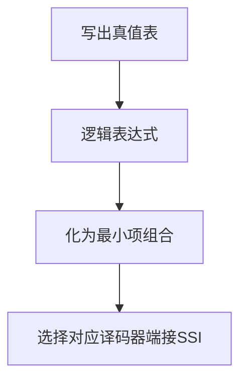
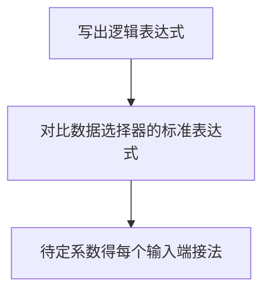

![[Pasted image 20230301212705.png]]
$$
\newcommand{\overline}{\overset{\mathbf{\_\_}}}
$$
## 组合逻辑的分析和设计
组合逻辑电路分析方法：
逐级写出逻辑表达式->卡诺图化简->列出真值表->由真值表分析电路功能

如果门电路的输入端有圆圈意思是对其进行取反

组合逻辑电路设计方法：
选用变量的0,1状态去描述事件->写出真值表->化简得表达式-->按题目要求门电路转化表达式-->画出逻辑电路图

在组合逻辑中，下标0代表二进制最低项。$A_3A_2A_1A_0$ 
画组合逻辑波形图的时候，考虑可能出现的门电路时延

### 编码器
- 优先编码器（74HC148）$I'_7,I'_6,I'_5 \cdots$优先级依次降低
芯片引脚：
- 编码数据输入引脚
- 编码数据输出引脚
- EI：使能引脚
- GS:无编码信号输出引脚
- EO：有编码信号输出引脚
![[Pasted image 20230307153005.png|300]]

### 译码器
- 3-8译码器(74138)
- 2-4译码器(74139)
- 二-十进制译码器（8421码译码器）
- 显示译码器

#### 3-8译码器
- 输出低电平有效译码器（74HC138），输出端均为最小项取反
- 基于译码器实现逻辑函数，先将逻辑函数变换为最小项之和的形式，译码器输入和变量，输出接部分门电路
- 可实现任意逻辑表达式

芯片引脚：
- 三个片选：$G_1,G_A,G_B$都是片选，只有当其为100时，芯片才运作，引脚用于拓展
![[Pasted image 20230307153815.png|200]]
### 2-4译码器
![[Pasted image 20230313182220.png|150]]

#### 二-十进制译码器
设计方法：
- 风险最小：采用4-16进制译码器
- 成本最小：将不会出现的6个码字当无关项处理
利用 4-16 二进制译码器的前 10 个输出所实现的十进制译码器相比，与门数目没有改变，但与门的输入数共减少了 6+2×2=10 个。

### 数据选择器
- 数据选择器输出表达式：$Y=\sum_{i=0}^{2^n-1}{m_iD_i}$,其中$m_i$为地址最小项，$D_i$为输入数据
- 要清楚哪个是控制端，哪个是输入端。可以自己选择，实现的难度不一样
- 扩展位或者扩展数据输入端

芯片引脚
- 数据输入和数据输出
- 地址输入
- 使能引脚

![[Pasted image 20230303153904.png|500]]

![[Pasted image 20230308103610.png|200]]

### 加法器
- 四位的全加器（74LS283）
- 加法器可以通过补码实现减法功能，一路原码，一路取反得反码，低位进位为1,则可实现减法运算。

芯片引脚：
- 输入相加数据
- 低位进位
- 输出结果
- 输出进位
![[Pasted image 20230303154400.png|500]]
![[Pasted image 20230303154807.png|400]]

### 比较器
- 等值比较器和数值比较器
![[Pasted image 20230315191322.png|200]]

## 竞争-冒险：
- 冒险可分为静态冒险和动态冒险，静态冒险又可分为静态 1 型冒险和静态 0 型冒险。
- 静态 1 型冒险是指基于电路功能的稳态分析，期望输出保持稳态 1 时，电路的输出有产生 0 尖峰的可能性。$(A+A')$
- 静态 0 型冒险是指当预期电路有静态 0 输出时却存在产生 1 尖峰的可能性。$(A\cdot A')$
- 卡诺图检查是否出现冒险，以及如何通过卡诺图修改消除冒险

原因：
- 由于门电路和连线之间的延迟，使得两个输入信号同时向相反逻辑电平跳变，成为竞争。由于竞争的出现，电路的输出端产生尖峰脉冲的现象称之为竞争-冒险。

判断方法：
1. 如果逻辑表达式在某种情况下出现如此情形，则说明存在冒险。$F=A+\overline{A},F=A\cdot\overline{A}$
2. 使用卡诺图化简表达式时，如果两个圈相切则有冒险现象存在。
3. 如果逻辑表达式是或与（最大项形式），可以转换为对偶求（其实直接画0就好了）

消除方法：
1. 修改逻辑表达式，增加冗余
2. 输出并联滤波电容，滤除毛刺
3. 引入选通脉冲，控制输出

### 卡诺图检查修改消除冒险
- 在卡诺图中，如果出现两个相邻的1单元，却从属于不同的圈，则变量在这两项之间变化时有冒险出现

- 消除冒险：重新圈1单元，使得任意相邻的1单元总是至少存在于一个圈中

MSI和SSI分别描述不同规模的集成电路器件¹：
- SSI（Small Scale Integration）是小规模集成电路，可以把少量（10个以内）的逻辑门或晶体管封装在一个芯片上。例如，基本的与门、或门、非门等都属于SSI。
- MSI（Middle Scale Integration）是中等规模集成电路，可以把几十到几百个逻辑门或晶体管封装在一个芯片上。例如，编码器、译码器、加法器、比较器等都属于MSI。

多功能函数发生器
- 指在不同控制下可以实现多种计算的电路

## 例题
### 门电路
用最少的门电路设计两位无符号二进制乘法器($P_3P_2P_1P_0=A_1A_0×B_1B_0$)。要求给出变量的卡诺图和输出变量的最简与或逻辑表达式，不必画出电路图。
- 列出$A_1A_0×B_1B_0$的16种情况

### 3-8译码器
#### 3-8译码器实现三位逻辑表达式
- 因为74138的输出恰好是最小项(CBA)的反，所以我们可以通过译码器设计逻辑电路
![[Pasted image 20230313181315.png|600]]

#### 3-8译码器实现四位逻辑表达式
利用一片74\*138和一个或非门实现逻辑函数$F(ABCD)=\sum(1,4,5,8,9,12)$
![[Pasted image 20230314161310.png|150]]
解：
$$
\begin{align*}
F&=A'B'C'D+A'BC'D'+A'BC'D+AB'C'D'+AB'C'D+ABC'D'
\\\\
&=C'\cdot \sum_{ABD}(1,2,3,4,5,6)=C'\cdot \prod_{ABD}(0,7)
\\\\
&输入:A=D,B=B,C=A,G_1=G_2=C'
\end{align*}
$$

### 加法器74×283
8421码转二进制
![[Pasted image 20230311165758.png|600]]
![[Pasted image 20230311165747.png|600]]

用 4 位二进制加法器 74×283 实现一个 4 位二进制加/减法器
![[Pasted image 20230316171135.png|400]]

### 7485+74283
使用一片 74×85（比较器）和一片 74×283（加法器）设计一个电路，将5421BCD码（X3X2X1X0）转换为余 3 码（Y3Y2Y1Y0）。
![[Pasted image 20230317140313.png|650]]
![[Pasted image 20230317140359.png|500]]

### 7485+74157
![[Pasted image 20230317140607.png|650]]
![[Pasted image 20230317140636.png|650]]

### 74151
- 卡诺图降维
利用74×151实现逻辑函数$F=\sum_{WXYZ}(0,1,3,7,9,13,14)$若用1片双4选1多路选择器 74×153 和部分门电路实现呢？
![[Pasted image 20230319161334.png|600]]

### 竞争与冒险
1. 先写出输出的逻辑表达式（与或式），如果是或与式，下一步画卡诺图则选0
2. 由逻辑表达式画出卡诺图，每个与或项对应一个圈
3. 检查画的圈是否有1单元相切但不从属于一个圈，则逻辑变量在这两个值之间变换时会出现冒险现象
4. 重新为卡诺图画圈，规避掉第3点的问题

![[Pasted image 20230313120937.png|500]]
