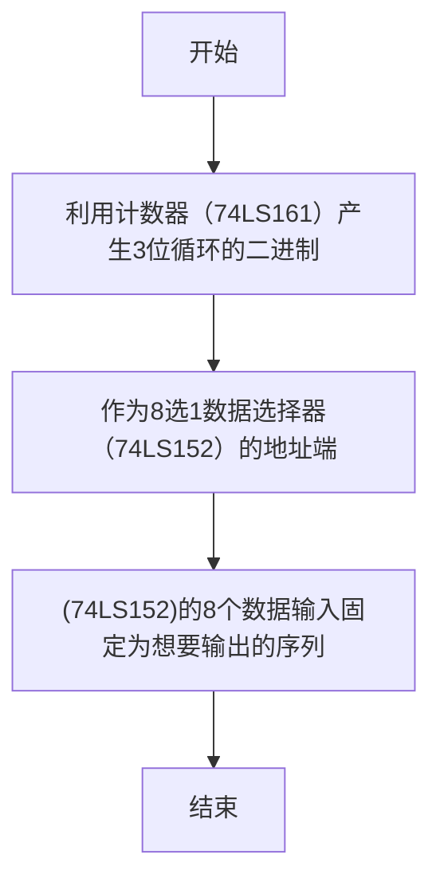
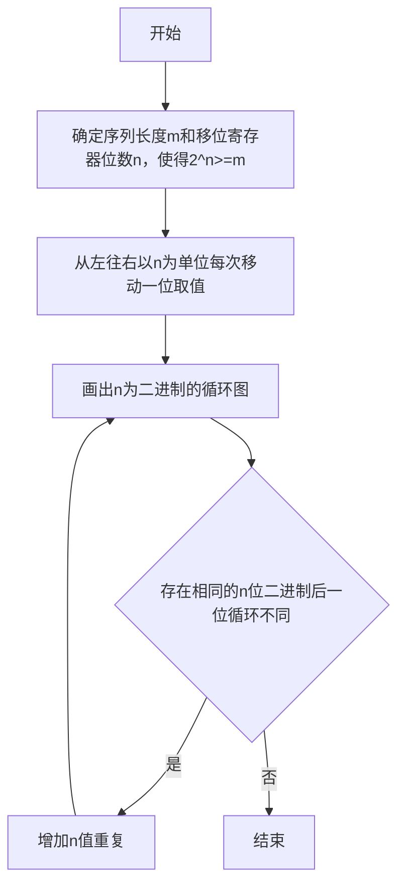
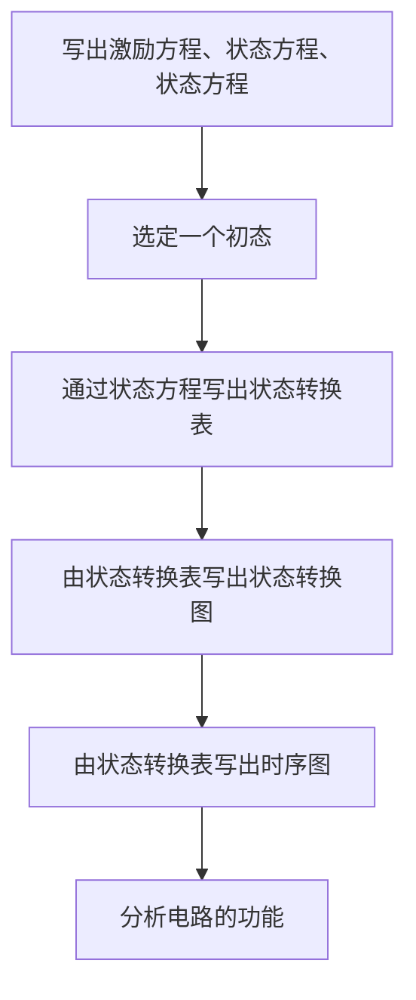
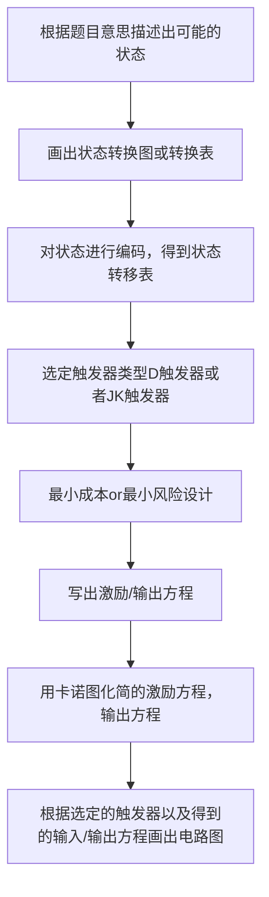

![[Pasted image 20230303151349.png]]

## 时序逻辑电路
### 种类：
- 米利（Mealy）：输出与输入变量有关
- 穆尔（Moore）：输出与输入变量无关
- Mealy与Moore的区别不在于是否有变量输入，他们都可以接收输入变量。区别是输出是否跟随输入改变。
- 实现同样功能的情况下，Mealy型电路状态数比Moore型少

### 描述序列电路的几种方法
- 方程描述
- 状态表
- 状态图
- 转换表/转移表==>（波形图）
#### 方程描述
驱动方程：触发器的输入
状态方程：将驱动方程带入触发器特性方程得到
输出方程：最终输出的逻辑表达式

#### 状态表
- 可以看到由于MOORE型的状态机输出Z与输入无关，所以可以单独列一行
![[Pasted image 20230305115618.png|300]]![[Pasted image 20230305115635.png|300]]

#### 转换表（或称为转移表）
对状态表中的状态A，B，C，D进行编码，如利用$Q_1Q_0$则可以描述出这四种状态用相应的数字编码去代替掉状态表中的状态==>即得到转换表/转移表
- 转换表可能没有输入、输出
![[Pasted image 20230305121244.png|250]]

#### 状态图
- 状态二义性：在各个状态下，画一张卡诺图逻辑变量为输入变量，图中标注为已知状态在输入下的次态
如果，这张卡诺图不全或者某个输入下有多个对应次态，则该状态具有二义性。
将转换表以流程图的形式显示出来==>状态图
左边为：Mealy      右边为：Moore
这是因为Moore的输出与输入无关，就可以直接将其写在圈中

![[Pasted image 20230305121458.png|700]]

## 常用时序逻辑电路
### 移位寄存器
- 移位寄存器的拓展
- 串并转换
- 计数器（环形计数器、扭环计数器、LFSR计数器）
- 可用D触发器，还有JK触发器、T触发器和SR触发器构成

74194引脚：
- 时钟、复位引脚
- 并行数据输入引脚
- 左右串行数据输入引脚
- 两个控制引脚
- 数据输出引脚

74HC194功能表

| R'  | S1   S0 | 工作状态 |
| --- | ------- | -------- |
| 0   | x    x  | 置零     |
| 1   | 0    0  | 保持     |
| 1   | 0    1  | 右移     |
| 1   | 1    0  | 左移     |
| 1   | 1    1  | 并行输入 |

![[Pasted image 20230310152724.png|150]]

#### 环形计数器
- 最简单的反馈连接方法就是将移位寄存器的串行输出端直接连接到其串行输入端，这种计数器称为环形计数器
- n个寄存器的环形计数只有n个有效循环状态
![[Pasted image 20230310162042.png|500]]

#### 扭环计数器
- 把 n 位移位寄存器的串行输出取反，反馈到串行输入端
![[Pasted image 20230310162239.png|340]]

#### 线性反馈移位寄存器计数器
线性反馈移位寄存器（LFSR）是移位寄存器的一种，通常用于在数字电路中产生伪随机数。它的应用包括生成伪随机数、伪随机噪声序列、快速数字计数器，还有扰频器。

#### 序列信号检测器
- 利用移位寄存器接受串行数据，由并行输出端进行比较检测
- 重叠型序列检测器or非重叠型序列检测器
![[Pasted image 20230310185159.png|700]]

#### 移位型序列发生器
![[Pasted image 20230310185626.png|700]]

### 计数器
工作特点：在时钟信号的作用下自动从一个状态转变到下一个状态，所以该电路的输入一般只有时钟信号
一般来说在状态图中包含有一个循环的时序电路都可称为计数器，而在循环中的状态个数则称为计数器的模。
分类：
- 二进制计数器（74161，74163）
- 十进制计数器（74160，74162）

#### 二进制计数器
| CLR' | LD' | EP  | ET  | 工作状态      |
| ---- | --- | --- | --- | ------------- |
| 0    | x   | x   | x   | 置零          |
| 1    | 0   | x   | x   | 预置数        |
| 1    | 1   | 0   | 1   | 保持          |
| 1    | 1   | X   | 0   | 保持（但C=0） |
| 1    | 1   | 1   | 1   | 计数          | 

74193是一个可逆计数器
![[Pasted image 20230304102218.png|500]]![[Pasted image 20230311133634.png|300]]

#### 十进制计数器
![[Pasted image 20230304102712.png|500]]

二进制计数器和十进制计数器的区别：
二进制计数器逢$2^n$进1
十进制计数器逢10进1

#### 环形计数器
- 移位寄存器首尾相接，随着时钟信号不断将寄存器的数据循环右移
- n个寄存器的有效状态为n个

#### 纽环形计数器
- n个寄存器的有效状态为2n个

#### 线性反馈移位寄存器计数器（LFSR计数器）
- n 位线性反馈移位寄存器（LFSR）计数器有$2^n–1$种有效状态，几乎就是有效状态数的最大值，因此这种
计数器也称为最大长度序列发生器。

线性反馈移位寄存器（Linear Feedback Shift Register，LFSR）计数器是一种基于LFSR寄存器的计数器，它具有以下特点：
1.  高速：LFSR计数器的计数速度非常快，因为其使用位移寄存器和异或门等简单的数字电路实现计数功能。
2.  可扩展：LFSR计数器的长度可以很容易地扩展，只需添加更多的反馈位和位移寄存器，就可以实现更高的计数范围。
3.  随机性：LFSR计数器可以产生高质量的伪随机序列，这些序列的性质可以用于加密、随机数生成等应用。
4.  低功耗：由于其简单的数字电路结构，LFSR计数器的功耗较低，适合于低功耗应用场景。
5.  低成本：LFSR计数器的实现成本较低，因为其使用的数字电路非常简单。

### 序列检测电路
- 在X连续输入某一段序列之后，输出为1，除此外均输出为0

### 序列信号发生器
- 计数器(74163)+数据选择器(74151)
- 移位寄存器(74193)+数据选择器(74151)
- 移位寄存器(74193)+门电路
- 触发器

#### 计数器+数据选择器
利用计数器（74LS161）产生3位循环的二进制，作为8选1数据选择器（74LS152）的地址端，（74LS152）的8个数据输入固定为想要输出的序列。
只能产生小于8位长度的序列

![[Pasted image 20230315193120.png|500]]

#### 移位寄存器搭建
![[Pasted image 20230315193551.png|450]]
选取寄存器位数：
最终的n值由以下流程决定
举例：其中n位以$Q_2Q_1Q_0$向右移动得$S_1,S_2,S_3\cdots$，写出循环图之后，将$S_1,S_2,S_3\cdots$从上往下排列
从上往下$S_i$第一个数是输出序列
从上往下$S_i$最后一个数是右移串行输入

其中$Q_2Q_1Q_0$可以取自移位寄存器
由$Q_2Q_1Q_0$和输出序列可列真值表，然后得逻辑表达式，再画出相应的电路图

## 时序逻辑电路的分析与设计
### 时序逻辑电路的分析
1. 写出激励方程、状态方程、输出方程，
2. 再选定一个初态000，通过状态方程写出转移表和输出表
3. 再为状态分配名字，并构造状态表或状态图
4. 最后分析电路的功能

### 时序逻辑电路的设计

### 最小成本设计or最小风险设计
#### 最小成本设计
- 将状态转移表中未出现的项当作无关项处理，可以化为最简形式
- 需要检查电路是否可以自启动

#### 最小风险设计
- 将状态转移图中的无关项指定为某一个有效的次态，在用卡诺图去化简

#### D触发器设计和JK触发器设计
#### D触发器设计
直接用相应的D替换次态QN

#### JK触发器设计
根据状态转移表中次态QN和初态Q的转换，将其依照JK触发器的应用表进行替换，得激励/输出方程
![[Pasted image 20230309165512.png|250]]
![[Pasted image 20230309165720.png|250]]![[Pasted image 20230309165740.png|220]]![[Pasted image 20230309165759.png|260]]
#### 等价状态
若两个状态在相同的输入下有相同的输出，并且转换到同样的下一状态，则称这两个状态是等价的。等价状态是重复的，可以合并。
#### 是否能自启动
- 如果电路随着时间历经无效状态之后可以进入有效循环则说明电路可以自启动

## 例题
### 分析同步时序逻辑电路
- 写出激励方程、状态方程、输出方程
- 转换（转移）/输出表；状态/输出表
- 状态转换图
![[Pasted image 20230311144038.png|600]]
$$
\begin{align*}
&激励方程:
\left\{\begin{matrix}
D_1=\sum_{BAQ_2}(1,2,4,7) \\D_2=\sum_{BAQ_2}(3,5,6,7)
\end{matrix}\right.
\\\\
&D触发器的特征方程:Q^{*}=D
\\\\
&状态方程:
\left\{\begin{matrix}
Q_1=\sum_{BAQ_2}(1,2,4,7) \\Q_2=\sum_{BAQ_2}(3,5,6,7)
\end{matrix}\right.
\\\\
&输出方程:
\left\{\begin{matrix}
Y=Q_1 \\ Z=Q_2 
\end{matrix}\right.
\end{align*}
$$
![[Pasted image 20230311144852.png|800]]

### 分析异步时序逻辑电路
- 不同触发器状态的改变并非同时
- 一定要在状态方程中应以•形式加入触发状态，额外写出时钟方程
![[Pasted image 20230311151122.png|700]]
![[Pasted image 20230311151327.png|700]]
![[Pasted image 20230311151400.png|700]]

### 设计时序逻辑电路
- 根据电路实现的功能分析出电路的状态数
	- 如果只有单输入就按照输入位为最小状态分析
	- 如果有多输入则按每个输入为最小状态分析
- 写出状态表
- 对状态进行编码，写出转移表
- 采用最小成本或最小风险设计
- 选择触发器类型实现（D触发器，或者Jk触发器）
- 写出激励/输出表
- 写出触发器的输入/输出方程
- 画出电路图
![[Pasted image 20230312195141.png|700]]

### 设计序列检测器
- 分为序列允许重叠or不允许重叠
设计一个 MEALY 型序列检测器，它有一个输入 X 和一个输出 Z，当且仅当输入 X 是 1111 或 1001 时，输出 Z 为 1；否则 Z=0。序列允许重叠。画出该电路的状态转换图。

1. 先写出电路的可能状态，其中初始状态A未收到有效码，
2. 再确定电路有效状态取自检测序列，假设序列为$I_nI_{n-1}I_{n-2}\cdots I_{1}I_{0}$
3. 则有效状态分别为：$B=I_n,C=I_nI_{n-1},D=I_nI_{n-1}I_{n-2},\cdots,H=I_nI_{n-1}I_{n-2}\cdots I_{1}$
4. 画出电路状态表，如下：
5. 依据前一个状态以及当前输入写出次态与输出，将表格填满

![[Pasted image 20230304201313.png|500]]

### 构成任意进制计数器
- 复位法（异步清零与同步清零）
- 预置法
- 利用好芯片自带的进位输出，可以减少门电路！
- 计数器计数到1111状态时进位输出RCO=1，当状态返回0000，输出RCO=0

#### 复位法
用74×163 的同步复位实现模 11 计数器
可以看到左右两个电路结构完全一样，不过一个是用的163，一个是161。
但这就体现出了同步和异步清零的差异
左边是一个模11计数器，当产生1010信号时给CLR时，由于是同步清零，所以要等下一个时钟有效边沿的到来才会清零计数。所以1010状态实际存在有效循环中。
右边是一个模10计数器，产生1010信号后，由于异步清零，芯片的CLR引脚接受置零信号会立马将计数器置为0状态，所以1010只存在一瞬间，有效循环中并不包括，所以是一个模10的计数器。
![[Pasted image 20230310104854.png|700]]

#### 预置法
- 163和161都是同步置数
用 74×163 实现一个模 11 计数器
![[Pasted image 20230310110439.png|450]]

### 计数器置两个不同的数
使用一个74LS163和一些简单的门电路来设计一个模14的计数器，实现的计数序列如下：1,2,3,4,5,6,7,8,9,10,11,12,13,15,1,2,也就是说其中不包含0,14这两个状态。

分析：
由计数序列可知，我们要置数两次，由于置数是同步，所以我们要在1111(15)和1101(13)处选择置数0001(0)和1111(15)，对比之后我们可以发现，可以使用$Q_3,Q_2,Q_0$作为置数信号,由$Q_1$决定$DCB$得如下电路图
![[8FE6C47C926D49CD757D598258888A23.png|450]]

### 中规模计数的级联
- 异步级联
- 同步级联

举个例子
如果要用两片74163构成一个模110的计数器
1. 用两片74163构成一个模256计数器，再采用清零or置数
2. 用一片74163构成10进制计数器，另一片构成11进制计数器，两片分别可以选择置数或清零
3. 以上几种方式都有选择同步还是异步的方式

#### 异步级联
- 异步级联是用前级计数器的输出作为后一级计数器的时钟信号。前级计数器的输出可以是计数输出，也可以是前一级的进位、借位输出。

分析下图的电路模值以及如果去掉中间的反相器，电路状态会有什么变化
这是一个16\*16=256的计数器
去掉反相器：电路模值不变，但是计数顺序会变化
以第一次进位为例子：不会出现00010000而是会出现状态00011111
![[Pasted image 20230310112934.png|600]]

#### 同步级联
- 芯片之间共用一个时钟信号，但是通过前一级的进位输出控制后一级的使能端
![[Pasted image 20230310144628.png|600]]

### 数字分频器
- 利用计数器实现输入波形的分频，且改变输入的占空比
![[Pasted image 20230310150829.png|650]]
在QD端即可输出十分频后的信号，占空比为90%，通过调整状态数可以改变占空比，调整模数可以改变分频比
![[Pasted image 20230310150855.png|350]]

### 序列发生器
- 计数器+数据选择器
- D触发器+门电路
- 移位寄存器+数据选择器
- 移位寄存器+门电路

#### 计数器+数据选择器
这是单独的一类，因为其构造方法不需要反馈表达式，只需要确定输出表达式
以74161+74151为例：
1. 确定循环的模值，从计数器中截取相应数量的长度，从0000开始或到1111结束
2. 画一张如下的表,$Q_3Q_2Q_1Q_0$列为你截取的计数序列，Z列为你的输出序列
3. 得到$Z(Q_3Q_2Q_1Q_0)$的卡诺图，可能存在无关项（由于你的计数模值不到16个）
4. 如果计数状态数>选择器地址输入端，则需要利用得到的卡诺图进行降维
5. 降维的原则：使得数据选择器的输入端尽可能只含0，1电平
6. 通过降维之后的卡诺图完成计数器和数据选择器之间的连线
7. 完成其他电路连接，数据选择器的输出为最终输出

| Q3Q2Q1Q0 | Z   |
| -------- | --- |
| 0000     | 1   |
| 0001     | 1   |
| 0010     | 0   |
| 0011     | 1   |
| ...      | ...   | 

![[Pasted image 20230310152214.png|450]]

#### D触发器构建
1. 确定构成信号发生器的循环状态数，假设是四位$Q_3Q_2Q_1Q_0$
2. 列出转移/输出表，其中输出一般为$Z=Q_3$
3. 画出激励/输出表
4. 分别列出$D_3,D_2,D_1,D_0$与$Q_3Q_2Q_1Q_0$的卡诺图，并化简得其表达式
5. 通过得到得激励方程和输出方程画出逻辑电路图

#### 移位寄存器+计数器
需要得到输出逻辑表达式和反馈逻辑表达式
1. 确定构成信号发生器的循环状态数，假设是四位$Q_3Q_2Q_1Q_0$
2. 列出转移/输出表，增加一列RIN，其中输出一般为$Z=Q_3$，$RIN=Q_0^*$
3. 列出$RIN$与$Q_3Q_2Q_1Q_0$的卡诺图，并化简得其表达式
4. 如果循环状态数>选择器地址输入端，则需要利用得到的卡诺图进行降维
5. 降维的原则：使得数据选择器的输入端尽可能只含0，1电平
6. 通过降维之后的卡诺图完成移位寄存器和数据选择器之间的连线
7. 数据选择器的连线需要接到74194的RIN，以实现反馈
8. 完成其他部分连线，输出取$Z=Q_3$

#### 移位寄存器+门电路
这个其实和74194+74151差不多做法，只是反馈端我们不用数据选择器实现，我们在得到反馈逻辑表达式之后，使用门电路搭建，然后接到RIN角。其余均相同！

假设构成信号发生器的循环状态数为$Q_3Q_2Q_1Q_0$
- 反馈逻辑表达式：输入$D_0$或者移位寄存器74194的RIN，与$Q_0^*$保持一致
- 输出逻辑表达式：一般来说是与$Q_4$保持一致
解题步骤：
1. 画出状态转换图
2. 写出状态/输出表
3. 得到输出表达式与反馈表达式

计数器74161+数据选择器74151构成信号发生器
最终的发生序列从74151的输出端输出

利用移位寄存器+反馈函数的方法设计一个序列信号发生器，要求产生的序列信号为 11100010。
（1）试用 D 触发器和门电路完成设计；
（2）试用 MSI 移位寄存器 74×194和数据选择器 74×151 完成设计。

![[Pasted image 20230323191055.png|650]]

### 74194拓展
用 74×194 构成 8 位双向移位寄存器
![[Pasted image 20230310155445.png|300]]

