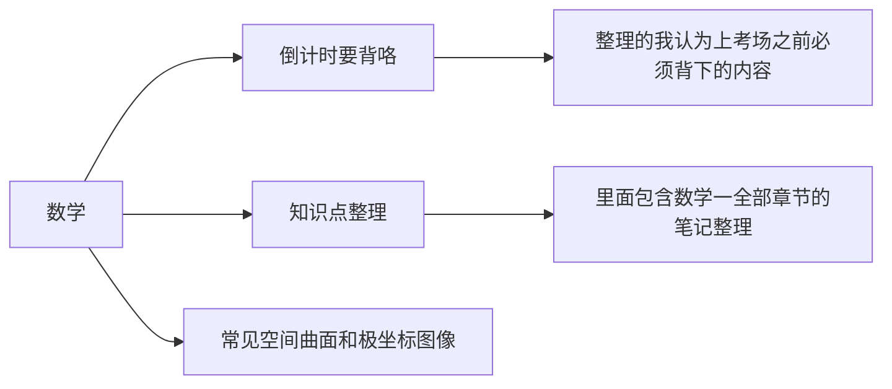

# 数学文件夹介绍

## 前言
“数学”这个文件夹是这份笔记中的支柱之一，其中最为核心的笔记是这一个文件“整理要背下来的东西”[[数学/倒计时要背咯/整理要背下来的东西|点击跳转]]。在临近考研的前两个月，我一边不断完善这份笔记，也一边保持默写这份笔记。这份文件是从所有知识点笔记中浓缩而成的精华，里面的知识点基本涵盖了考研公式定理的全部要求。

## 文件夹结构

[[README|点击跳转整体笔记介绍]]

