# 整理要背下来的东西


[TOC]


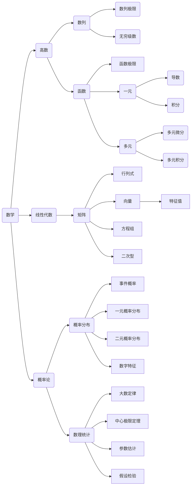

## 高等数学
### 渐近线
- <font color=red>极坐标下要先转换为直角坐标或参数方程</font>$x=r(\theta)cos\theta;\quad y=r(\theta)sin\theta$
$$
\begin{align*}
&1.铅垂渐近线:x_0来源: ➊ 无定义点 \quad ➋区间端点
\\\\
&若\lim_{x\to x_0^+}f(x)=\infty(或\lim_{x\to x_0^-}f(x)=\infty) \Rightarrow x=x_0为铅垂渐近线
\\\\
&2.水平渐近线:来源: \pm \infty处
\\\\
&若\lim_{x\to +\infty}f(x)=y_1  \Rightarrow y=y_1为水平渐近线
\\
&若\lim_{x\to -\infty}f(x)=y_2  \Rightarrow y=y_2为水平渐近线
\\\\
&3.斜渐近线:来源: \pm \infty处(已经有水平渐近线的方向一定没斜渐近线)
\\\\
&若\lim_{x\to +\infty}\frac{f(x)}{x}=k_1,\lim_{x\to +\infty}[f(x)-k_1x]=b_1  \Rightarrow y=k_1x+b_1为斜渐近线
\\
&若\lim_{x\to -\infty}\frac{f(x)}{x}=k_2,\lim_{x\to -\infty}[f(x)-k_2x]=b_2 \Rightarrow y=k_2x+b_2为斜渐近线
\end{align*}
$$
### 等价无穷小
$$
\begin{align*}
&x\to 0时
\\
&sinx\sim tanx \sim arcsinx \sim arctanx \sim x
\\\\
&e^x=1+x+\frac{1}{2}x^2+\frac{1}{3}x^3+o(x^3)
\\\\
&ln(x+1)=x-\frac{1}{2}x^2+\frac{1}{3}x^3+o(x^3)
\\\\
&cosx=1-\frac{1}{2}x^2+\frac{1}{24}x^4+o(x^4)
\\\\
&sinx=x-\frac{1}{6}x^3+o(x^3)
\\\\
&a^{x}-1=e^{xlna}-1\sim xlna (a>0且a\neq1)
\\\\
&(1+x)^a=1+ax+\frac{\alpha(\alpha-1)}{2}x^2+o(x^2)(a\neq0)
\\\\
&\sqrt{x}-1 \sim \frac{1}{2}(x-1)  \quad x\to 1
\\\\
&推广:
\\
&(1+x)^{\alpha (x)}-1 \sim \alpha(x)x \quad 要求\alpha(x)x\to 0,且
\alpha(x)\ne 0
\\
&x-sinx \sim\frac{1}{6}x^3, \  x-arcsinx \sim -\frac{1}{6}x^3, \ 
x-tanx \sim -\frac{1}{3}x^3 ,\ x-arctanx\sim\frac{1}{3}x^3
\\
&x-ln(1+x)\sim \frac{1}{2}x^2,\ tanx-sinx\sim \frac{1}{2}x^3,\ e^x-1-x\sim \frac{1}{2}x^2,\ 1-cos^{\alpha}x\sim\frac{\alpha}{2}x^2
\\\\
&n\to \infty时,有ln^{\alpha}n\ll n^{\beta}{\ll}{a^n{\ll}{n!{\ll}{n^n}}},其中\alpha,\beta>0,a>1
\\
&\lim_{n\to \infty}\sqrt[n]{a_1^n+a_2^n+\cdots+a_m^n}=max\{a_1,a_2,\cdots,a_m\} \quad 其中a_i\ge 0(i=1,2,\cdots,m)
\\\\
&设f(x)是以T为周期的可积函数,则\lim_{x\to \infty}\frac{\int_{0}^{x}f(t)dt}{x}=\frac{\int_{0}^{T}f(t)dt}{T}
\\\\
&{\color \red 求极限的时候可以利用四则运算拆分运算}
\end{align*}
$$
### 极限
- 定义
$$
\begin{align*}
\lim_{n \to \infty}x_n=A \Leftrightarrow \forall \varepsilon>0,\exists  
N>0,当n>N时，有|x_n-A|<\varepsilon
\end{align*}
$$
- 第二问的解题之路就在第一问的结论
<font color =red>极限的存在</font>
- 数列$\{a_n\}$极限存在⇔数列$\{a_n\}$收敛
- $\{a_n\}$<font color = red>收敛+g(x)连续</font>⇒$\lim_{n\to \infty}arcsin\ x_n=arcsin(\lim_{n\to \infty}x_n)$
- 函数极限存在⇔左右极限存在且相等
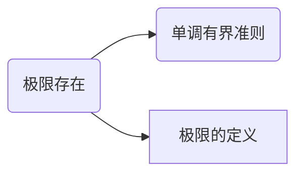
<mark>单调有界准则</mark>
- 单调递增有上界：极限存在
- 单调递减有下界：极限存在   

间断点类型都有哪些
$$
\begin{cases}
第一类间断点
\begin{cases}
可去间断点\quad \lim_{x\to x_0^-}f(x)=\lim_{x\to x_0^+}f(x)\neq f(x)
\\\\
跳跃间断点\quad \lim_{x\to x_0^-}f(x)\neq\lim_{x\to x_0^+}f(x)
\end{cases}
\\\\\\
第二类间断点
\begin{cases}
无穷间断点\quad  \lim_{x\to x_0^-}f(x)=\infty 或者 \lim_{x\to x_0^+}f(x)=\infty
\\\\
震荡间断点\quad  \lim_{x\to x_0^-}f(x)=振荡不存在or \lim_{x\to x_0^+}f(x)振荡不存在
\end{cases}
\end{cases}
$$

数学归纳法
- 如果第k项只与第k-1有关,则用第一数学归纳法
- 如果与多项k之前有关,则用第二数学归纳法

$$
\begin{align*}
&第一数学归纳法
\\
&(1) 验证n=1时,命题成立
\\
&(2) 假设n=k时,命题成立
\\
&(3) 证明n=k+1时,命题成立
\\\\
&第二数学归纳法
\\
&(1) 验证n=1,n=2,命题成立
\\
&(2) 假设n<k时,命题成立
\\
&(3) 证明n=k时,命题成立
\end{align*}
$$


<font color=red>极限的计算</font>
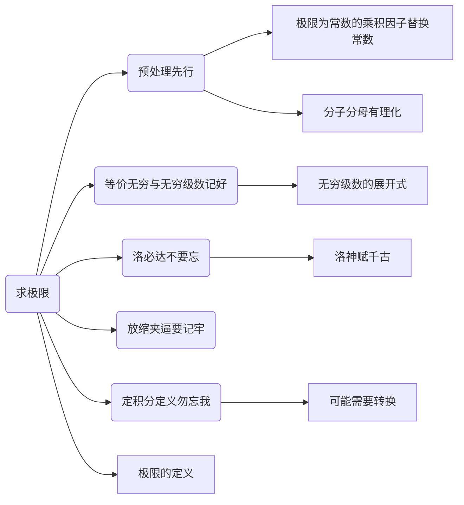

### 导数
- <font color=red>具体点采用定义法</font>，<font color=blue>导数的极限值也可以采用定义法</font>
- 显函数直接求导
- 隐函数方程左右同时求导
- 隐函数求导公式$y'=-\frac{F_x}{F_y}$
- <font color=red>高阶导数-{uv乘积导数公式}-{泰勒展开的形式不变性}</font>

<font color=red>导数定义</font>
$$
\begin{align*}
&f'(x_0)=
\lim_{\Delta x\to 0}\frac{f(x_0+\Delta x)-f(x_0)}{\Delta x}
=
\lim_{x\to x_0}\frac{f(x)-f(x_0)}{x-x_0}
\end{align*}
$$

#### 变上限函数的导数
$$
\frac{d\int_{g(x)}^{f(x)}h(t)dt}{dt}=f'(x)h[f(x)]-g'(x)h[g(x)]
$$
要求如下：被积函数h(t)中不得含有变量x，否则需要==先进行换元==除去才可以如此求导

#### 反函数导数
$$
x'=\frac{1}{y'}  \qquad x''=-\frac{y''}{(y')^3}
$$
#### 曲率与曲率半径
$$
\begin{align*}
&k=\frac{|y''|}{(1+y'^2)^{\frac{3}{2}}}

&R=\frac{1}{k}
\end{align*}
$$
#### 极值点拐点
极值点
- 使得$f'(x)$在$x_0$左右变号的x值
- 可以是在不可导点
- 如果在$x_0$处可导，则$f'(x_0)=0$

拐点
- <font color=red>凹凸区间的分隔点-凹凸区间的函数定义记住</font>
- 使得$f''(x)$在$x_0$左右变号的坐标(x,y)
- ⇐$f''(x_0)=0$但$f'''(x_0)\ne 0$
- 可以是在不可导点
- 如果在$x_0$处二阶可导，则$f''(x_0)=0$
区别：
- 极值点是x坐标，如x=a；拐点是(x,y)坐标

拐点存在的充分条件:
$$
\begin{align*}
& ➊ 第一充分条件:二阶导数在x_0的左右邻域变号
\\\\\
& ➊ 第二充分条件:f''(x_0)=0,f'''(x_0)\ne 0
\\\\\
& ➊ 第三充分条件:要求n为奇数,f^{(n-1)}(x_0)=0,f^{(n)}(x_0)\ne 0
\end{align*}
$$

### 多元微分

#### 微分定义
$$
\begin{align*}
&\color \red一元函数:
\\
&\Delta y=f(x_0+\Delta x)-f(x_0)
\\
&如果\exists 常数A \Rightarrow \Delta y=A\Delta x+o(\Delta x) \Leftrightarrow 在x_0处可微:dy|_{x_0}=Adx 
\\
&其中A\Delta x 称为线性主部,其中A=f'(x_0)
\\\\
&\color \red {多元函数:}
\\
&全微分:df(x,y)=\frac{\partial f}{\partial x}dx+\frac{\partial f}{\partial y}dy
\\
&判断函数z=f(x,y)在点(x_0,y_0)处是否可微,步骤如下:
\\\\
&\begin{cases}
➊写出全增量:\Delta z=f(x_0+\Delta x,y_0+\Delta y)-f(x_0,y_0)
\\\\
➋写出线性增量A\Delta x+B\Delta y,其中A=f'_x(x_0,y_0),B=f'_y(x_0,y_0)
\\\\
➌作极限\lim_{\Delta x \to 0,\Delta y\to 0}\frac{\Delta z-(A\Delta x+B\Delta y)}{\sqrt{(\Delta x)^2+(\Delta y)^2}}
\\\\
➍如果➌中极限等于0\Rightarrow f(x,y)在点(x_0,y_0)处可微
\end{cases}
\end{align*}
$$


#### 偏导数连续的判断步骤
$$
\begin{align*}
&判断函数z=f(x,y)在点(x_0,y_0)处是否偏导数连续,步骤如下:
\\\\
&\begin{cases}
➊用定义法求f'_x(x_0,y_0),f'_y(x_0,y_0)
\\\\
➋用公式法求f'_x(x,y),f'_y(x,y)
\\\\
➌计算\lim_{(x,y)\to (x_0,y_0)}f'_x(x,y) \quad \lim_{(x,y)\to (x_0,y_0)}f'_y(x,y)
\\\\
➍如果\lim_{(x,y)\to (x_0,y_0)}f'_x(x,y)=f'_x(x_0,y_0) 
\quad \lim_{(x,y)\to (x_0,y_0)}f'_y(x,y)=f'_y(x_0,y_0)
\\
\quad 成立,则该点偏导连续
\end{cases}
\end{align*}
$$


#### 全微分的求解
$$
dz=\frac{\partial z}{\partial x}dx+\frac{\partial z}{\partial y}dy
$$
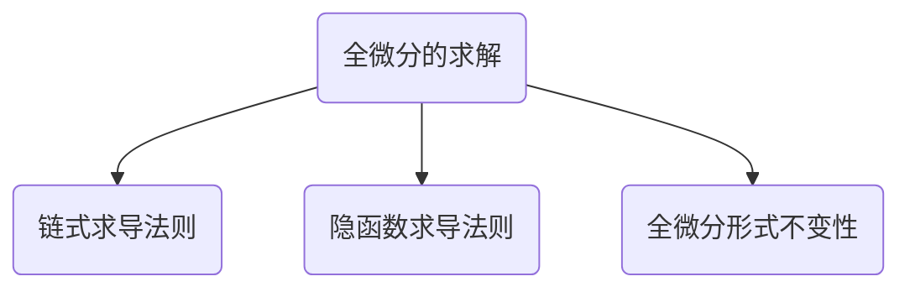

#### 多元函数求导
<font color = red>导数定义</font>
$$
\begin{align*}
&f_{x}'(x_0,y_0)=\lim_{x\to x_0}\frac{f(x,y_0)-f(x_0,y_0)}{x-x_0}
\\\\
&f_{y}'(x_0,y_0)=\lim_{x\to x_0}\frac{f(x_0,y)-f(x_0,y_0)}{y-y_0}
\end{align*}
$$

显函数-链式求导
很重要的一点，f'(u,v)同样具有u,v的结构，无论f的几阶导数，都有和f相同的复合结构。为了清楚结构，不仅要写出f的复合结构图，而且还要写出f'的复合结构图。

下面列举几种复合结构图，u，v也常用1、2替代

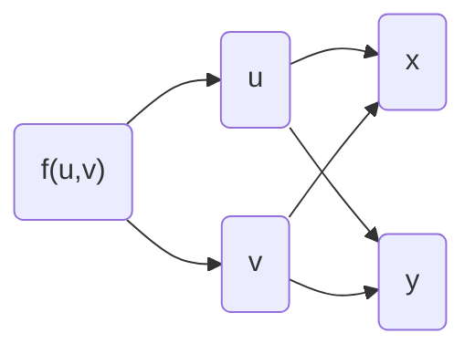

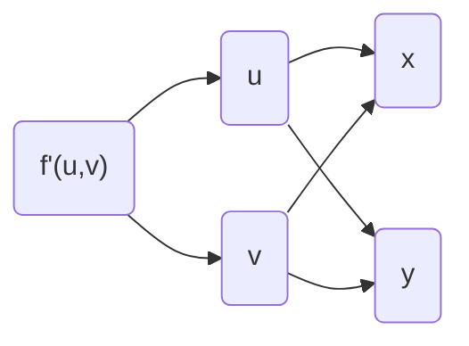

复合里面套函数的复合结构图：

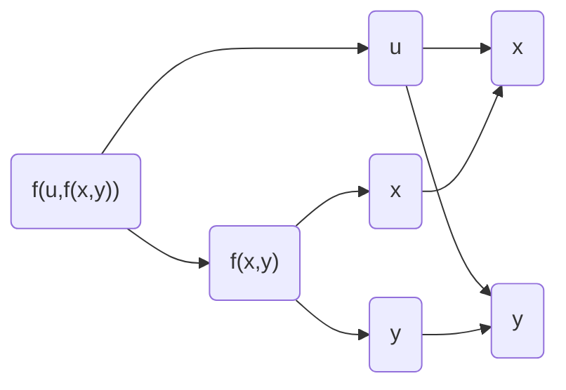
#### 多元函数的极值判断
- Δ=0无法判断时，需要考虑放缩法
- <font color=red>关于拉格朗日数乘，考虑怎么可以较好的运用约束方程</font>
$$
\begin{align*}
\color \red 无条件极值:&
\\\\
(1)&二元函数取极值的必要条件
\\
&设z=f(x,y)在(x_0,y_0)
\begin{cases}
一阶偏导数存在
\\\\
取极值
\end{cases}
\Rightarrow f_x'(x_0,y_0)=f_y'(x_0,y_0)=0
\\\\
(2)&二元函数取极值的充分条件
\\
&记A=f''_{xx}(x_{0},y_{0}) \quad B=f''_{xy}(x_{0},y_{0})  \quad C=f''_{yy}(x_{0},y_{0}) 
\\\\
&\Delta=AC-B^2 \ 
\begin{cases}
\Delta>0
\begin{cases}
A>0\quad极小值
\\
A<0 \quad极大值
\end{cases}
\\\\
\Delta<0 \quad 不是极值
\\
\Delta=0 \quad 无法判断
\end{cases}
\\\\
\color \red 有条件极值:&拉格朗日数乘法
\\\\
&求目标函数u = f ( x , y , z ) \text { 在条件 } \left\{\begin{array} {l} {\varphi ( x , y , z ) = 0  } \\\\ { \psi ( x , y , z ) = 0 } \end{array} \right. \quad 的最值
\\\\
&1.构造辅助函数F ( x , y , z , \lambda , \mu ) = f ( x , y , z ) + \lambda \varphi ( x , y , z ) + \mu \psi ( x , y , z )
\\
&2.令
\\
&\qquad \qquad \left\{ \begin{array} { l } { F _ { x } ^ { \prime } = f _ { x } ^ { \prime } + \lambda \varphi _ { x } ^ { \prime } + \mu \psi _ { x } ^ { \prime } = 0 , } \\ { F _ { y } ^ { \prime } = f _ { y } ^ { \prime } + \lambda \varphi _ { y } ^ { \prime } + \mu \psi _ { y } ^ { \prime } = 0 , } \\ { F _ { z } ^ { \prime } = f _ { z } ^ { \prime } + \lambda \varphi _ { z } ^ { \prime } + \mu \psi _ { z } ^ { \prime } = 0 , } \\ { F _ { \lambda } ^ { \prime } = \varphi ( x , y , z ) = 0 , } \\ { F _ { \mu } ^ { \prime } = \psi ( x , y , z ) = 0 ; } \end{array} \right.
\\
&3.解上述方程组得到备选点P_i,i=1,2,3,\cdots,n并求f(P_i),取其最大为u_{max},最小为u_{min}
\end{align*}
$$

### 中值定理
所有定理都至少要求区间连续
#### 确定区间
- 圈出题给区间，并在坐标轴上画出
#### 确定辅助函数
$$
\begin{align*}
&➊ 乘积公式(uv)'=u'v+uv'的逆用
\\\\
&\begin{cases}
a.[f(x)f(x)]'=[f^2(x)]'=2f(x)·f'(x)
\\\\
b.[f(x)f'(x)]'=[f'(x)]^2+f(x)·f''(x)
\\\\
c.[f(x)e^{\varphi(x)}]'=[f'(x)+f(x)\varphi'(x)]e^{\varphi(x)}
\begin{cases}
f'(x)+f(x)
\\\\
f'(x)-f(x)
\end{cases}
\end{cases}
\\\\
&➋商的求导公式(\frac{u}{v})'=\frac{u'v-uv'}{v^2}
\\\\
&\begin{cases}
a.[\frac{f(x)}{x}]'=\frac{f'(x)x-f(x)}{x^2}
\\\\
b.[\frac{f'(x)}{f(x)}]'=\frac{f''(x)f(x)-[f'(x)]^2}{f^2(x)}
\\\\
c.[lnf(x)]'=\frac{f'(x)}{f(x)}
\end{cases}
\\\\
&➌见到\int_{a}^{b}f(x)dx,可令F(x)=\int_{a}^{x}f(t)dt
\\\\
&➍二阶乘积导数公式:(uv)''=u''v+2u'v'+uv'' 
\end{align*}
$$
#### 确定使用的定理
函数f(x)相关
- 要求：f(x)在[a,b]上连续
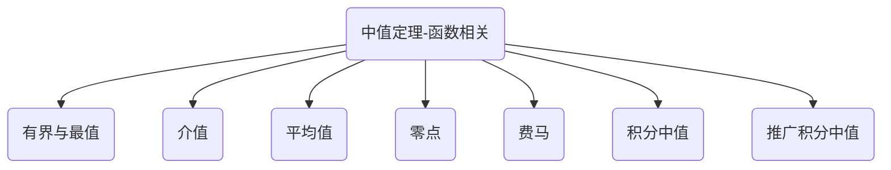
$$
\begin{align*}
有界与最值定理:&m\le f(x) \le M,其中m,M分别为f(x)在[a,b]上的最小值与最大值
\\\\
介值定理:&当m \le \mu \le M时,存在\xi \in [a,b],使得f(\xi)=\mu
\\\\
平均值定理:&当a<x_1<x_2< \cdots <x_n<b时,在[x_1,x_n]上至少存在一点\xi,使得:
\\\\
&f(\xi)=\frac{f(x_1)+f(x_2)+\cdots+f(x_n)}{n}
\\\\
零点定理:&f(a)·f(b)<0 \Rightarrow \exists\xi \ \in  (a,b),使得f(\xi)=0
\\\\
费马定理:&设f(x)在点x_0处满足
\begin{cases}
➊可导
\\\\
➋ 取极值
\end{cases}
\Rightarrow f'(x_0)=0
\\\\\\
积分中值定理:
&设f(x)在[a,b]上连续,则存在\xi\in[a,b]\quad \Rightarrow
\int_{a}^{b}f(x)dx=f(\xi)(b-a)
\\\\\\
推广积分中值定理:&\begin{cases}
1.f(x)、g(x)在[a,b]上连续
\\\\
2.g(x)在[a,b]上不变号
\end{cases}
\Rightarrow 
\int_{a}^{b}f(x)\cdot g(x)dx=f(\xi)\cdot \int_{a}^{b}g(x)dx
\quad \exists \xi\in(a,b)
\end{align*}
$$

导数相关
- 等式罗尔，二阶泰勒，柯西基本不考，一阶不等式或一二阶相联系拉他
- <font color=red>分部积分也可以构建f(x)与f'(x)之间关系</font>
- f(x)在[a,b]连续
- f'(x)在(a,b)可导
- $ln 1=0,e^{0}=1$,==留意f(x)=0,f'(x)=0的点==

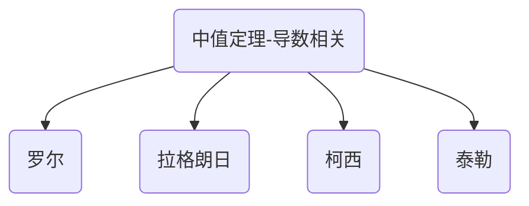
$$
\begin{align*}
罗尔定理:&设f(x)满足
\begin{cases}
➊[a,b]上连续
\\\\
➋(a,b)内可导
\\\\
➌f(a)=f(b)  
\end{cases}
\quad 则存在\xi \in(a,b),使得f'(\xi)=0
\\\\\\
拉格朗日定理:&设f(x)满足
\begin{cases}
➊[a,b]上连续
\\\\
➋(a,b)内可导
\end{cases}
\quad 则存在\xi \in(a,b),使得f'(\xi)=\frac{f(b)-f(a)}{b-a}
\\\\\\
柯西中值定理:&设f(x),g(x)满足
\begin{cases}
➊[a,b]上连续
\\\\
➋(a,b)内可导
\\\\
➌g'(x)\ne 0  
\end{cases}
\quad 则存在\xi \in(a,b),使得\frac{f(b)-f(a)}{g(b)-g(a)}=\frac{f'(\xi)}{g'(\xi)}
\\\\\\
泰勒公式:&f(x)=f(x_0)+f'(x_0)(x-x_0)+\cdots+\frac{1}{n!}f^{(n)}(x_0)(x-x_0)^n+\frac{f^{(n+1)}(\xi)}{(n+1)!}(x-x_0)^{n+1}
\\\\
&f(x)=\sum_{n=0}^{\infty}\frac{f^{(n)}(x_0)}{n!}(x-x_0)^{n}
\\\\
二元泰勒:&
f(x,y)=f(x_{0},y_{0})+(f'_{x} \quad f'_{y})_{X_{0}}\begin{pmatrix}
\Delta x \\ \Delta y
\end{pmatrix} +\frac{1}{2!}(\Delta x \quad \Delta y)\begin{pmatrix}
f''_{xx} & f''_{xy}  \\
f''_{yx} & f''_{yy}  \\
\end{pmatrix}_{X_{0}}\begin{pmatrix}
\Delta x \\ \Delta y
\end{pmatrix}+R_{2}
\end{align*}
$$

#### 微分等式问题
- 方程的根、函数的零点
$$
\begin{align*}
&a.存在性:零点定理
\\\\
&b.唯一性:单调性,研究导数
\\\\
&c.罗尔原话:f^{(n)}(x)=0有k个根\Rightarrow f(x)=0至少有k+n个根
\\\\
&d.实系数奇次方程组至少有一个实根
\end{align*}
$$
#### 微分不等式
- 观察函数的性质-<mark>对称性</mark>
- 利用函数性质-单调性-凹凸性
- 放缩法

### 一元积分
- <font color=red>常数项写作定积分形式→放缩为定积分</font>
- 被积函数可积⇒变上限积分连续    被积函数连续/可去间断点⇒变上限积分可导
- 变上限函数≠原函数
- 求解旋转曲面面积
- 周期函数积分特性$\int_{0}^{nT}f(x)dx=n \int_{0}^{T}f(x)dx$，在一个周期内的积分与周期的起终点无关
````mermaid
graph TB
A("一元积分")-->B("定积分")
A-->E("不定积分")
B-->C("对称性")
B-->W("区间再现")
B-->H("点火公式")

B-->E

E-->F("凑微分")
E-->D("换元")
E-->R("有理函数")
E-->G("分部积分")

````
<mark>定积分定义</mark>
$$
\begin{align*}
&\lim_{n \to \infty}\sum_{i=1}^{n}f(0+\frac{1-0}{n}i)\frac{1-0}{n}=\int_{0}^{1}f(x)dx
\\\\
&\lim_{n \to \infty}\sum_{i=0}^{n-1}f(0+\frac{1-0}{n}i)\frac{1-0}{n}=\int_{0}^{1}f(x)dx
\end{align*}
$$
#### 原函数存在定理
- <font color = red>在一定区间内成立</font>
- 连续函数必有原函数
- 含有第一类间断点和无穷间断点的必没有原函数
- 含震荡间断点的可能存在原函数

#### 积分表
$$
\begin{align*}
&\int x^kdx=\frac{1}{k+1}x^{k+1}+C \quad k\neq -1
\\
\\
&\int \frac{1}{x}dx=ln|x|+C
\\
\\
&\int a^x dx=\frac{a^x}{lna}+C	\quad a>0且a \neq1
\\
\\
&\int tanx dx = -ln|cosx|+C	\overset{法则1}{\xrightarrow[]{}} \int cot dx = ln|sinx|+C
\\
\\
&\int \frac{1}{cosx}dx = \int secx dx = ln|secx+tanx|+C
\overset{法则1}{\xrightarrow[]{}}
\int \frac{1}{sinx}dx = \int csc dx = ln|cscx-cotx|+C
\\
\\
&\int sec^2x dx = tanx+C
\overset{法则1}{\xrightarrow[]{}}
\int csc^2x dx = -cotx+C
\\
\\
&\int secxtanxdx=secx + C
\overset{法则1}{\xrightarrow[]{}}
\int cscxcotxdx=-cscx+C
\\
\\
&\int \frac{1}{a^2+x^2}dx = \frac{1}{a}arctan\frac{x}{a}+C	\quad a>0
\\
\\
&\int \frac{1}{\sqrt{a^2-x^2}}dx=arcsin\frac{x}{a}+C
\\
\\
&\int \frac{1}{\sqrt{x^2+a^2}}dx=ln(x+\sqrt{x^2+a^2})+C
\\
\\
&\int \frac{1}{\sqrt{x^2-a^2}}dx=ln|x+\sqrt{x^2-a^2}|+C
\\
\\
&\int \frac{1}{x^2-a^2}dx = \frac{1}{2a}ln|\frac{x-a}{x+a}|+C
\\
\\
&\int \sqrt{a^2-x^2}dx = \frac{a^2}{2}arcsin\frac{x}{a}+\frac{x}{2}\sqrt{a^2-x^2}+C \quad(a>|x| \geq 0)
\\\\
&\int \sqrt{x^2-a^2}dx = -\frac{a^2}{2}ln|x+\sqrt{x^2-a^2}|+\frac{x}{2}\sqrt{x^2-a^2}+C 
\\
\\
&\int \sqrt{a^2+x^2}dx =
\frac{a^2}{2}ln ({x}+\sqrt{x^2+a^2}) +\frac{x}{2}\sqrt{x^2+a^2}+C
\\
\\
&\int sin^2xdx=\frac{x}{2}-\frac{sin2x}{4}+C
\overset{法则1}{\xrightarrow[]{}}
\int cos^2xdx=\frac{x}{2}+\frac{sin2x}{4}+C
\\
\\
&\int tan^2xdx=tanx-x+C
\overset{法则1}{\xrightarrow[]{}}
\int cot^2xdx=-cot-x+C
\end{align*}
$$

#### 华里士公式
[0,pi]cos奇数n为0
$$
\int_{0}^{\frac{\pi }{2}}sin^{n}xdx = \int_{0}^{\frac{\pi }{2}}cos^{n}xdx=\left\{\begin{matrix}
\frac{n-1}{n}\cdot \frac{n-3}{n-2} \cdots  \frac{2}{3}\cdot1	 &n为奇数
\\\\
\frac{n-1}{n}\cdot \frac{n-3}{n-2} \cdots   \frac{1}{2}\cdot \frac{\pi}{2} &n为偶数
\end{matrix}\right.
$$
#### 积分比大小
````mermaid
graph LR
A("积分比大小")-->积分保号性
A-->B("相同区间-不同函数")
A-->E("相同函数-不同区间")
A-->C("不同区间-不同函数")
C-->W("化作同一区间")
C-->H("化作同一函数")
C-->R("化作其他积分的组合")
````
#### 一元积分的物理应用
- 以水面为坐标起点，向下为x轴正方向

- 提取物体做功
$$
W=\rho g\int_{a}^{b}xA(x)dx \quad \rho为物体密度\quad g为重力加速度
$$
- 静水压力
$$
P=\rho g\int_{a}^{b}x[f(x)-h(x)]dx
$$
#### 一元积分的几何应用
- 弧长公式：$s=\int_{a}^{b}\sqrt{1+(y')^2}dx$
- 曲线绕坐标轴旋转公式：$v=\int_{a}^{b}\pi f^2(x) dx\quad v=\int_{a}^{b}2\pi xf|(x)|dx$
- 极坐标面积公式：$S=\int_{\alpha}^{\beta}\frac{1}{2}|r_2^2(\theta)-r_1^2(\theta)|d\theta$

#### 反常积分的敛散判断
- 将题给反常积分转为如下两种形式
$$
\begin{align*}
&\int_{a}^{b}\frac{1}{(x-a)^q}dx\quad (a<b)
\begin{cases}
q<1,&收敛
\\\\
q\ge1,&发散
\end{cases}
\\\\
&\int_{a}^{+\infty}\frac{1}{x^p}dx\quad (a>0)
\begin{cases}
p>1,&收敛
\\\\
p\le1,&发散
\end{cases}
\end{align*}
$$
#### 求解曲面表面积(侧)
记住公式，不要将坐标系的转换当作公式换元
- <font color=red>绕x轴旋转</font>
$$
\begin{align*}
S_{侧}=
\begin{cases}
2\pi\int_{a}^{b}y\cdot \sqrt{1+y'^2}\ dx
\\\\
2\pi\int_{a}^{b}y(t)\cdot \sqrt{x'(t)^2+y'(t)^2}\ dt
\\\\
2\pi\int_{a}^{b}rsin\ \theta\cdot \sqrt{r^2+r'^2}\ d\theta
\end{cases}
\end{align*}
$$
- <font color=blue>绕y轴旋转</font>
$$
\begin{align*}
S_{侧}=
\begin{cases}
2\pi\int_{a}^{b}x\cdot \sqrt{1+y'^2}\ dx
\\\\
2\pi\int_{a}^{b}x(t)\cdot \sqrt{x'(t)^2+y'(t)^2}\ dt
\\\\
2\pi\int_{a}^{b}rcos\ \theta\cdot \sqrt{r^2+r'^2}\ d\theta
\end{cases}
\end{align*}
$$
### 二重积分
---
后积先定限，限内画条线
先交写下限，后交写上限

---

````mermaid
graph TB
A("由题目画出积分区域")-->B("写出积分表达式")-->C("对称性简化积分表达式")
B-->D("选取恰当积分系（直角or极坐标）")
````
$$
\begin{align*}
&1.对称性:
\begin{cases}
➊普通对称性:\{x轴\}-\{y轴\}-\{原点\}-\{x=a\}-\{y=b\}对称
\\
➋轮换对称性:积分区域关于y=x对称\quad \iint_{D}f(x,y)d\sigma=\iint_{D}f(y,x)d\sigma
\end{cases}
\\\\
&2.积分坐标系:
\begin{cases}
➊直角坐标系
\begin{cases}
➊先x后y:\iint_{D}f(x,y)d\sigma=\int_{c}^{d}dy\int_{\psi_{1}(y)}^{\psi_{2}(y)}f(x,y)dx
\\
➋先y后x:\iint_{D}f(x,y)d\sigma=\int_{a}^{b}dx\int_{\varphi_{1}(x)}^{\varphi_{2}(x)}f(x,y)dy
\\
➌交换积分次序
\end{cases}
\\\\
➋极坐标系
\begin{cases}
➊\iint_{D}f(x,y)d\sigma=\int_{\alpha}^{\beta}d\theta\int_{r_{1}(\theta)}^{r_{2}(\theta)}f(rcos\theta,rsin\theta)rdr
\\
➋被积函数中出现(x-y)^2,(x^2+y^2),\frac{y}{x}\cdots时使用
\end{cases}
\\\\
➌参数方程:化为直角坐标下的累次积分
\end{cases}
\\\\
&3.二重积分中值定理:\iint_{D}f(x,y)d\sigma=f(\xi,\eta)\sigma
\end{align*}
$$
<font color = red>交换积分次序or极直互换</font>
由已知积分上下限⇒重构积分区域⇒重写积分上下限

#### 二重积分换元法
$$
\begin{align*}
&一元函数积分换元 \qquad
\int_{a}^{b}f(x)dx\overset{x=\varphi(t)}{=\!=\!=\!=} \int_{\alpha}^{\beta}f[\varphi(t)]\varphi'(t)dt
\\
&其中三换:a.f(x) \to f[\varphi(t)] \quad b.\int_{a}^{b} \to \int_{\alpha}^{\beta} \quad c.dx\to \varphi'(t)dt
\\\\
&二元函数积分换元 \qquad
\iint_{D_{xy}}f(x,y)dxdy \overset{x=x(u,v)}{\underset{y=y(u,v)}{=\!=\!=\!=} }
\iint_{D_{uv}}f[x(u,v),y(u,v)]\begin{vmatrix}
\frac{\partial (x,y)}{\partial (u,v)} 
\end{vmatrix}dudv
\\\\
&其中三换:a.f(x,y) \to f[x(u,v),y(u,v)] \quad b.\iint_{D_{xy}} \to \iint_{D_{uv}} \quad c.dxdy \to 
\begin{vmatrix}
\frac{\partial (x,y)}{\partial (u,v)} 
\end{vmatrix}
dudv
\\\\
&\frac{\partial (x,y)}{\partial (u,v)}
=
\begin{vmatrix}
\frac{\partial x}{\partial u} & \frac{\partial x}{\partial v}
\\
\frac{\partial y}{\partial u} & \frac{\partial y}{\partial v}
\end{vmatrix}
\end{align*}
$$


### 三重积分
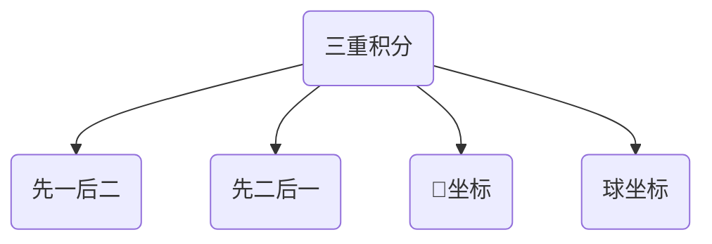
球坐标公式
$$
\iiint_{\Omega}f(x,y,z)dxdydz=\iiint_{\Omega}f(rsin\varphi cos\theta,rsin\varphi sin\theta,rcos\varphi)r^2sin\varphi d\theta d\varphi dr
$$
### 第一型曲线积分
- 弧长公式$s=\int_{a}^{b}\sqrt{1+(y')^2}dx$
$$
\begin{align*}
&\begin{cases}
\int_{L}f(x,y)ds
\\\\
\int_{\Gamma}f(x,y,z)ds
\end{cases}
\\\\
&\int_{L}f(x,y)ds=
\begin{cases}
\int_{a}^{b}f[x,y(x)]\sqrt{1+(y'_x)^2}dx
\\\\
\int_{\alpha}^{\beta}f[x(t),y(t)]\sqrt{(x'_t)^2+(y'_t)^2}dt
\\\\
\int_{\alpha}^{\beta}f[rcos\theta,rsin\theta]\sqrt{r^2+(r')^2}dt
\end{cases}
\end{align*}
$$
### 第一型曲面积分
- 普通对称，轮换对称
- <font color=red>投影面不能有重叠哦</font>
- 应用：求解曲面面积$S=\iint_{\sum}1 dS$
$$
\begin{align*}
&曲面\sum:z=g(x,y) 
\\\\
&\iint_{\sum}f(x,y,z)dS=\iint_{D_{xy}}f(x,y,g(x,y))\cdot
\sqrt{1+(\frac{\partial z}{\partial x})^2+(\frac{\partial z}{\partial y})^2}\ \ dxdy
\end{align*}
$$


### 第二型曲线积分
- <mark>其对称性与其他积分不同，谨慎使用，因为与积分路径的方向有关系</mark>
- 换元的积分起终点没有绝对的大小关系
- <font color=red>使用格林公式之后-积分区域变化，原来函数关系不再成立</font>
- $\int_LPdx+Qdy=\int_L(Pcos\alpha+Qsin\alpha)ds=\int_L(A\cdot \tau)ds$
- $\int_{\Gamma}Pdx+Qdy+Rdz=\int_{\Gamma}(Pcos\alpha+Qcos\beta+Rcos\gamma)ds=\int_{\Gamma}(A\cdot \tau)ds$
- 其中A：向量场。τ：与L/Γ同方向的单位切向量

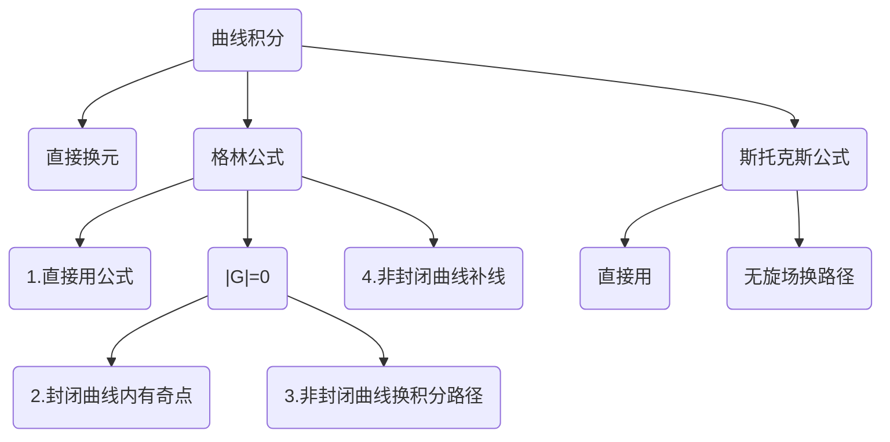
对称性：第二型的对称性和其他都不一样！！！
- <font color=red>轮换对称性</font>
$$
\begin{align*}
&如果被积曲线关于y=x对称\Leftrightarrow 交换x,y后曲线方程不变
\\\\
&\Rightarrow \int_{L}f(x,y)dx+f(y,x)dy=0
\end{align*}
$$
- <font color=blue>普通对称性</font>
$$
\begin{align*}
&1.L关于y轴对称:L_1为L在右半平面的部分
\\\\
&\int_{L}P(x,y)dx=
\begin{cases}
0 &P(x,y)是关于x的奇函数
\\\\
2\int_{L_1}P(x,y)dx &P(x,y)是关于x的偶函数
\end{cases}
\\\\\\
&\int_{L}Q(x,y)dy=
\begin{cases}
2\int_{L_1}Q(x,y)dy &Q(x,y)是关于x的奇函数
\\\\
0 &Q(x,y)是关于x的偶函数
\end{cases}
\\\\\\
&2.L关于x轴对称:L_1为L在上半平面的部分
\\\\
&\int_{L}P(x,y)dx=
\begin{cases}
2\int_{L_1}P(x,y)dx &P(x,y)是关于y的奇函数
\\\\
0 &P(x,y)是关于y的偶函数
\end{cases}
\\\\\\
&\int_{L}Q(x,y)dy=
\begin{cases}
0 &Q(x,y)是关于y的奇函数
\\\\
2\int_{L_1}Q(x,y)dy  &Q(x,y)是关于y的偶函数
\end{cases}
\end{align*}
$$


格林公式：
- 有界闭区域D由分段光滑曲线L围成
- P(x,y)、Q(x,y)在D上具有一阶连续偏导数-<font color=red>如果只是函数连续,则不可使用格林公式</font>
- L取正方向-人沿着这个方向走的时候，左手始终在L所围的D内部	
$$
\oint_LP(x,y)dx+Q(x,y)dy=\iint_D(\frac{\partial Q}{\partial x}-\frac{\partial P}{\partial y})d\sigma
$$

重定义格林公式如下:
$$
\begin{align*}
&定义格林行列式|G|=
\begin{vmatrix}
\frac{\partial }{\partial x} & \frac{\partial }{\partial y} \\
P & Q \\
\end{vmatrix}
\\\\
&重写格林公式如下:
\\
&\oint_LP(x,y)dx+Q(x,y)dy=\iint_D|G|d\sigma
\end{align*}
$$

积分与路径无关的几个充要条件
- a.$\int_{L_{AB}}P(x,y)dx+Q(x,y)dy$与路径无关
- b. $Pdx+Qdy$为某二元函数u(x,y)的全微分
- c. $Pdx+Qdy=0$为全微分方程
- d. $Pi+Qj$为某二元函数的梯度
- e. 沿D内任意分段光滑闭曲线L都有$\oint_{L}Pdx+Qdy=0$
- f. $\frac{\partial Q}{\partial x}\equiv\frac{\partial P}{\partial y}$在D内处处成立

斯托克斯公式
- Γ与$\sum$的法向量成右手系
- P，Q，R在Ω内具有连续的一阶偏导数-<font color=red>如果只是函数连续,则不可使用斯托克斯公式</font>
- <font color=red>使用斯托克斯公式之后-积分区域变化，原来函数关系不再成立</font>
- <mark>对于平面⇒第一型曲面积分，对于曲面⇒第二型曲面积分</mark>
	
$$
\begin{align*}
\oint_{\Gamma}P(x,y,z)dx+Q(x,y,z)dy+R(x,y,z)dz
=&\iint_{\sum}\begin{vmatrix}
 dydz&dzdx &dxdy \\
\frac{\partial }{\partial x} & \frac{\partial }{\partial y} &\frac{\partial }{\partial z}  \\
P &  Q& R \\
\end{vmatrix}
\\\\
=&\iint_{\sum}\begin{vmatrix}
 cos\alpha&cos\beta &cos\gamma \\
\frac{\partial }{\partial x} & \frac{\partial }{\partial y} &\frac{\partial }{\partial z}  \\
P &  Q& R \\
\end{vmatrix}dS
\\\\
其中\overrightarrow{n}=(cos\alpha,cos\beta,cos\gamma)为\sum的&单位外法线向量
\end{align*}
$$

### 第二型曲面积分
- $\iint_{\sum}Pdydz+Qdzdx+Rdxdy=\iint_{\sum}(Pcos\alpha+Qcos\beta+Rcos\gamma)dS$      其中$(cos\alpha,cos\beta,cos\gamma)$为$\sum$同侧单位法向量
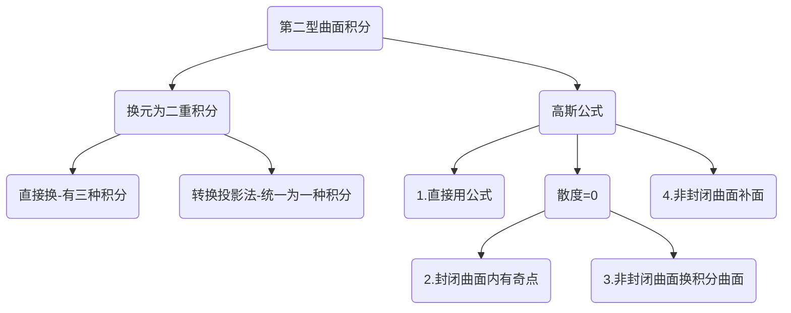
换元-二重积分
将P(x,y,z)中的x用x(y,z)替换,Q中的y用y(z,x)替换,R中z用z(x,y)替换:
$$
\begin{align*}
&\iint_{\sum}P(x,y,z)dydz+Q(x,y,z)dzdx+R(x,y,z)dxdy
\\\\
=&\pm\iint_{D_{yz}}P[x(y,z),y,z]dydz\pm \iint_{D_{zx}}P[x,y(z,x),z]dzdx
\pm\iint_{D_{xy}}P[x,y,z(x,y)]dxdy
\end{align*}
$$
其中$D_{xy},D_{zx},D_{xy}$为原来的曲面向对应二维平面的投影

要求:
- 1.其投影面不能有任何重叠部分，如果有重叠的话，要分割处理投影
- 2.其中当“<font color = "red">曲面的法向量</font>”和“<font color = "blue">被消变量的正轴方向夹锐角时取+</font>”


转换投影法
$$
\begin{align*}
&\iint_{\sum}P(x,y,z)dydz+Q(x,y,z)dzdx+R(x,y,z)dxdy
\\\\
=&\pm \iint_{D_{xy}}P[x,y,z(x,y)](-\frac{\partial z}{\partial x})
+Q[x,y,z(x,y)](-\frac{\partial z}{\partial y})+Q[x,y,z(x,y)]dxdy
\end{align*}
$$
要求：
- 投影面不能有重叠
- $\pm$与直接换元法取法同

高斯公式
使用条件:
- 1.空间有界闭区域Ω由有向分片光滑曲面$\sum$围成
- 2.P(x,y,z)、Q(x,y,z)、R(x,y,z)在Ω上具有一阶连续偏导数
- 3.其中$\sum$取外侧
- <font color=red>使用高斯公式之后-积分区域变化，原来函数关系不再成立</font>

公式:
$$
\newcommand{\oiint}{\subset\kern{-3pt}\supset\kern{-16.5pt}\iint}

\oiint_{\sum} Pdydz+Qdzdx+Rdxdy=\iiint_{\Omega}(\frac{\partial P}{\partial x}+\frac{\partial Q}{\partial y}+\frac{\partial R}{\partial z})dv
$$


### 各类积分
[[定积分-二重积分-三重积分.xmind]]
![[定积分-二重积分-三重积分.png]]
[[各类积分之间的联系.xmind]]
![[Pasted image 20221125101415.png]]


### 积分的物理与数学应用
[[积分在物理和数学上的应用.xmind]]

### 微分方程
- <font color=red>积微分方程都需要通过求导转为微分方程求解</font>
- 积分带非积分变量函数
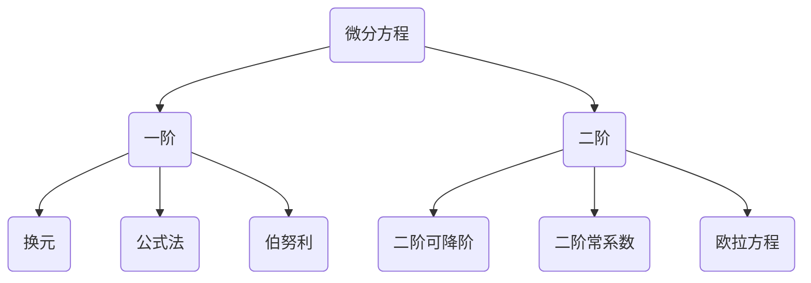
#### 换元法
常见的四种换元方式
- 如果$\frac{dy}{dx}$走不通，可以考虑$\frac{dx}{dy}$
$$
\begin{align*}
u=&ay+bx+c
\\
u=&\frac{y}{x}
\\
u=&\frac{x}{y}
\\
u=&xy
\end{align*}
$$

#### 公式法求解
$$
\begin{align*}
形如:y'+p(x)y=&q(x)
\\
\\
y=e^{-\int p(x)dx}
\{
\int e^{\int p(x)dx}\cdot &q(x)\ dx+C
\}
\end{align*}
$$

伯努利方程
$$
\begin{align*}
y'+p(x)y&=q(x)y^n
\\\\
令z=y^{1-n}\quad 则有:&\frac{1}{1-n}z'+p(x)z=q(x),再代公式
\end{align*}
$$
#### 二阶可降阶
- 缺y形
$$
形如:y''=f(x,y')
\\ 
令y'=z,y''=z'即可
$$

- 缺x形

$$
形如:y''=f(y,y')
\\ 
令y'=z,y''=zz'即可
$$
#### 二阶常系数微分方程
- 三种通解形式
$$
\begin{align*}
单根:y_n=&C_{1}e^{\lambda_{1}x}+C_{2}e^{\lambda_{2}x}
\\
\\
重根:y_n=&(C_{1}+C_{2}x)e^{\lambda x}
\\
\\
复数根(\lambda=\alpha \pm \beta j);y=&e^{\alpha x}{(C_{1}cos\beta x+C_{2}sin\beta x)}
\end{align*}
$$
- 两种特解形式
$$
\begin{align*}
1.f(x)=&e^{\alpha x}P_{n}(x)时  
\\\\
设为:y_p=&e^{\alpha x}Q_{n}(x)x^k \quad 
k=
\begin{cases}
0 &\alpha\ne \lambda_1,\alpha\ne \lambda_2
\\\\
1 &\alpha=\lambda_1或\alpha=\lambda_2
\\\\
2 &\alpha=\lambda_1=\lambda_2
\end{cases}
\\
\\
2.f(x)=&e^{\alpha x}[P_{m}(x)cos{\beta x}+P_{n}(x)sin{\beta x}]时
\\\\
设为:y_p=&e^{\alpha x}[Q_{l}^{(1)}(x)cos{\beta x}+Q_{l}^{(2)}(x)sin{\beta x}]x^k \quad 
k=
\begin{cases}
0 &\alpha\ne \lambda
\\\\
1 &\alpha=\lambda
\end{cases}
\end{align*}
$$
#### 欧拉方程
$$
\begin{align*}
&形如:x^2y''+pxy'+qy=f(x)
\\
\\
&换元成如下形式:
\\ &
\begin{cases}
y''+(p-1)y'+qy=f(e^t) &x>0 \quad x=e^t
\\
\\
\\
y''+(p-1)y'+qy=f(-e^t) &x<0 \quad x=-e^t
\end{cases}
\end{align*}
$$
### 无穷级数
- 级数收敛的必要条件是数列极限为0

敛散性的判别
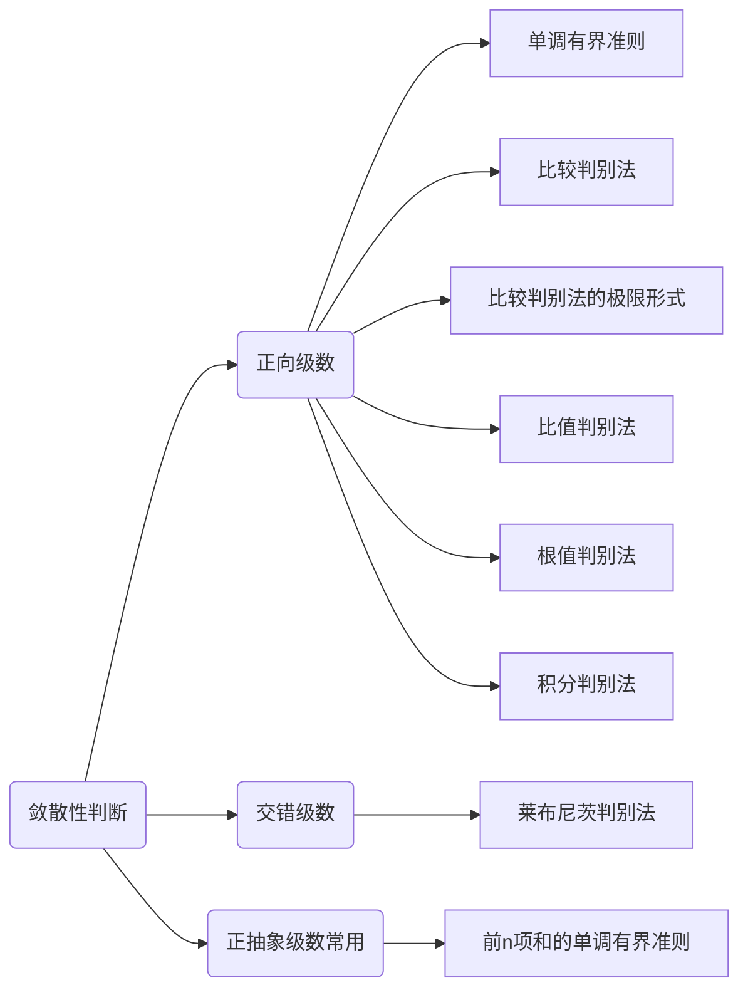

[[无穷级数.xmind]]
#### 级数的敛散性
<font color = red >绝对收敛⇒原级数必收敛 </font>
<font color = blue>条件收敛前提是原级数收敛 </font>
#### 幂级数收敛域
- <font color=red>幂级数的收敛域关于收敛中心对称</font>
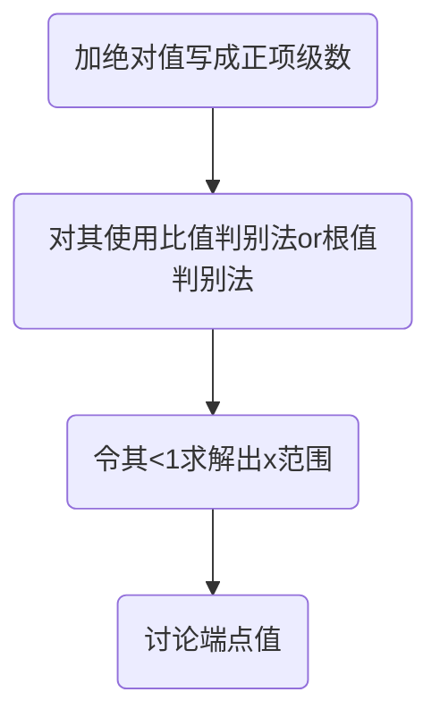
$$
\begin{align*}
&对于\sum u_n f(x_n)
\\\\
&\lim_{n\to \infty}|\frac{u_n f(x_n)}{u_{n-1} f(x_{n-1})}|<1
\end{align*}
$$

#### 常用参考级数
$$
\begin{align*}
&➊ 等比级数\sum_{n=1}^{\infty}aq^{n-1}
\begin{cases}
 \frac{a}{1-q} &|q|<1
\\
\\
发散    &|q|>1
\end{cases}
\\\\
&➋p级数\sum_{n=1}^{\infty}\frac{1}{n^p}
\begin{cases}
收敛 &p>1
\\
\\
发散    &p \leq 1
\end{cases}
\\
\\
&➌广义p级数\sum_{n=2}^{\infty}\frac{1}{n(lnn)^p}
\begin{cases}
收敛 &p>1
\\
\\
发散    &p \leq 1
\end{cases}
\\
\\
&➍交错p级数\sum_{n=1}^{\infty}(-1)^{n-1}\frac{1}{n^p}
\begin{cases}
绝对收敛 &p>1
\\
\\
条件收敛    &0<p \leq 1
\end{cases}
\\


\end{align*}
$$

#### 阿贝尔定理
- 收敛域端点的敛散性：具体问题具体分析

$$
\begin{align*}
&1.当幂级数\sum_{n=0}^{\infty}a_nx^n在点x=x_1处收敛时
\\
&\Rightarrow 对于|x|<|x_1|,幂级数绝对收敛
\\\\

&2.当幂级数\sum_{n=0}^{\infty}a_nx^n在点x=x_1处发散时
\\
&\Rightarrow 对于|x|>|x_1|,幂级数发散
\end{align*}
$$
已知某点敛散性求该级数的收敛半径：
$$
\begin{align*}
&对于级数\sum_{n=0}^{\infty}a_n(x-x_0)在某点x_1的敛散性
\\\\
&\begin{cases}
➊ convergence & 则收敛半径R\geq|x_1-x_0|
\\
➋ divergence  & 则收敛半径R\leq|x_1-x_0|
\\
➌ conditional & 则收敛半径R =|x_1-x_0|
\end{cases}
\end{align*}
$$


#### 常用展开公式
- <font color=red>以下只是相应函数在x=0一点处的展开公式</font>
- 由于积分与求导会改变端点值的收敛情况，所以端点值的收敛情况需要单独分析！！！
- <font color=red>把展开式乘到级数那边</font>分析$a_n$关系-待定系数法

$$
\begin{align*}
&要记住的只有两个对数与指数\\
&ln(1+x)=\sum_{n=1}^{\infty}(-1)^{n-1}
\frac{x^n}{n}   &-1<x\leq 1
\\
\\
&e^x=\sum_{n=0}^{\infty}\frac{x^n}{n!} &-\infty<x<+\infty
\\
\\
&ln(1-x)=ln(1+(-x))=-\sum_{n=1}^{\infty}
\frac{x^{n}}{n}   &-1\leq x< 1
\\
\\
&\frac{1}{1+x}=\frac{d[ln(1+x)]}{dx}
=\sum_{n=0}^{\infty}(-1)^{n}{x^{n}}  &-1<x<1
\\
\\
&\frac{1}{1-x}=\frac{1}{1+(-x)}=\sum_{n=0}^{\infty}
{x^{n}}  &-1<x<1
\\
\\
&\frac{1}{1+(ax)^b}=\sum_{n=0}^{\infty}(-1)^{n}
{a^{bn}}{x^{bn}}  &-\frac{1}{a}<x<\frac{1}{a}
\\
\\
&arctanx=\int \frac{1}{1+x^2}dx=\sum_{n=0}^{\infty}
(-1)^n\frac{x^{2n+1}}{2n+1}
&-1 \leq x \leq 1
\\
\\
&cosx=\frac{e^{jx}+e^{-jx}}{2}=\sum_{n=0}^{\infty}(-1)^n\frac{x^{2n}}{(2n)!} &-\infty<x<+\infty
\\
\\
&sinx=\int cosxdx=\sum_{n=0}^{\infty}(-1)^n\frac{x^{2n+1}}{(2n+1)!} &-\infty<x<+\infty
\\
\\
&这两个和正弦系数形式很像：
\\
&\frac{e^{x}+e^{-x}}{2}=\sum_{n=0}^{\infty}\frac{x^{2n}}{(2n)!} &-\infty<x<+\infty
\\
\\
&\frac{e^{x}-e^{-x}}{2}=\sum_{n=0}^{\infty}\frac{x^{2n+1}}{(2n+1)!} &-\infty<x<+\infty
\end{align*}
$$


---
求解收敛域的时候可以利用加减运算法则分开求解，然后取交集！！！

---
#### 求解和函数
 - <font color=red>级数的和函数在收敛域中出现未定义点，最后的s(x)应该修正包含无定义点</font>
1. 先积后导，先导后积，直接求
2. 构建微分方程求解

#### 傅里叶级数
- 注意傅里叶级数在<font color=red>间断点和区间端点的值</font>
$$
\begin{align*}
&f(x)=\frac{a_0}{2}+\sum_{n=1}^{\infty}(a_ncos\frac{n \pi x}{l}+b_nsin\frac{n \pi x}{l})
\\
\\
&其中：a_0=\frac{1}{l}\int_{-l}^{l}f(x)dx \qquad a_n=\frac{1}{l}\int_{-l}^{l}f(x)cos\frac{n \pi x}{l}dx
\\
\\
&b_n=\frac{1}{l}\int_{-l}^{l}f(x)sin\frac{n \pi x}{l}dx
\end{align*}
$$

### 多元微分学预备知识
#### 空间曲线的切向量
$$
\begin{align*}
&参数方程:
\begin{cases}
x=x(t)
\\
y=y(t)
\\
z=z(t)
\end{cases}
\\
\\
&\Rightarrow \overrightarrow\tau=(x'(t_0),y'(t_0),z'(t_0))
\\\\
&方程组:
\begin{cases}
F(x,y,z)
\\\\
G(x,y,z)
\end{cases}
\\
\\
&\Rightarrow \overrightarrow\tau=
\begin{vmatrix}
 \overrightarrow i&  \overrightarrow j &  \overrightarrow k\\
 F'_x&F'_y  &F'_z  \\
 G'_x&G'_y  &G'_z  \\
\end{vmatrix}_P
\end{align*}
$$

#### 空间曲面的法向量
$$
\begin{align*}
&隐式方程:F(x,y,z)=0
\\\\
& \Rightarrow \overrightarrow {n}=(F'_x,F'_y,F'_z)|_p
\\\\
&显式方程:z=f(x,y)
\quad 
令F(x,y,z)=f(x,y)-z
\\\\
&\Rightarrow \overrightarrow {n}=(f'_x(x,y),f'_y(x,y),-1)|_p
\\\\
&参数方程:
\begin{cases}
x=x(u,v)
\\
y=y(u,v)
\\
z=z(u,v)
\end{cases}
\Rightarrow
\overrightarrow n=
\begin{vmatrix}
 \overrightarrow i&  \overrightarrow j &  \overrightarrow k\\
 x'_u&y'_u  &z'_u  \\
 x'_v&y'_v  &z'_v  \\
\end{vmatrix}_P
\end{align*}
$$

#### 平面束方程
$$
\begin{align*}
&如果某条空间直线可写做
\begin{cases}
A_1x+B_1y+C_1z+D_1=0
\\
\\
A_2x+B_2y+C_2z+D_2=0
\end{cases}
\\
\\
&则:\mu(A_1x+B_1y+C_1z+D_1)+\lambda(A_2x+B_2y+C_2z+D_2)=0
\\
&为所有经过该直线的平面,也称平面束
\\
\\
&1.当已知不需要考虑平面A_1x+B_1y+C_1z+D_1=0时
\\
&改写如下:\mu(A_1x+B_1y+C_1z+D_1)+(A_2x+B_2y+C_2z+D_2)=0\\
\\
&2.当已知不需要考虑平面(A_2x+B_2y+C_2z+D_2)=0时
\\
&改写如下:(A_1x+B_1y+C_1z+D_1)+\lambda(A_2x+B_2y+C_2z+D_2)=0
\end{align*}
$$
#### 点到平面的距离
$$
d=\frac{|Ax_0+By_0+Cz_0+D|}{\sqrt{A^2+B^2+C^2}}
$$
#### 旋转曲面
- 曲线绕直线旋转
$$
\begin{align*}
&在直线L上取一点M_0(x_0,y_0,z_0),任取曲线\Gamma上一点M_1(x_1,y_1,z_1),
\\\\
&M_1旋转形成的纬圆上任一点P(x,y,z)
\\\\
&记直线方向向量\overrightarrow{s}=(m,n,p)
\\\\
&则有如下方程成立:
\\\\
&\begin{cases}
\overset{\rightarrow}{PM_1}\cdot \overrightarrow{s}=0
\\\\
|PM_0|=|M_1M_0|
\\\\
(x_1,y_1,z_1)在曲线\Gamma上
\end{cases}
\end{align*}
$$

- 曲线绕坐标轴旋转
	- 以绕z轴旋转为例子
$$
\begin{align*}
&从直线方程中解出:x=\varphi(z),y=\psi(z)
\\\\
&旋转曲面方程:x^2+y^2=\varphi^2(z)+\psi^2(z)
\end{align*}
$$
#### 向量积
$$
\begin{align*}
&a×b=
\begin{vmatrix}
 \overrightarrow i& \overrightarrow j &\overrightarrow k  \\
 a_x&a_y  &a_z  \\
 b_x&b_y  &b_z  \\
\end{vmatrix}
\\
\\
&|a×b|=|a||b|sin\theta \quad \theta右手法则，不大于\pi
\end{align*}
$$
#### 混合积
- [abc]=(a×b)·c

#### 方向导数-梯度-散度-旋度
- 梯度是最大方向导数的方向，其模值是最大的方向导数值
- 方向导数是数，梯度是向量
- 散度是数，旋度是向量

方向导数
- 对于函数u(x,y,z)上的某一个点(x,y,z)的梯度$(u_x',u_y',u_z')$,与可能的空间任意方向$(cos\alpha,cos\beta,cos\gamma)$的点乘
- (x,y,z)一定在函数u(x,y,z)上，但其空间方向是无关函数u(x,y,z)的
- 而在某一个具体点$(x_0,y_0,z_0)$的最大方向导数是其梯度的模值

<mark>方向导数与偏导数关系</mark>
- 方向导数：函数在某一个方向上的导数
- 偏导数：只要求x，y方向。但是要求x，y方向的双侧！
- 方向导数只要求一侧有值即可，偏导数要求x，y双侧有值且相等
- 两者互相不能推出

<mark style="background: #ADCCFFA6;">在可微条件下可以用此公式</mark> 
$$
\begin{align*}
\frac{\partial u}{\partial \overrightarrow l}=u_x'cos\alpha+u_y'cos\beta+u_z'cos\gamma
\end{align*}
$$
<mark style="background: #FFB8EBA6;">不可微分条件下需使用定义</mark> 
$$
\begin{align*}
&方向导数:\frac{\partial u}{\partial \overrightarrow l}=
\lim_{\rho \to 0^+}\frac{u(x_0+\Delta x,y_0+\Delta y,z_0+\Delta z)-u(x_0,y_0,z_0)}{\rho}
\\\\
&其中\rho=\sqrt{\Delta x^2+\Delta y^2+\Delta z^2}
\\\\
&梯度:\mathbf{grad}\ u=(u_x',u_y',u_z')
\\\\
&\mathbf{A}(x,y,z)=P(x,y,z)\mathbf{i}+Q(x,y,z)\mathbf{j}+R(x,y,z)\mathbf{k}
\\
\\
&散度:div\ \mathbf{A}=\frac{\partial P}{\partial x}+\frac{\partial Q}{\partial y}
+\frac{\partial R}{\partial z}
\\\\
&旋度:\mathbf{rot \ A}=
\begin{vmatrix}
 \mathbf{i}&\mathbf{j} &\mathbf{k} \\
\frac{\partial }{\partial x} & \frac{\partial }{\partial y} &\frac{\partial }{\partial z}  \\
P &  Q& R \\
\end{vmatrix}
\end{align*}
$$

## 高数一些Tips
### 证明满足什么条件的唯一性
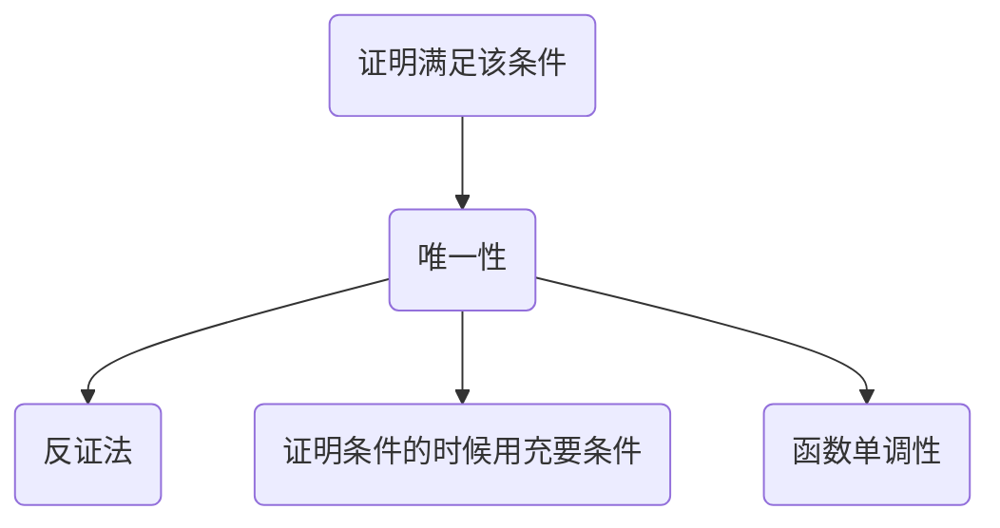
### 做积分题目之前想想对称性
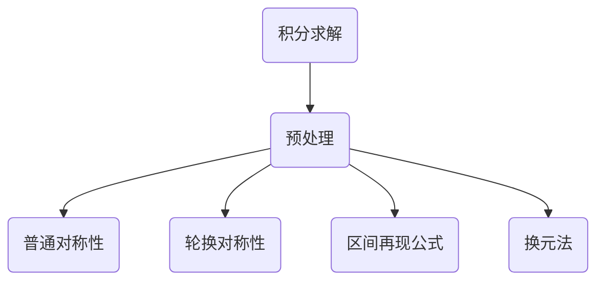

### 函数相关的题
- 单调性-凹凸性
- 导数-偏导

## 线性代数
- 巧劲用不上就暴力破解，==一力降十会==
[[线性代数框架.xmind]]
### 行列式
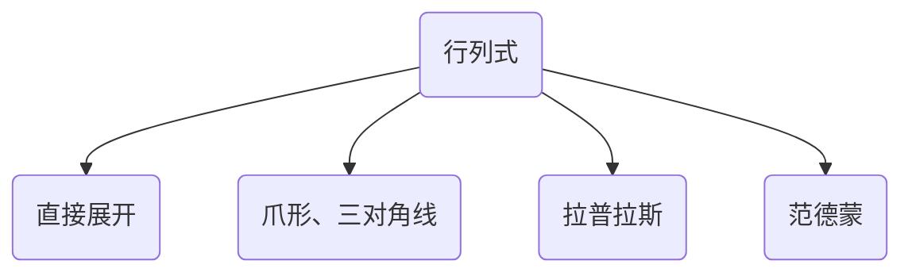
求解行列式的几种方法：[[2-1行列式]]
- 消出一行或一列出现单非0，然后按单非0展开。展开时注意存在符号问题！
- 爪型、三对角线型、拉普拉斯(符号问题)、范德蒙、上下三角(符号问题)
- 技巧：逐行相加、全加到第一行、对角线消元素

展开式：
$$
\begin{align*}
&其中A_{ij}是代数余子式，M_{ij}是余子式，A_{ij}=(-1)^{i+j}M_{ij}
\\\\
&|A|=a_{i1}A_{i1}+a_{i2}A_{i2}+...+a_{in}A_{in}
\\\\
&|A|=a_{1j}A_{1j}+a_{2j}A_{2j}+...+a_{nj}A_{nj}
\end{align*}
$$
公式：
$$
\begin{align*}
&A-n阶,B-n阶
\\
&1.|A^T|=|A|
\\
&2.|kA|=k^n|A|
\\
&3.|AB|=|A||B|
\\
&4.|A^{*}|=|A|^{n-1} \quad AA^*=A^*A=|A|E
\\
&5.|A^{-1}|=\frac{1}{|A|}
\\
&6.|A|=\prod \lambda_{i}
\\
&5.A、B相似\Leftrightarrow P^{-1}AP=B，则|A|=|B|
\end{align*}
$$
### 矩阵
- 正交矩阵A⇒$|A|=\pm 1\quad A^*=\pm A^T\quad A_{ij}=\pm a_{ij}$，列向量两两正交且单位
- 正定矩阵⇔特征值都大于0⇔正定二次型的矩阵，其主对角线元素全为正数
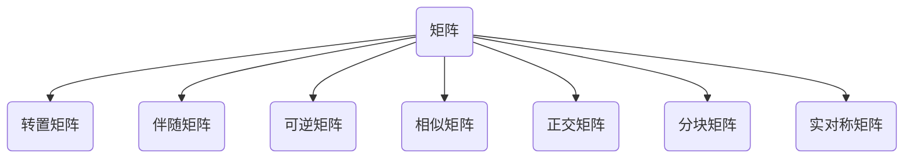

#### 伴随矩阵
$$
\begin{align*}
&\color {red}AA^{*}=A^{*}A=|A|E
\\\\
&A-n阶矩阵:\color {red}r(A^{*})=
\begin{cases}
n,&r(A)=n
\\
1,&r(A)=n-1
\\
0,&r(A)<n-1
\end{cases}
\end{align*}
$$

#### 初等变换与初等矩阵
- <font color=red>左行右列</font>
- 初等矩阵：单位矩阵经过一次初等变换所得矩阵
$$
\begin{align*}
&E_{ij}^{-1}(k)=E_{ij}(-k);\quad E_{ij}^{-1}=E_{ij};\quad E_{i}^{-1}(k)=E_{i}(\frac{1}{k});\quad
\\\\
&E_{ij}^{n}(k)=E_{ij}(nk);\quad E_{ij}^{n}=
\begin{cases}
E_{ij}, &n=2k
\\\\
E,&n=2k-1
\end{cases}
\\\\
&E_{i}^{n}(k)=E_{i}(k^{n});\quad
\end{align*}
$$
#### 矩阵的秩
- <font color=red>秩与空间直线或平面之间的联系</font>
矩阵秩的性质：
$$
\begin{align*}
&1.秩r(A)=A的行秩=A的列秩
\\\\
&2.r(A)=r(A^T) \quad r(A^TA)=r(A)
\\\\
&3.k\neq0 \quad r(kA)=r(A)
\\\\
&\color {red}4.r(A+B)\leq r(A)+r(B)
\\\\
&\color {red}5.r(AB)\leq min(r(A),r(B))
\\\\
&\color {red}6.A可逆，则r(AB)=r(B),r(BA)=r(B)
\\\\
&\color {red}7.若A_{m×n},B_{n×s}且AB=0\Rightarrow r(A)+r(B)\leq n
\\\\
&8.r\begin{bmatrix}
A &O\\
O &B\\
\end{bmatrix}=r(A)+r(B)
\\\\
&7.A\sim B,\Rightarrow r(A)=r(B),r(A+kE)=r(B+kE)
\\\\
&8.A-m×n,r(A)=n \Rightarrow r(AB)=r(B)
\\\\
&9.初等变换不改变矩阵的秩
\\\\
&10.Ax=0有非0解 \Leftrightarrow r(A)<n
\\&线性无关解向量个数为n-r(A)
\\\\
&11.AB的列向量可由A线性表出,AB的行向量可由B线性表出
\\\\
&A,B为n阶矩阵\quad r(AB)\ge r(A)+r(B)-n
\end{align*}
$$

### 向量
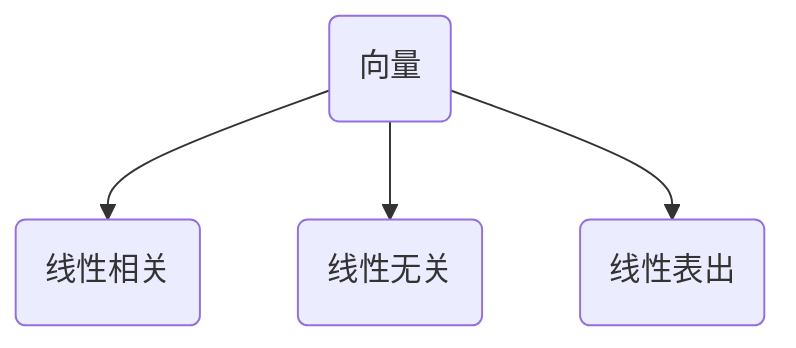

#### 线性相关
- 充要条件
$$
\begin{align*}
&1.[\alpha_1,\alpha_2,...,\alpha_s]x=0有非零解
\\\\
&2.r(\alpha_1,\alpha_2,...,\alpha_s)<s\Leftrightarrow方程组的个数小于未知数的个数
\\\\
&3.某\alpha_i可以由\alpha_1,...,\alpha_{i},...,\alpha_s线性表出
\\\\
&4.n个n维向量线性相关的充分必要条件是行列式为0,克拉默法则
\end{align*}
$$
- 充分条件
$$
\begin{align*}
&1.n+1个n维向量一定线性相关
\\\\
&2.多数向量能用少数向量表示
\\\\
&3.存在零向量
\end{align*}
$$
- 线性相关的几何意义
$$
\begin{align*}
&\alpha 相关 \Leftrightarrow \alpha =0
\\
&\alpha_1,\alpha_2 相关 \Leftrightarrow \alpha_1,\alpha_2共线
\\
&\alpha_1,\alpha_2,\alpha_3 相关 \Leftrightarrow \alpha_1,\alpha_2,\alpha_3共面
\end{align*}
$$
#### 线性无关
- 和线性相关反着来就是

#### 线性表出
- 充要条件
$$
\begin{align*}
\beta能由\alpha_1,\alpha_2...\alpha_s线性表出 
\Leftrightarrow& 
方程组x_1\alpha_1+x_2\alpha_2+...+x_s\alpha_s=\beta 有解
\\\\
\Leftrightarrow& 
增广矩阵[\alpha_1,\alpha_2...\alpha_s,\beta]与系数矩阵的秩相等
\end{align*}
$$

#### 一些相关定理
$$
\begin{align*}
➊&\begin{cases}
矩阵AB的列向量可由A的列向量线性表出
\\\\
矩阵AB的行向量可由B的行向量线性表出
\end{cases}
\\\\
➋&如果向量组\alpha_1,\alpha_2,...,\alpha_s可由向量组\beta_1,\beta_2,...,\beta_t线性表出,而且s>t
\\
&那么\alpha_1,\alpha_2,...,\alpha_s线性相关.
\\\\\
➌&如果向量组\alpha_1,\alpha_2,...,\alpha_s可由向量组\beta_1,\beta_2,...,\beta_t线性表出,
\\
&则r(\alpha_1,\alpha_2,...,\alpha_s)\leq
r(\beta_1,\beta_2,...,\beta_t)
\end{align*}
$$

### 方程组
#### 基础解系
- 齐次方程组解的极大无关组
- 是解、极大(n-r(A))、无关

 #### 齐次方程组$A_{m×n}x=0$
- 必有零解，要么只有零解，要么有无穷组解
- 把A按列展开，就是线性相关无关问题
- 联系特征值与特征向量的定义：<font color=red>Aα=λα⇔(λE-A)α=0</font>
- 线性无关解个数：n-r(A)

$$
\begin{align*}
&n:代表A的列向量个数,也代表未知数个数
\\\\
&
\begin{cases}
有非零解-列向量组线性相关\Leftrightarrow r(A)<n
\\\\
无非零解-列向量组线性无关\Leftrightarrow r(A)=n
\end{cases}
\\\\
&基础解系个数:n-r(A)
\end{align*}
$$

#### 非齐次方程组
- 与空间平面或直线的位置关系联系
- <font color=red>线性无关解个数：n-r(A)+1</font>
$$
\begin{align*}
\newcommand{\overline}{\overset{\mathbf{\_\_}}}
&\begin{cases}
有解r(A)=r(\overline A)
\begin{cases}
r(A)=r(\overline A)=n &唯一解
\\\\
r(A)=r(\overline A)<n &无穷解
\end{cases}
\\\\
无解r(A)+1= r(\overline A)
\end{cases}
\end{align*}
$$

#### 同解方程组
- Ax=0与Bx=0同解的充要条件 
$$
r(A)=r\begin{pmatrix}
A \\B
\end{pmatrix}=r(B)
$$

- Ax=0的解是Bx=0的解的充要条件
$$
r(A)=r\begin{pmatrix}
A\\B
\end{pmatrix}
$$
#### 有公共解
$$
\begin{align*}
n阶矩阵A、B,Ax=0与Bx=0有非零公共解\Leftrightarrow r\begin{pmatrix}
A\\B
\end{pmatrix}<n
\end{align*}
$$

### 特征值&特征向量
- 同一个特征值对应的特征向量的线性组合<font color=red>依旧是特征向量且特征值不变</font>
- <mark>特征向量有无穷组</mark>,$\alpha$和$k\alpha(k\ne 0)$均是λ对应的特征向量
特征值性质
$$
\begin{align*}
&|A|=\prod_{i=1}^{n}\lambda_i
\\\\
&tr(A)=\sum_{i=1}^{n}\lambda_i
\end{align*}
$$
#### 几种矩阵之间特征值的联系
- $A^T$与A的特征值相同，但特征向量不一定相同
$$
\begin{align*}
\begin{array}{c| c c c c c c}
A& kA+E& A+kE&A^{-1} &A^*&A^n&P^{-1}AP
\\\hline
\lambda&k\lambda+1&\lambda+k &\frac{1}{\lambda}&\frac{|A|}{\lambda}&\lambda^n &\lambda
\\\hline
\alpha&\alpha&\alpha &\alpha&\alpha&\alpha&P^{-1}\alpha
\end{array}
\end{align*}
$$
<合工大-超越2>
tr(A)、tr(A*)、|A|和矩阵特征多项式的关系
$$
\begin{align*}
|\lambda E-A|&=\lambda^3-(a_{11}+a_{22}+a_{33})\lambda^2+(A_{11}+A_{22}+A_{33})\lambda-|A|
\\\\
&=(\lambda-\lambda_1)\cdot (\lambda-\lambda_2)\cdot (\lambda-\lambda_3)
\end{align*}
$$

### 相似
- 实对称矩阵一定可以相似对角化，$AA^T$是实对称
- <font color=red>已知特征值与特征向量，使用矩阵乘法，反解出原矩阵A</font>
- $\alpha \alpha^T$是实对称矩阵，相似于diag$(\alpha^T\alpha,0,\cdots,0)$
#### 相似的性质
$$
\begin{align*}
&1.|A|=|B|
\\\\
&2.r(A)=r(B)
\\\\
&3.|\lambda E-A|=|\lambda E-B| \Rightarrow特征值相同
\\\\
&4.\sum a_{ii}=\sum b_{ii}
\\\\
&5.A+kE\sim B+kE 
\\\\
&6.相似的传递性:A\sim \Lambda,B\sim \Lambda \Rightarrow A\sim B 
\\\\
&7.A^n\sim B^n,借助对角阵可解决n阶矩阵问题
\\\\
&8.A\sim B \Rightarrow A,B具有相同的特征值
\end{align*}
$$
#### 相似对角阵
- 实对称矩阵一定可以相似对角化
$$
\begin{align*}
&A\alpha=\lambda\alpha \quad其中\lambda\ne 0 \Rightarrow \alpha是A的特征向量,\lambda是其特征值
\end{align*}
$$
1. 不同特征值对应的特征向量线性无关
  - 实对称矩阵不同特征值对应的特征向量相互正交
3. 当P可逆时矩阵A才可以相似对角化
	a. A有n个不同的特征值
	b. A的一个特征值有k重，但是其对应有k个线性无关的特征向量
$$
\begin{align*}
&对于三阶矩阵A,有三个特征值\lambda_1,\lambda_2,\lambda_3,且对应特征向量为\alpha_1,\alpha_2,\alpha_3
\\\\
&记P=(\alpha_1,\alpha_2,\alpha_3)则有:P^{-1}AP
=
\begin{bmatrix}
\lambda_1 &  &  \\
 &\lambda_2  &  \\
 &  &\lambda_3  \\
\end{bmatrix}
\end{align*}
$$
#### 求解特征向量
- <mark>特征向量≠0</mark>
- 写出特征多项式⇒得到特征值⇒求解特征方程组⇒特征向量
- 使用定义$A\alpha=\lambda \alpha$

#### 正交相似对角化-正交变换
- 正交变换$Q^TAQ=\Lambda \Rightarrow x^TAx \ \overset{x=Qy}{=\!=\!=} \ y^T \Lambda y$

```mermaid
	graph TB
	A("预处理")-->B("求A的特征值")
	B-->C("求A的特征向量")-->D("改造特征向量")
	D-->Q("不同特征值-垂直")-->W("单位化")
	D-->T("相同特征值-不垂直")-->R("施密特正交化")
	D-->U("相同特征值-垂直")-->I("单位化")
```

##### 施密特正交化
$$
\begin{align*}
&如果向量组\alpha_1,\alpha_2,\alpha_3线性无关
\\\\
&\beta_1=\alpha_1
\\\\
&\beta_2=\alpha_2-\frac{(\alpha_2,\beta_1)}{(\beta_1,\beta_1)}\beta_1
\\\\
&\beta_3=\alpha_3-\frac{(\alpha_3,\beta_1)}{(\beta_1,\beta_1)}\beta_1
-\frac{(\alpha_3,\beta_2)}{(\beta_2,\beta_2)}\beta_2
\\\\
&单位化
\\
&\gamma_1=\frac{\beta_1}{|\beta_1|} \quad \gamma_2=\frac{\beta_2}{|\beta_2|}
\quad \gamma_3=\frac{\beta_3}{|\beta_3|}

\end{align*}
$$

### 等价-相似-合同
- 两个矩阵合同的充要条件正负惯性指数相等，<font color=red>合同的前提得是矩阵A、B得是对称矩阵</font>
- $Q^{T}AQ=\Lambda \Leftrightarrow Q^{T}(A+A^*)Q=\Lambda+\Lambda^*$
$$
\begin{align*}
&等价:A  \cong B \Leftrightarrow PAQ=B \quad (P,Q可逆)
\\\\
&相似:A\sim B \Leftrightarrow P^{-1}AP=B
\\\\
&合同:A\simeq B\Leftrightarrow C^TAC=B,矩阵C可逆 
\end{align*}
$$

#### 正定充要条件
$$
\begin{align*}
&1.特征值\lambda全>0
\\
&2.正惯性指数p=n
\\
&3.顺序主子式全>0
\\
&4.A\simeq E:A=C^TEC其中C可逆
\\
&5.x\ne 0 \Rightarrow 二次型f>0
\end{align*}
$$
### 过渡矩阵-坐标变换 
过渡矩阵：
$$
\begin{align*}
&由基α_1,α_2,⋯,α_n到基β_1,β_2,⋯,β_n的过渡矩阵C满足:
\\\\
&(\beta _ {1} , \beta _ {2} ,\cdots, \beta _ {n} )=( \alpha _ {1} , \alpha _ {2} , \cdots , \alpha_ {n} ) 
\begin{bmatrix}
c_{11}&c_{12}& \cdots & c_{1n}
\\
c_{21}&c_{22}& \cdots & c_{2n}
\\
\vdots &\vdots &\cdots &\vdots
\\
c_{n1}&c_{n2}& \cdots & c_{nn}
\end{bmatrix} 
=( \alpha_ {1} , \alpha _ {2} , \cdots , \alpha_ {n} )C
\end{align*}
$$
坐标变换：
$$
\begin{align*}
&若向量\gamma在基α_1,α_2,⋯,α_n和基β_1,β_2,⋯,β_n的坐标分别是X=(x_1,x_2,\cdots,x_n)^T,
\\
&Y=(y_1,y_2,\cdots,y_n)^T,即:
\\\\
&\gamma=x_1α_1+x_2α_2+⋯+x_nα_n=y_1β_1+y_2β_2+⋯+y_nβ_n
\\\\
&X=CY或Y=C^{-1}X
\\\\
&其中C是从基α_1,α_2,⋯,α_n到基β_1,β_2,⋯,β_n的过渡矩阵
\end{align*}
$$


## 概率论
#### 概率公式
$$
\begin{align*}
&1.分割互斥  \qquad 2.全集分解
\\
& ➊分割互斥 :  {A\cup B}= {A\cup \overline{A}B}={B\cup A\overline B}
={A\overline B\cup AB \cup \overline AB};
\\
&\Rightarrow P(A \cup B)=P(A)+P(\overline AB)=P(B)+P(A\overline B)=P(A\overline B)+P( AB)+P(\overline AB)
\\\\
&➋ 全集分解:A=A\Omega=A(B_1 \cup B_2 \cup B_3)=AB_1 \cup AB_2 \cup AB_3
\\
&\Rightarrow P(A)=P(AB_1)+P(AB_2)+P(AB_3)
\\\\
&➌减法公式:P(A \overline B)=P(A-B)=P(A)-P(AB)
\\\\
&➍a.加法公式:P(A\cup B)=P(A)+P(B)-P(AB)
\\
&\quad b.P(A\cup B\cup C)=P(A)+P(B)+P(C)-P(AB)-P(BC)-P(AC)+P(ABC) 
\\
&\quad c.如果A_1,A_2,\cdots,A_n(n>3)两两互斥,则:
\\\\
&\qquad \qquad \qquad P(\bigcup_{i=1}^{n} A_i)=\sum_{i=1}^{n}P(A_i)
\\\\
&➎P(A|B)=\frac{P(AB)}{P(B)}\quad (P(B)>0)
\\\\
&➏P(AB)=P(B)P(A|B)=P(A)P(B|A)
=P(A)+P(B)-P(A+B)
=P(A)-P(A\overline B)
\\\\
&➐ P(A_1A_2A_3)=P(A_1)P(A_2|A_1)P(A_3|A_1A_2)
\\\\
&➑A_1,A_2,\cdots,A_n为完备事件组,P(A_i)>0(i=1,2,\cdots,n),则:
\\\\
&P(B)=\sum_{i=1}^{n}P(A_i)P(B|A_i)
\\\\
&➒若已知B发生了,执果索因-贝叶斯,有:
\\\\
&P(A_j|B)=\frac{P(A_jB)}{P(B)}=\frac{P(A_j)P(B|A_j)}{\sum_{i=1}^{n}P(A_i)P(B|A_i)}
\end{align*}
$$

独立
- 如果事件A的概率P(A)=0/1，则它与任何一个事件都相互独立
$$
\begin{align*}
&A、B相互独立 \Leftrightarrow P(AB)=P(A)P(B)
\\\\
&A、B、C相互独立 \Leftrightarrow
\begin{cases}
P(AB)=P(A)\cdot P(B)
\\\\
P(BC)=P(B)\cdot P(C)
\\\\
P(AC)=P(A)\cdot P(C)
\\\\
P(ABC)=P(A)\cdot P(B)\cdot P(C)
\end{cases}
\end{align*}
$$
### 分布
<font color=red>概率密度函数与概率分布函数</font>
$$
\begin{align*}
&F(x)=P\{X<x\}\ge 0 \quad 其中x取遍(-\infty,+\infty)
\\\\
&F(x)=\int_{-\infty}^{x}f(t)dt \quad (x\in R) \quad f(x)=F'(x)\ge 0
\\\\
&(1)F(x)是分布函数 \Leftrightarrow 
\begin{cases}
F(x)是x的单调不减,右连续函数
\\\\
且F(-\infty)=0,F(+\infty)=1
\end{cases}
\\\\
&(2)\{p_i\}是概率分布 \Leftrightarrow 
\begin{cases}
p_i \ge 0
\\\\
\sum_{i}p_i=1
\end{cases}
\\\\
&(3)f(x)是概率密度 \Leftrightarrow
\begin{cases}
f(x)\ge0
\\\\
\int_{-\infty}^{+\infty}f(x)dx=1
\end{cases}
\\\\
\end{align*}
$$
```mermaid
graph TB
A("常用分布")-->B("0-1")
A-->二项
A-->几何
A-->C("超几何")
A-->泊松
A-->D("均匀")
A-->指数
A-->E("正态")
```


#### 0-1分布
$$
\begin{align*}
&X \sim B(1,p),\quad 
X \sim
\begin{bmatrix}
0 & 1 \\
1-p & p \\
\end{bmatrix}
\end{align*}
$$
#### 二项分布
$$
\begin{align*}
&X \sim B(n,p)
\begin{cases}
a.n次实验相互独立
\\
b.P(A)=p
\\
c.只有A,\overline {A}两种结果
\end{cases}
\\\\
&记X为A发生的次数,则P\{X=k\}=C_{n}^{k}p^k(1-p)^{n-k},k=0,1,2,\cdots,n
\\\\
&二项分布性质:对于固定n和p,随着k的增大,P\{X=k\}先上升再减小
\\\\
&最大概率对应的k值:
\\
&\begin{cases}
k=(n+1)p或(n+1)p-1 &(n+1)p为整数
\\\\
k=[(n+1)p]     &(n+1)p不为整数
\end{cases}
\end{align*}
$$
#### 几何分布
- 首中即停止,无记忆性

$$
\begin{align*}
&X\sim G(p)首中即停止(等待型分布),记X为试验次数,则:
\\
&P\{X=k\}=p\cdot(1-p)^{k-1},k=1,2,\cdots
\end{align*}
$$
#### 超几何分布
$$
\begin{align*}
&N件产品中有M件正品,无放回取n次,则取k个正品的概率
\\
&P\{X=k\}=\frac{C_{M}^{k}C_{N-M}^{n-k}}{C_{N}^{n}} 
\end{align*}
$$
#### 泊松分布
- 可加性
$$
\begin{align*}
&某单位时间段某场合下,源源不断的随机质点流的个数,也用于描述稀有事件的概率
\\
&X\sim P(\lambda):P\{X=k\}=\frac{\lambda^k}{k!}e^{-\lambda}(k=0,1,\cdots,\lambda>0) \quad \lambda表示强度(EX=\lambda)
\\\\\
&泊松定理:若X \sim B(n,p),当n很大,p很小,\lambda=np适中时,二项分布可用泊松分布
\\
&近似表示:C_{n}^{k}p^{k}(1-p)^{n-k} \approx \frac{\lambda^k}{k!}e^{-\lambda}
\\\\
&\begin{cases}
n \ge 20,p \le 0.05 &效果比较好
\\\\
n \ge 100,np \le 10 &效果更好
\end{cases}
\end{align*}
$$
$$
\begin{align*}
&X\sim f(x),\Rightarrow F(x)=\int_{-\infty}^{x}f(t)dt;\quad F(x)单调不减
\\\\
&f(x)可唯一确定F(x)
\\
&F(x)不可唯一确定f(x)
\end{align*}
$$

#### 均匀分布
$$
\begin{align*}
 &X \sim U(a,b)
 \\\\
 &f(x)=\begin{cases}
\frac{1}{b-a}  &a<x<b
\\\\
0 &其它
\end{cases}
\quad
F(x)=\begin{cases}
0, &x<a
\\\\
\frac{x-a}{b-a}, &a\le x<b
\\\\
1, &x\ge b
\end{cases}
\end{align*}
$$
#### 指数分布
- 无记忆性
$$
\begin{align*}
&X\sim E(\lambda)
\\\\
 &f(x)=\begin{cases}
\lambda e^{-\lambda x}  &x\ge 0
\\\\
0 &其它
\end{cases}
\quad
(\lambda>0)
\quad
F(x)=\begin{cases}
1-e^{-\lambda x}, &x\ge 0
\\\\
0, &x<0
\end{cases}
\\\\
&无记忆性:P\{X\ge t+s|X\ge t\}=P\{X\ge s\}
\\
&\lambda -失效率(常数)
\end{align*}
$$

#### 正态分布
- σ越大，图像越矮胖，σ越小，图像越高瘦
- 可加性

$$
\begin{align*}
&X\sim N(\mu,\sigma^2)
\qquad \qquad 
X\sim f(x)=\frac{1}{\sqrt{2\pi}\sigma}e^{-\frac{(x-\mu)^2}{2\sigma ^2}}
\\
&\mu=0,\sigma=1时的正态分布N(0,1)为标准正态分布:
\\
&X\sim \varphi(x)=\frac{1}{\sqrt{2\pi}}e^{-\frac{x^2}{2}}
\qquad 
\varPhi(x)=\int_{-\infty}^{x}\frac{1}{\sqrt{2\pi}}e^{-\frac{t^2}{2}}dt
\end{align*}
$$
##### 正态标准化
$$
\begin{align*}
&\frac{X-\mu}{\sigma} \sim N(0,1)
\\\\
&F(x)=P\{X\le x\}=\varPhi(\frac{x-\mu}{\sigma})
\\
&P\{a\le X \le b\}=\varPhi(\frac{b-\mu}{\sigma})-\varPhi(\frac{a-\mu}{\sigma})
\end{align*}
$$
##### 标准正态分布性质
$$
\begin{align*}
&\varPhi(-x)=1-\varPhi(x)
\\\\
&P\{|x|\le a\}=2\varPhi(a)-1 
\\\\
&P\{|x|> a\}=2[1-\varPhi(a)]
\end{align*}
$$

正态分布的线性组合还是正态分布：
$$
\sum_{i=1}^{n}X_i\sim N(\sum_{i=1}^{n}\mu_i,\sum_{i=1}^{n}\sigma_i^2)
$$
##### 二维正态分布
$$
\begin{align*}
& (X,Y)\sim N(\mu_1,\mu_2;\sigma_1^2,\sigma_2^2;\rho) \quad 注意顺序
\\\\
&\large f(x,y)=\frac{1}{2\pi \sigma_1\sigma_2\sqrt{1-\rho^2}}
e^{-\frac{1}{2(1-\rho^2)}[(\frac{x-\mu_1}{\sigma_1})^2-2\rho\frac{(x-\mu_1)(y-\mu_2)}{\sigma_1\sigma_2}+(\frac{y-\mu_2}{\sigma_2})^2]}
\end{align*}
$$

$$
\begin{align*}
&(X,Y)\sim N(\mu_1,\mu_2;\sigma_1^2,\sigma_2^2;\rho) \quad 注意顺序
\\\\
&六大结论:
\\
&➊联合分布为正态 \Rightarrow 边缘分布为正态
\\
&\quad (X,Y)\sim N(\mu_1,\mu_2;\sigma_1^2,\sigma_2^2;\rho)
\Rightarrow X_1\sim N(\mu_1,\sigma_1^2),
 X_2\sim N(\mu_2,\sigma_2^2)
\\\\
&➋如果边缘都是正态+{\color{red}独立性} \Rightarrow 联合分布为正态
\\
&\quad X_1\sim N(\mu_1,\sigma_1^2),
X_2\sim N(\mu_2,\sigma_2^2)且X_1,X_2相互独立 \Rightarrow
(X,Y)\sim N(\mu_1,\mu_2;\sigma_1^2,\sigma_2^2;0)
\\\\
&➌(X_1,X_2)\sim N \Rightarrow k_1X_1+k_2X_2 \sim N(k_1,k_2不全为0)
\\\\
&➍(X_1,X_2)\sim N,Y_1=a_1X_1+a_2X_2,Y_2=b_1X_1+b_2X_2,且
\\
&\qquad \qquad \qquad \qquad \qquad
\begin{vmatrix}
a_1 &a_2  \\
b_1 &b_2   \\
\end{vmatrix}
\neq 0 \Rightarrow (Y_1,Y_2)\sim N
\\\\
&➎(X_1,X_2)\sim N,\Rightarrow X_1,X_2相互独立 
\Leftrightarrow X_1,X_2不相关
\\\\
&➏二维正态分布的条件分布仍然是正态分布
\\
&\quad (X_1,X_2)\sim N,则f_{X|Y}(x|y)\sim N,f_{Y|X}(y|x)\sim N
\end{align*}
$$
#### 混合型分布

$$
\begin{align*}
&X是混合型,则F(x)=P\{X\le x\}
\\\\
&\color{red}用定义法
\end{align*}
$$
#### 分布的期望方差
- 前n项平方和：$\frac{1}{6}n(n+1)(2n+1)$
$$
\begin{align*}
&➊X\sim p_i \Rightarrow EX=\sum_{i}x_ip_i
\begin{cases}
有限项相加
\\\\
无穷项相加
\end{cases}
\\\\
&➋X\sim f(x)\Rightarrow EX=\int_{-\infty}^{+\infty}xf(x)dx
\begin{cases}
有限区间积分(定积分)
\\\\
无穷区间积分(反常积分)
\end{cases}
\\\\
&DX=E(X^2)-(EX)^2
\\\\
&D(X\pm Y)=D(X)+D(Y)\pm 2cov(X,Y)
\end{align*}
$$
$$
\begin{align*}
\begin{array}{c|c|c}
\hline
\\
分布 & 期望EX &方差DX
\\
\hline
0-1分布&p &p(1-p)
\\\hline
X\sim B(n,p)&np&np(1-p)
\\\hline
X\sim P(\lambda)&\lambda&\lambda
\\\hline
X\sim G(p)&\frac{1}{p}&\frac{1-p}{p^2}
\\\hline
X\sim U(a,b) &\frac{a+b}{2} &\frac{(b-a)^2}{12}
\\\hline
X\sim E(\lambda)&\frac{1}{\lambda}&\frac{1}{\lambda^2}
\\\hline
X\sim N(\mu,\sigma^2)&\mu&\sigma^2
\\\hline
X\sim \chi^2(n)&n&2n
\\\hline
\end{array}
\end{align*}
$$
### 二维随机变量的分布
- <font color = red>已知X,Y满足的关系，可以以此为积分区间积分得事件概率</font>
定义
$$
\begin{align*}
&1.二维随机变量分布函数(X,Y)\sim F(x,y)
\\\\
&\qquad\qquad\qquad F(x,y)=P\{X\le x,Y\le y\}
\\\\
&意义:F(x,y)表示事件A=\{X\le x\}与事件B=\{Y\le y\}同时发生的概率
\\\\
&2.二维离散随机变量分布律(X,Y)\sim p_{ij}
\\\\
&\qquad\qquad\qquad p_{ij}=P\{X=x_i,Y=y_j\} \quad (i,j=1,2,\cdots)
\\\\
&常用表格形式来表示X,Y联合分布律
\\
&
\begin{array}{c|c c c c|c}
\hline
X\verb|\|Y&y_1&\cdots&y_j&\cdots &P\{X=x_i\}
\\  \hline
x_1&p_{11}&\cdots&p_{1j}&\cdots &p_{1\cdot}
\\
\vdots&\vdots&&\vdots& &\vdots
\\
x_{i}&p_{i1}&\cdots&p_{ij}&\cdots &p_{i\cdot}
\\
\vdots&\vdots&&\vdots& &\vdots
\\
\hline
P\{Y=y_i\}&p_{\cdot1}&\cdots&p_{\cdot j}&\cdots&1
\\
\hline
\end{array}
\\\\
&3.联合概率密度函数:F(x,y)=\int_{-\infty}^{y}\int_{-\infty}^{x}f(u,v)dudv
\end{align*}
$$
<font color=red>求边缘分布</font>
$$
\begin{align*}
&1.F_X(x)=F(x,+\infty)& F_Y(y)=F(+\infty,y)
\\\\
&2.p_{i\cdot}=\sum_{j}p_{ij}& p_{\cdot j}=\sum_{i}p_{ij}
\\\\
&3.f_X(x)=\int_{-\infty}^{+\infty}f(x,y)dy 
&f_Y(y)=\int_{-\infty}^{+\infty}f(x,y)dx
\end{align*}
$$
<font color=blue>求条件分布</font>
$P(A|B)=\frac{P(AB)}{P(B)} \leftrightarrow$ 条件=$\frac{联合}{边缘}$
$$
\begin{align*}
&1.离散
\begin{cases}
P\{Y=y_j|X=x_i\}=\frac{P\{X=x_i,Y=y_i\}}{P\{X=x_i\}}=\frac{p_{ij}}{p_{i\cdot}}
\\\\
P\{X=x_i|Y=y_j\}=\frac{P\{X=x_i,Y=y_i\}}{P\{Y=y_j\}}=\frac{p_{ij}}{p_{\cdot j}}
\end{cases}
\\\\
&2.连续
\begin{cases}
f_{Y|X}(y|x)=\frac{f(x,y)}{f_X{(x)}}
\\\\
f_{X|Y}(x|y)=\frac{f(x,y)}{f_Y{(y)}}
\end{cases}
\\\\
&3.记一个公式:\frac{f_{Y|X}(y|x)}{f_{X|Y}(x|y)}=\frac{f_Y{(y)}}{f_X{(x)}}
\end{align*}
$$
### 随机变量函数的分布
- 公式法与定义法：事件的转化
- 独立时可以卸磨杀驴
- 不独立时要根据定义求解

```mermaid
graph TB
A("随机变量函数分布")-->B("一元反函数公式法")
A-->D("二元卷积公式法")
A-->C("定义法")
```

#### 一维随机变量公式法
$$
\begin{align*}
&前提:y=g(x)在(a,b)上单调可导:其反函数x=h(y)
\\\\
&结论如下:
\\
&f_Y(y)=\begin{cases}
f_X[h(y)]\cdot|h'(y)|,&\alpha<y<\beta
\\\\
0,&其它
\end{cases}
\\
&其中:(\alpha,\beta)为y=g(x)在(a,b)上的值域
\end{align*}
$$

#### Y=F(X)型
变量之间的变换关系是一个分布函数
$$
\begin{align*}
&如果F(X)是连续型随机变量:
\\
&\Rightarrow 
F_Y(y)=
\begin{cases}
0, &y<0
\\
y, &0<y<1
\\
1, &y>1
\end{cases}
\end{align*}
$$
#### 二维随机变量-卷积公式法
- z取值扫值时，若与区域无交点积分为0
做题三部曲:换字母→换区域→背口诀
$$
\begin{align*}
积谁不换&谁,换完求偏导
\\
偏导加绝&对,还要换区域
\\
从-扫到&\ +,分组求积分
\\\\
常用四种&卷积公式:
\\
➊Z=&X+Y
\\\\
f_Z(z)=&\int_{-\infty}^{+\infty}f(x,z-x)dx
\overset{\underset{\mathrm{X,Y独立}}{}}{=}\int_{-\infty}^{+\infty}f_X(x)\cdot f_Y(z-x)dx
\\\\
=&\int_{-\infty}^{+\infty}f(z-y,y)dy
\overset{\underset{\mathrm{X,Y独立}}{}}{=}\int_{-\infty}^{+\infty}f_X(z-y)\cdot f_Y(y)dy
\\\\
➋Z=&X-Y
\\\\
f_Z(z)=&\int_{-\infty}^{+\infty}f(x,x-z)dx
\overset{\underset{\mathrm{X,Y独立}}{}}{=}\int_{-\infty}^{+\infty}f_X(x)\cdot f_Y(x-z)dx
\\\\
=&\int_{-\infty}^{+\infty}f(z+y,y)dy
\overset{\underset{\mathrm{X,Y独立}}{}}{=}\int_{-\infty}^{+\infty}f_X(z+y)\cdot f_Y(y)dy
\\\\
➌Z=&XY
\\\\
f_Z(z)=&\int_{-\infty}^{+\infty}\frac{1}{|x|}f(x,\frac{z}{x})dx
\overset{\underset{\mathrm{X,Y独立}}{}}{=}\int_{-\infty}^{+\infty}\frac{1}{|x|}f_X(x)\cdot f_Y(\frac{z}{x})dx
\\\\
=&\int_{-\infty}^{+\infty}\frac{1}{|y|}f(\frac{z}{y},y)dy
\overset{\underset{\mathrm{X,Y独立}}{}}{=}\int_{-\infty}^{+\infty}\frac{1}{|y|}f_X(\frac{z}{y})\cdot f_Y(y)dy
\\\\
➍Z=&\frac{X}{Y}
\\\\
f_Z(z)=&\int_{-\infty}^{+\infty}|y|f(zy,y)dy
\overset{\underset{\mathrm{X,Y独立}}{}}{=}\int_{-\infty}^{+\infty}|y|f_X(zy)\cdot f_Y(y)dy
\end{align*}
$$
#### 最值关系
- $max\{X,Y\}\cdot min\{X,Y\}=XY$

两个随机变量情况
$$
\begin{align*}
&U=max\{X,Y\}=\frac{X+Y+|X-Y|}{2} \qquad V= min\{X,Y\}=\frac{X+Y-|X-Y|}{2}
\\\\
&\Rightarrow
\begin{cases}
U+V=X+Y
\\\\
U-V=|X-Y|
\\\\
UV=XY
\end{cases}
\end{align*}
$$

$Y=min\{X_1,X_2,\cdots,X_n\}$
$$
\begin{align*}
&F_Y(y)=1-[1-F(y)]^n
\\\\
&f_Y(y)=n[1-F(y)]^{n-1}f(y)
\\\\
&X_i \overset{iid}\sim U(0,\theta) \Rightarrow  EY=\frac{\theta}{n+1}
\end{align*}
$$

$Z=max\{X_1,X_2,\cdots,X_n\}$
$$
\begin{align*}
&F_Z(z)=[F(z)]^n
\\\\
&f_Z(z)=n[F(z)]^{n-1}f(z)
\\\\
&X_i \overset{iid}\sim U(0,\theta) \Rightarrow  EZ=\frac{n\theta}{n+1}
\end{align*}
$$


### 独立与不相关的判定
<font color = red>分布判独立</font>
- 独立的传递：==X,Y相互独立⇒f(X),g(Y)相互独立==
证明需要任意，否定只需要存在一个不相等
$$
\begin{align*}
X与Y相互独立 \Leftrightarrow &\forall x,y,F(x,y)=F_X(x)\cdot F_Y(y)
\\\\
\Leftrightarrow &\forall i,j,p_{ij}=p_{i\cdot}\cdot p_{\cdot j}
\\\\
\Leftrightarrow &\forall x,y,F(x,y)=f_X(x)\cdot f_Y(y)
\\\\
分布律独立的{\color{red}必要条件}:&中间那部分必定任意两行成比例
\end{align*}
$$

<font color = blue>数字特征判不相关</font>
$$
\begin{align*}
&五个充要条件:
\\
&\rho_{XY}=0 \Leftrightarrow Cov(X,Y)=0
\Leftrightarrow E(XY)=EX\cdot EY\Leftrightarrow
D(X\pm Y)=DX+DY
\end{align*}
$$

$$
\begin{align*}
&Cov(X,Y)=E(XY)-EX\cdot EY
\begin{cases}
\ne 0 \Leftrightarrow X与Y相关 \Rightarrow X与Y不独立
\\\\
=0\Leftrightarrow X与Y不相关,通过
\begin{cases}
分布推断
\begin{cases}
X,Y独立
\\
X,Y不独立
\end{cases}
\\
反证法
\end{cases}
\end{cases}
\end{align*}
$$

独立不相关之间联系
$$
\begin{align*}
&➊独立一定不相关，相关一定不独立
\\
&➋如果(X,Y)服从二维正态分布,则X,Y独立 \Leftrightarrow X,Y不相关
\\
&➌如果X与Y均服从0-1分布,则X,Y独立 \Leftrightarrow X,Y不相关
\end{align*}
$$


### T函数
常用于正态的积分
$$
\begin{align*}
&T(\alpha)=\int_{0}^{+\infty}x^{\alpha-1}e^{-x}dx=2\int_{0}^{+\infty}t^{2\alpha-1}e^{-t^{2}}dt
\\\\
&T(\alpha+1)=\alpha T(\alpha)
\\\\
&初始条件:T(1)=1 \qquad T(\frac{1}{2})=\sqrt{\pi}
\\\\
&\int_{0}^{+\infty}x^{n-1}e^{-x}dx=T(n)=(n-1)!
\end{align*}
$$
### 相关系数和协方差
$$
\begin{align*}
&Cov(X,Y)=E[(X-EX)(Y-EY)]
\\\\
&公式法:Cov(X,Y)=E(XY)-EX\cdot EY
\end{align*}
$$

表示随机变量之间<font color ="red">线性相关</font>程度
$$
\begin{align*}
&\rho_{XY}定义.
\\\\
&\rho_{XY}=\frac{Cov(X,Y)}{\sqrt{DX}\cdot \sqrt{DY}}
\begin{cases}
=0 \Leftrightarrow X,Y不线性相关
\\\\
\ne 0 \Leftrightarrow X,Y线性相关
\end{cases}
\end{align*}
$$

### 切比雪夫不等式
$$
\begin{align*}
&设随机变量X的数学期望与方差存在,则对任意\varepsilon >0
\\
&\qquad \qquad \qquad P\{|X-EX|\ge \varepsilon\}\le \frac{DX}{\varepsilon^2}
\end{align*}
$$
### 依概率收敛
$$
\begin{align*}
&设随机变量X与随机变量序列\{X_n\}(n=1,2,3\cdots),如果\forall \varepsilon>0,有
\\
&\qquad \qquad \lim_{n\to \infty}P\{|X_n-X|\ge \varepsilon\}=0或
\lim_{n\to \infty}P\{|X_n-X|< \varepsilon\}=1
\\
&则称随机变量序列\{X_n\}{\color {red} 依概率收敛于随机变量X},记为:
\\
&\qquad \qquad \lim_{n\to \infty}X_n=X(P)或X_n \xrightarrow[]{P}X(n\to \infty) 
\\\\
&其中的X换做常数a也成立
\end{align*}
$$
### 大数定律-均值的稳定性
伯努利大数定律:频率依概率收敛于概率
$$
\begin{align*}
&假设\mu_n是n重伯努利试验中事件A发生的次数,在每次试验中事件A发生的
\\
&概率为p(0<p<1),则\frac{\mu_n}{n}\xrightarrow[]{P}p,即对\forall \varepsilon>0,有
\\\\
&\qquad \qquad \qquad \qquad\lim_{n\to \infty}P\{|\frac{\mu_n}{n}-p|<\varepsilon\}=1
\end{align*}
$$

切比雪夫大数定律
$$
\begin{align*}
&\begin{cases}
➊相互独立的随机变量
\\\\
➋方差DX_i存在且一致有上界
\end{cases}
\Rightarrow
\frac{1}{n}\sum_{i=1}^{n}X_i\xrightarrow[]{P}\frac{1}{n}\sum_{i=1}^{n}EX_i
\end{align*}
$$

辛钦大数定律
$$
\begin{align*}
&\begin{cases}
➊相互独立的随机变量
\\\\
➋同分布
\\\\
➌期望EX_i=\mu存在
\end{cases}
\Rightarrow
\lim_{n\to \infty}P\{|\frac{1}{n}\sum_{i=1}^{n}X_i-\mu|<\varepsilon\}=1
\quad \forall \varepsilon>0
\end{align*}
$$

### 中心极限定理-万物终结于正态
$$
\begin{align*}
&不论X_i\overset{iid} \sim F(\mu,\sigma^2),\mu=EX_i,\sigma^2=DX_i
\\\\
&\Rightarrow \sum_{i=1}^{n}X_i \overset{n\to \infty}\sim N(n\mu,n\sigma^2)
\\\\
&即:\frac{\sum_{i=1}^{n}X_i-n\mu}{\sqrt{n}\sigma}\overset{n\to \infty}\sim N(0,1)
\\\\
&\lim_{n\to \infty}P
\begin{Bmatrix}
\frac{\sum_{i=1}^{n}X_i-n\mu}{\sqrt{n}\sigma}\le x
\end{Bmatrix}
=\varPhi(x)
\end{align*}
$$

### 统计量
$$
\begin{align*}
设&X_1,X_2,\cdots,X_n是来自总体X的简单随机样本,则相应的统计量定义如下:
\\\\
➊&样本均值:\overline{X}=\frac{1}{n}\sum_{i=1}^{n}X_i
\\
➋&样本方差:S^2={\color {red} \frac{1}{n-1}}\sum_{i=1}^{n}(X_i-\overline{X})^2
=\frac{1}{n-1}(\sum_{i=1}^{n}X_i^2-n\overline{X}^2)
\\
&\qquad 样本标准差: S=\sqrt{\frac{1}{n-1}\sum_{i=1}^{n}(X_i-\overline{X})^2} 
\\
➌&样本k阶原点矩:A_k=\frac{1}{n}\sum_{i=1}^{n}X_i^k(k=1,2,\cdots)
\\
➍&样本k阶中心矩:B_k=\frac{1}{n}\sum_{i=1}^{n}(X_i-\overline{X})^k
(k=2,3,\cdots)
\\
➎&顺序统计量:将样本X_1,X_2,\cdots,X_n的n个观测量按其取值从小到大的顺序
\\
&排列,得:X_{(1)}\le X_{(2)}\le \cdots \le X_{(n)}
\\\\
&随机变量X_{(k)}(k=1,2,\cdots,n)称为第k顺序统计量,其中X_{(1)}是最小观测量,
\\
&而X_{(n)}是最大观测量:
\\\\
&X_{(1)}=min\{X_1,X_2,\cdots,X_n\} \qquad X_{(n)}=max\{X_1,X_2,\cdots,X_n\}
\end{align*}
$$
#### 统计量的分布
- $\chi^2(2)=E(\frac{1}{2})$
$$
\begin{align*}
&1.正态分布:X\sim N(\mu,\sigma^2)\quad X\sim f(x)=\frac{1}{\sqrt{2\pi }\sigma}e^{-\frac{(x-\mu)^2}{2\sigma^2}}
\\\\
&2.\chi^2分布:\begin{cases}
X_i\overset{iid}\sim N(0,1)
\\\\
X=X_1^2+X_2^2+\cdots+X_n^2
\end{cases}
\Rightarrow X\sim \chi^2(n) \quad 其中n为自由度
\\\\
&3.t分布:
\begin{cases}
X\sim N(0,1)\quad Y\sim \chi^2(n)
\\\\
X与Y相互独立
\end{cases}
\Rightarrow t=\frac{X}{\sqrt{Y/n}}服从自由度为n的t分布
\\\\
&记t\sim t(n) \qquad t分布概率密度函数f(x)是{\color {red}偶函数}
\\\\
&4.F分布:\begin{cases}
X\sim \chi^2(n_1)\quad Y\sim \chi^2(n_2)
\\\\
X与Y相互独立
\end{cases}
\Rightarrow F=\frac{{X/n_1}}{{Y/n_2}}服从自由度为(n_1,n_2)的F分布
\\\\
&记F\sim F(n_1,n_2)
\end{align*}
$$
#### 正态总体下的常用结论
- 可用于参数估计值的期望与方程求解
- 正态总体下的<font color=red>样本方差</font>和<font color=blue>样本均值</font>相互独立
$$
\begin{align*}
&设X_1,X_2,\cdots,X_n是取自正态总体N(\mu,\sigma^2)的一个样本,\overline{X},S^2分别是样本均值
\\
&和样本方差,则
\\
&➊\overline{X}\sim N(\mu,\frac{\sigma^2}{n}),即\frac{\overline{X}-\mu}{\frac{\sigma}{\sqrt{n}}}=\frac{\sqrt{n}(\overline{X}-\mu)}{\sigma}\sim N(0,1)
\\\\
&➋\frac{1}{\sigma^2}\sum_{i=1}^{n}(X_i-\mu)^2\sim\chi^2(n)
\\\\
&➌\frac{(n-1)S^2}{\sigma^2}=\sum_{i=1}^{n}(\frac{X_i-\overline{X}}{\sigma})^2\sim \chi^2(n-1) \quad \mu未知时用\overline{X}代替
\\\\
&➍\overline{X}与S^2相互独立,\frac{\sqrt{n}(\overline{X}-\mu)}{S}\sim
t(n-1) \quad \sigma未知时用S代替
\\\\
&\qquad \frac{{n}(\overline{X}-\mu)^2}{S^2}\sim 
F(1,n-1)
\end{align*}
$$
### 矩估计与最大似然估计
- 矩估计是利用$\overline{X}=EX$构建方程
- 最大似然估计要理解其意义
	- 已经发生A事件，使得A事件发生概率最大的参数
	- 所以有驻点时候用驻点，没有驻点时候用定义
	- 一定要知道概率密度或离散事件概率

$$
\begin{align*}
{\color {red} 估计值小写}&-{\color {blue}  估计量大写}
\\\\
矩估计&:估计值小写-估计量大写
\\\\
&(1)对于一个参数
\begin{cases}
➊用一阶矩建方程:令\overline{X}=EX \Rightarrow \overset{\wedge }{\theta}
\\
\qquad 其中\overline{X}是已知的,EX中含有参数\theta
\\\\
➋如果➊不能用,令\frac{1}{n}\sum_{i=1}^{n}X_{i}^2=E(X^2)
\end{cases}
\\\\
&(2)含两个参数,用一阶矩与二阶矩建立两个方程,即
\begin{cases}
➊\overline{X}=EX
\\\\
➋\frac{1}{n}\sum_{i=1}^{n}X_{i}^2=E(X^2)
\end{cases}
\\\\
最大似&然估计:
\\\\
&(1)写似然函数L(x_1,x_2,\cdots,x_n;\theta)
=\begin{cases}
\prod_{i=1}^{n}p(x_i;\theta)
\\\\
\prod_{i=1}^{n}f(x_i;\theta)
\end{cases}
\\\\
&(2)求参数
\begin{cases}
➊若似然函数有驻点,则令\frac{dL}{d\theta}=0或\frac{dlnL}{d\theta}=0,解出
\overset{\wedge}{\theta}
\\
➋若似然函数无驻点(单调),则用定义求\overset{\wedge}{\theta}
\\
➌若似然函数为{\color {red} 常数},则用定义求\overset{\wedge}{\theta},此时\overset{\wedge}{\theta}不唯一
\end{cases}
\\\\
&(3)最大似然估计量的不变性原则
\\
&设\overset{\wedge}{\theta}是总体分布中未知参数\theta的最大似然估计,函数u=u(\theta)具有单值的反函数
\\
&\theta=\theta(u),则\overset{\wedge}{u}={u}(\overset{\wedge}{\theta})
是u(\theta)的最大似然估计
\end{align*}
$$

### 估计量的评价
#### 无偏性
$$
\begin{align*}
&对于估计量\overset{\wedge}{\theta},若E\overset{\wedge}{\theta}=\theta,称\overset{\wedge}{\theta}是\theta的无偏估计量
\end{align*}
$$
#### 有效性
在无偏估计的前提下
$$
\begin{align*}
&若E\overset{\wedge}{\theta_1}=\theta,E\overset{\wedge}{\theta_2}=\theta,即\overset{\wedge}{\theta_1},\overset{\wedge}{\theta_2}均是\theta的无偏估计量,当D\overset{\wedge}{\theta_1}<D\overset{\wedge}{\theta_2}时
\\
&称\overset{\wedge}{\theta_1}比\overset{\wedge}{\theta_2}有效
\end{align*}
$$
#### 一致性
- $\frac{1}{n}\sum_{i=1}^{n}X_{i}^2 \overset{P} \rightarrow E(X^2) \Rightarrow S  \overset{P} \rightarrow  \sigma$
---
1.一致性也叫相合性
2.只针对大样本$n\to \infty$成立，因为要满足依概率收敛
3.联系切比雪夫大数定律和辛钦大数定律
4.切比雪夫不等式

---

$$
\begin{align*}
&当\overset{\wedge}{\theta}\xrightarrow[]{P}\theta时,称\overset{\wedge}{\theta}为\theta的一致(相合)估计
\\\\
&\forall \varepsilon >0,验证是否有下式成立:
\\
&\lim_{n\to \infty}P\{|\overset{\wedge}{\theta}-\theta|\ge \varepsilon \}=0 或
\lim_{n\to \infty}P\{|\overset{\wedge}{\theta}-\theta|< \varepsilon \}=1
\end{align*}
$$


### 假设检验
$\alpha越小H_0成立可能性越大$
$$
\begin{align*}
&原假设:H_0 \qquad 对立假设:H_1 \quad 主要看对立假设,是否拒绝它
\\\\
&步骤
\begin{cases}
➊由\sigma已知或未知+H_1确定拒绝域
\\\\
➋看是否题给样本均值落入拒绝域中
\begin{cases}
➊在拒绝域中\Rightarrow 拒绝H_0 
\\
➋不在拒绝域中\Rightarrow 接受H_0 
\end{cases}
\end{cases}
\end{align*}
$$
![[Pasted image 20221007224625.png|700]]
![[Pasted image 20221007224726.png|700]]

#### 置信区间的定义
$$
\begin{align*}
&若\theta的置信区间为(a,b)的置信度为\alpha:P\{a<\theta<b\}=\alpha
\end{align*}
$$


#### 两类错误🙅‍♂️
$$
\begin{align*}
\begin{cases}
1.第一类错误:P\{拒绝H_0|H_0为真\}
\\\\
2.第二类错误:P\{接受H_0|H_0为假\}
\end{cases}
\end{align*}
$$

## 概率论Tips
### 二维正态分布参数顺序
$$
(X,Y)\sim N(\mu_1,\mu_2;\sigma_1^2,\sigma_2^2;\rho) \quad 注意顺序
$$
