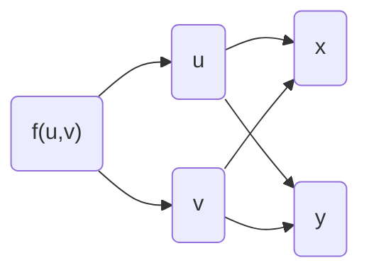
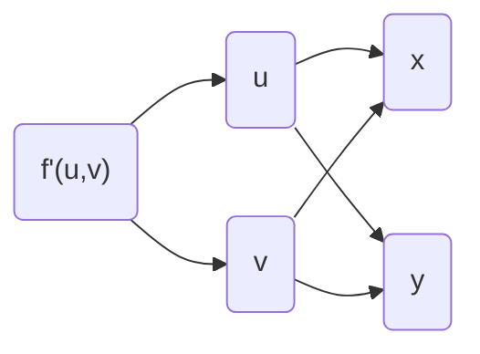
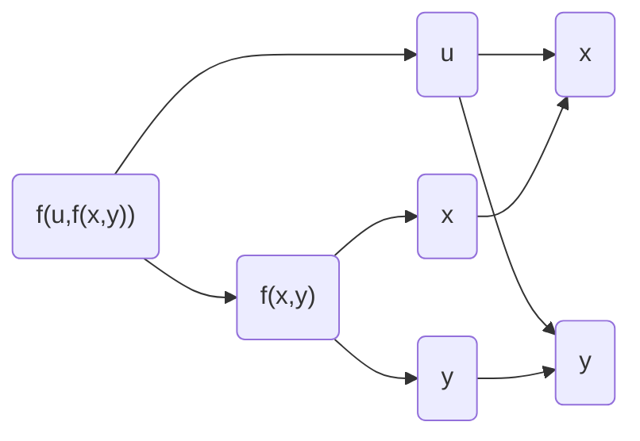

# 多元函数微分学
## 基本概念

区别一元函数中可导等价可微

偏导数先代后求等价先求后代

### 可微与偏导连续的定义：

$$
\begin{align*}
&判断函数z=f(x,y)在点(x_0,y_0)处是否可微,步骤如下:
\\\\
&\begin{cases}
➊写出全增量:\Delta z=f(x_0+\Delta x,y_0+\Delta y)-f(x_0,y_0)
\\\\
➋写出线性增量A\Delta x+B\Delta y,其中A=f'_x(x_0,y_0),B=f'_y(x_0,y_0)
\\\\
➌作极限\lim_{\Delta x \to 0,\Delta y\to 0}\frac{\Delta z-(A\Delta x+B\Delta y)}{\sqrt{(\Delta x)^2+(\Delta y)^2}}
\\\\
➍如果➌中极限等于0\Rightarrow f(x,y)在点(x_0,y_0)处可微
\end{cases}
\end{align*}
$$

全微分的计算公式：
$$
dz=\frac{\partial z}{\partial x}dx+\frac{\partial z}{\partial y}dy
$$
偏导数连续的判断步骤：
$$
\begin{align*}
&判断函数z=f(x,y)在点(x_0,y_0)处是否偏导数连续,步骤如下:
\\\\
&\begin{cases}
➊用定义法求f'_x(x_0,y_0),f'_y(x_0,y_0)
\\\\
➋用公式法求f'_x(x,y),f'_y(x,y)
\\\\
➌计算\lim_{(x,y)\to (x_0,y_0)}f'_x(x,y) \quad \lim_{(x,y)\to (x_0,y_0)}f'_y(x,y)
\\\\
➍如果\lim_{(x,y)\to (x_0,y_0)}f'_x(x,y)=f'_x(x_0,y_0) 
\quad \lim_{(x,y)\to (x_0,y_0)}f'_y(x,y)=f'_y(x_0,y_0)成立,则该点偏导连续
\end{cases}
\end{align*}
$$

## 复合函数求导法

### 链式求导法则

有一点一定要注意！就是f与f任意阶导数拥有相同的结构。
要会画复合结构图，f里面有u、v，f的任意阶导数里面也有u、v。

### 全微分形式不变性
### 隐函数求导法则
直接背公式，注意在此处，视x，y，z为独立变量，不考虑z与x，y的纠缠关系。

$$
\frac{\partial z}{\partial x}=-\frac{F_x'}{F_z'} \qquad
\frac{\partial z}{\partial y}=-\frac{F_y'}{F_z'}
$$

下面是两个方程的情况：

解题的时候就只有上面三种方法：
假设有z(x,y)是x、y的函数
链式求导规则： 方程两侧对某一变量求偏导，如果对x、y求偏导，需要考虑z(x,y)的影响。

隐函数求导法则： 先要构建出隐函数，直接套公式法。但是注意此时把每个变量视作独立不相关。意思就是，求F'x时不考虑z与x的关联。

**全微分形式不变性:** 方程左右两侧同时取微分。
$$
\begin{align*}
\left\{\begin{matrix}
d\varphi(u)=\varphi'(u)du
\\\\
d\varphi(u,v,w)=\frac{\partial \varphi}{\partial u}du+\frac{\partial \varphi}{\partial v}dv+\frac{\partial \varphi}{\partial w}dw
\end{matrix}\right.
\end{align*}
$$
## 多元函数的极最值问题
### 多元函数的泰勒公式
$$
f(x,y)=f(x_{0},y_{0})+(f'_{x} \quad f'_{y})_{X_{0}}\begin{pmatrix}
\Delta x \\ \Delta y
\end{pmatrix} +\frac{1}{2!}(\Delta x \quad \Delta y)\begin{pmatrix}
f''_{xx} & f''_{xy}  \\
f''_{yx} & f''_{yy}  \\
\end{pmatrix}_{X_{0}}\begin{pmatrix}
\Delta x \\ \Delta y
\end{pmatrix}+R_{2}
$$

### 无条件极值

必要条件：可偏导的极值点处偏导数为0！一元里面有个很重要的定理“费马定理”
还有一件事，和一元一样，两个原因这是必要条件。
1、导数为零的点不一定是极值点，一元里面不是$y=x^3$，多元不是
2、极值点处导数不一定为零，可能不可导

$$
\begin{align*}
(1)&二元函数取极值的必要条件
\\
&设z=f(x,y)在(x_0,y_0)
\begin{cases}
一阶偏导数存在
\\\\
取极值
\end{cases}
\Rightarrow f_x'(x_0,y_0)=f_y'(x_0,y_0)=0
\\\\
(2)&二元函数取极值的充分条件
\\
&记A=f''_{xx}(x_{0},y_{0}) \quad B=f''_{xy}(x_{0},y_{0})  \quad C=f''_{yy}(x_{0},y_{0}) 
\\\\
&\Delta=AC-B^2 \ 
\begin{cases}
\Delta>0
\begin{cases}
A>0\quad极小值
\\
A<0 \quad极大值
\end{cases}
\\\\
\Delta<0 \quad 不是极值
\\
\Delta=0 \quad 无法判断
\end{cases}
\end{align*}
$$
### 条件极值-拉格朗日数乘法

就记住最值是比较出来的，取其最小为最小，最大为最大。
就像在一元求出极值之后还要与端点值比较得到最值一样。
如果题目给定的范围是带有边界的区域，那么应该在**区域内部利用“无条件极值的做法”** 求出极值，**边界上利用拉格朗日数乘法**求极值点，然后一起比较，得出最值。

![[image-20220731150613736.png|700]]
## 偏微分方程
#### 两步走

1、得到偏微分方程
还是之前那几个方法，链式求导、隐函数法、全微分形式不变。

**2、解偏微分方程
这里有点讲究，就是当你对某一个变量积分时，其他**非积分变量应该视作常数。那么不同于一元中积分后引入常数C，这里应该引入“非积分变量的函数”。

## 习题总结

### 极限问题
对于二元函数的极限，不同于一元中只有两条趋近路线。多元函数中极限**有无数条趋近路线**，必须要保证每一条路线均趋相与同一个极限值。

证明极限存在：
通常用**放缩法+夹逼定理**证明极限值。
$$
\begin{align*}
&\frac{2}{\frac{1}{x}+\frac{1}{y}}\leq \sqrt{xy} \leq\frac{{x+y}}{2}\leq \sqrt{\frac{x^2+y^2}{2}}
\\\\
&e^x-1 \geq x  \qquad ln(x+1) \leq x
\end{align*}
$$

证明极限不存在：
采用取y=kx或y=$kx^2-x\ (k\ne 0)$等方式去证明k取不同值的时候，极限不一样，从而证明极限不存在。
二元函数中可以使用等价无穷小但不可以使用洛必达

**顺序：极限是否存在---->偏导数是否存在（定义法）---->是否可微（可微定义--在上面）---->是否偏导连续（定义法求间断点，公式法求区间，这个时候不可以先带后求，要证明对于任意方向趋近结果都一样）**

### 偏导问题
#### 三种方法：链式求导法则--隐函数求导--全微分形式不变
**链式求导法则：** 适合显函数求导
关键在于写出复合关系结构图
对于某一个显函数f(u,v)，弄清楚哪一个是u，哪一个是v，以及u，v与x，y对应的复合关系。

很重要的一点，f'(u,v)同样具有u,v的结构，无论f的几阶导数，都有和f相同的复合结构。为了清楚结构，不仅要写出f的复合结构图，而且还要写出f'的复合结构图。

下面列举几种复合结构图，u，v也常用1、2替代

复合里面套函数的复合结构图：

**隐函数求导法则：** 适合隐函数求导，也可以用于求解复合结构不复杂的显函数

1.一个方程的情形：
$$
\frac{\partial z}{\partial x}=-\frac{F'_{x}}{F'_{z}}
\qquad
\frac{\partial z}{\partial y}=-\frac{F'_{y}}{F'_{z}}
$$
2.两个方程的情形：
$$
\begin{align*}
已知\left\{\begin{matrix}
F(x,y,z)=0 \\G(x,y,z)=0
\end{matrix}\right.
\quad
当满足\frac{\partial(F,G)}{\partial(y,x)}\neq0时，可确定
\left\{\begin{matrix}
y=y(x)\\z=z(x)
\end{matrix}\right.

\\
\\
其中\frac{dy}{dx}=-\frac{\frac{\partial(F,G)}{\partial(x,z)}}{\frac{\partial(F,G)}{\partial(y,z)}}
\quad
\frac{dz}{dx}=-\frac{\frac{\partial(F,G)}{\partial(y,x)}}{\frac{\partial(F,G)}{\partial(y,z)}}
\qquad
\frac{\partial(F,G)}{\partial(u,v)}=
\begin{vmatrix}
\frac{\partial F}{ \partial u}& \frac{\partial F}{ \partial v} \\ \frac{\partial G}{ \partial u}
 & \frac{\partial G}{ \partial v}
\end{vmatrix}
\end{align*}
$$

$$
\begin{align*}
&\frac{\partial(F,G)}{\partial(u,v)}=
\begin{vmatrix}
\frac{\partial F}{ \partial u}& \frac{\partial F}{ \partial v} \\ \frac{\partial G}{ \partial u}
 & \frac{\partial G}{ \partial v}
\end{vmatrix}

\quad
\frac{\partial F}{ \partial u}·\frac{\partial G}{ \partial v}- \frac{\partial F}{ \partial v}· \frac{\partial G}{ \partial u}
\\\\

&\quad简单记就是左侧×右侧-对角线相乘

\end{align*}
$$

**全微分形式不变性：** 一次性全给求出来

使用微分形式不变性的时候，对于加减可以直接展开，对于乘除，要按照微分的乘除规则去处理。（和导数类似）

举个例子，
$$
\begin{align*}
xcosy+ycosz+&zcosx=1
\\\\
d(xcosy+ycosz+zco&sx)=d1=0
\\\\
d(xcosy)+d(ycosz)+&d(zcosx)=0
\\\\
cosydx+(-xsiny)dy+coszdy+&(-ysinz)dz+cosxdz+(-zsinx)dx=0
\\\\
dz=\frac{cosy-zsinx}{ysinz-cosx}dx+&\frac{cosz-xsiny}{ysinz-cosx}dy
\end{align*}
$$

#### 注意事项：

抽象函数不要用隐函数法则，用不明白的，吃亏吃好多次了

复合里面套复合的题目，不要缩写成f，要写全。f'(u,f(x,y))、f'(x,y)写出全部，不然会弄混的

积分成ln产生的绝对值是可以消除的，通过未定的C参数

Δ判别法中，Δ=0时通常此方法失效。如果此时非极值，按照不同路径趋近会有既大于又小于的情况。如果是极值，得用放缩法试试

### 多元函数的极、最值问题

#### 多元函数的泰勒公式

$$
\begin{align*}
&f(x,y)=f(x_{0},y_{0})+(f'_{x}\quad f'_{y})_{X_{0}}
\begin{pmatrix}
\Delta x
 \\
 \Delta y
\end{pmatrix}
+\frac{1}{2!}(\Delta x \quad \Delta y)
\begin{pmatrix}
f'_{xx} & f'_{xy}  \\
f'_{yx} & f'_{yy}  \\
\end{pmatrix}_{X_{0}}
\begin{pmatrix}
\Delta x
 \\
 \Delta y
\end{pmatrix}
+R_{2}

\\
\\
&X_{0}=(x_{0},y_{0})	\qquad
\Delta x = x-x_{0}  \qquad  \Delta y = y-y_{0}
\end{align*}
$$

#### 无条件极值

$$
\begin{align*}
&极值必要条件:f'_{x}(x_{0},y_{0})=0 \quad f'_{y}(x_{0},y_{0})=0
\\
\\
&{充分条件}:
记A=f''_{xx}(x_{0},y_{0}) \quad B=f''_{xy}(x_{0},y_{0})  \quad C=f''_{yy}(x_{0},y_{0}) 
\\\\
&\Delta=AC-B^2 \ 
\begin{cases}
\Delta>0
\begin{cases}
A>0\quad极小值
\\
A<0 \quad极大值
\end{cases}
\\\\
\Delta<0 \quad 不是极值
\\
\Delta=0 \quad 无法判断
\end{cases}
\end{align*}
$$

#### 有条件极值

公式在上面

**除了使用公式算出来的点之外，还要注意端点。**

方程一般来说是不难解出来的，主要是需要利用引入的变量λ、μ的到x，y的关系，再带入只含有x、y的等式中去求解处具体值。
