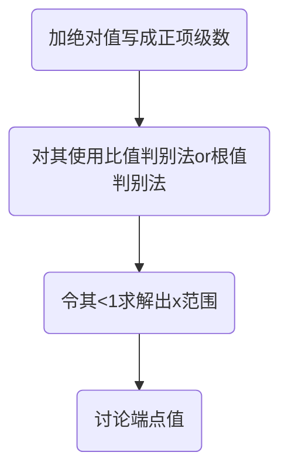
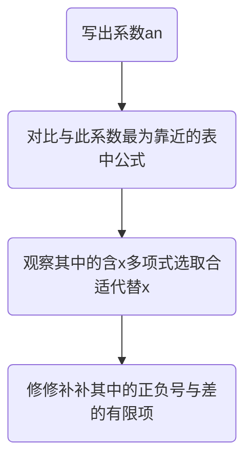

# 无穷级数
## 数项级数的判敛

### 定义与Sn
$$
\begin{align*}
&无穷级数:\sum_{n=1}^{\infty}u_{n}=u_{1}+u_{2}+u_{3}+...
+u_{n}+...  
\\
\\
&前n项和:
S_{n}=u_{1}+u_{2}+u_{3}+...
+u_{n}
\\
\\
&\sum_{n=1}^{\infty}u_{n}收敛 \Leftrightarrow
\lim_{n \to \infty}S_{n}存在   
\\
\\
&\sum_{n=1}^{\infty}u_{n}收敛 \Rightarrow 
\lim_{n \to \infty}u_{n}=0
\end{align*}
$$
[[1-2数列极限]]由于级数收敛等价于前n项和的极限是否存在，则可联系数列极限。实现“级数敛散”与“数列极限存在”的同一性

#### 判敛法
#### 正项级数
➊	[[1-2数列极限#单调有界准则]]，但是对于正向级数，已经满足单调性，所以只需满足Sn有上界即可。
➋比较判别法
➌比较判别法的极限形式
$$
\begin{align*}
\lim_{n \to \infty}\frac{u_{n}}{v_{n}} =
\begin{cases}
0  
\\
+\infty
\\
A   &同敛散
\end{cases}
\end{align*}
$$

➍比值判别法
$$
\begin{align*}
\lim_{n \to \infty} \frac{u_{n+1}}{u_{n}}=
\begin{cases}
<1   &收敛
\\
>1   &发散
\\
=1    &无法判断
\end{cases}

\end{align*}
$$

➎根值判别法
$$
\begin{align*}
\lim_{n \to \infty} \sqrt[n]{u_{n}}=
\begin{cases}
<1   &收敛
\\
>1   &发散
\\
=1    &无法判断
\end{cases}

\end{align*}
$$
➏积分判别法
对于正项级数，存在<mark style="background: #ADCCFFA6;">“（a,∞）单调递减非负连续函数f(x)”</mark>，<mark style="background: #FF5582A6;">且Un=f(n)</mark> 
$$
\sum_{n=a}^{\infty}u_{n} 
\Leftrightarrow
\int_{a}^{+\infty}f(x)dx
$$

#### 交错级数
$$
\begin{align*}
&\sum_{n=1}^{\infty}(-1)^{n-1}u_{n}满足如下两个条件收敛
\\
&➊ \lim_{n \to \infty}u_{n}=0 \quad 任何级数收敛的必要条件
\\
&➋ 存在某个k   \qquad 当n \geq k;\ u_{n} \geq u_{n+1} 
\end{align*}
$$
#### 绝对收敛and条件收敛
- 讨论的前提:原级数收敛
<mark style="background: #ADCCFFA6;">绝对收敛</mark> ：加绝对值之后，级数收敛
<mark style="background: #FF5582A6;">条件收敛</mark> ：加绝对值之后，级数不收敛

### 常用参考级数
$$
\begin{align*}
&➊ 等比级数\sum_{n=1}^{\infty}aq^{n-1}
\begin{cases}
 \frac{a}{1-q} &|q|<1
\\
\\
发散    &|q|>1
\end{cases}
\\\\
&➋p级数\sum_{n=1}^{\infty}\frac{1}{n^p}
\begin{cases}
收敛 &p>1
\\
\\
发散    &p \leq 1
\end{cases}
\\
\\
&➌广义p级数\sum_{n=2}^{\infty}\frac{1}{n(lnn)^p}
\begin{cases}
收敛 &p>1
\\
\\
发散    &p \leq 1
\end{cases}
\\
\\
&➍交错p级数\sum_{n=1}^{\infty}(-1)^{n-1}\frac{1}{n^p}
\begin{cases}
绝对收敛 &p>1
\\
\\
条件收敛    &0
收敛+收敛=收敛</mark> 
<mark style="background: #FF5582A6;">收敛+发散=发散</mark> 
<mark style="background: #FFB8EBA6;">发散+发散=不好说</mark> 
## 幂级数的收敛域
### 有关概念
幂级数中的Un是关于x的变量，数项级数相当于x取某个值的情况。满足级数收敛的x取值范围就是收敛域。[[6.Z变换]] z变换就属于幂级数
### 具体型问题
#### 已知表达式求解收敛域

### 抽象性问题
#### 不同级数之间敛散性关系  
<mark style="background: #FFB86CA6;">阿贝尔定理</mark>
$$
\begin{align*}
&1.当幂级数\sum_{n=0}^{\infty}a_nx^n在点x=x_1处收敛时
\\
&\Rightarrow 对于|x|<|x_1|,幂级数绝对收敛
\\\\

&2.当幂级数\sum_{n=0}^{\infty}a_nx^n在点x=x_1处发散时
\\
&\Rightarrow 对于|x|>|x_1|,幂级数发散
\end{align*}
$$
已知某点敛散性求该级数的收敛半径：
$$
\begin{align*}
&对于级数\sum_{n=0}^{\infty}a_n(x-x_0)在某点x_1的敛散性
\\\\
&\begin{cases}
➊ convergence & 则收敛半径R\geq|x_1-x_0|
\\
➋ divergence  & 则收敛半径R\leq|x_1-x_0|
\\
➌ conditional & 则收敛半径R =|x_1-x_0|
\end{cases}
\end{align*}
$$
已知A级数的敛散性求B级数的敛散性：
通过“平移”、“乘除因式”、“逐项微积分”使得A级数转化为B级数，并分析此过程中A级数收敛域的变化。
<mark style="background: #ADCCFFA6;">单独讨论端点处的收敛情况</mark> 

### 四则运算的收敛域
---
其实只有加减的收敛域问题，取两则的交集。
和导数、极限一样，收敛域也可以分开求解

---

## 展开问题
#### 常用展开公式
由于积分与求导回改变端点值的收敛情况，所以端点值的收敛情况需要单独分析！！！ ^577995
$$
\begin{align*}
&要记住的只有两个对数与指数\\
&ln(1+x)=\sum_{n=1}^{\infty}(-1)^{n-1}
\frac{x^n}{n}   &-1<x\leq 1
\\
\\
&e^x=\sum_{n=0}^{\infty}\frac{x^n}{n!} &-\infty<x<+\infty
\\
\\
&ln(1-x)=ln(1+(-x))=-\sum_{n=1}^{\infty}
\frac{x^{n}}{n}   &-1\leq x< 1
\\
\\
&\frac{1}{1+x}=\frac{d[ln(1+x)]}{dx}
=\sum_{n=0}^{\infty}(-1)^{n}{x^{n}}  &-1<x<1
\\
\\
&\frac{1}{1-x}=\frac{1}{1+(-x)}=\sum_{n=0}^{\infty}
{x^{n}}  &-1<x<1
\\
\\
&\frac{1}{1+(ax)^b}=\sum_{n=0}^{\infty}(-1)^{n}
{a^{bn}}{x^{bn}}  &-\frac{1}{a}<x<\frac{1}{a}
\\
\\
&arctanx=\int \frac{1}{1+x^2}dx=\sum_{n=0}^{\infty}
(-1)^n\frac{x^{2n+1}}{2n+1}
&-1 \leq x \leq 1
\\
\\
&cosx=\frac{e^{jx}+e^{-jx}}{2}=\sum_{n=0}^{\infty}(-1)^n\frac{x^{2n}}{(2n)!} &-\infty<x<+\infty
\\
\\
&sinx=\int cosxdx=\sum_{n=0}^{\infty}(-1)^n\frac{x^{2n+1}}{(2n+1)!} &-\infty<x<+\infty
\\
\\
&这两个和正弦系数形式很像：
\\
&\frac{e^{x}+e^{-x}}{2}=\sum_{n=0}^{\infty}\frac{x^{2n}}{(2n)!} &-\infty<x<+\infty
\\
\\
&\frac{e^{x}-e^{-x}}{2}=\sum_{n=0}^{\infty}\frac{x^{2n+1}}{(2n+1)!} &-\infty<x<+\infty
\end{align*}
$$
### 考法
#### 函数展开
题型：给定一个函数f(x)要求对其进行展开。
解题思路：对其f(x)进行变换（求导、积分...使之转为可用上表直接替换的形式）
#### 积分展开
[[1-9一元积分计算的几种方法#特殊的一些题型]]
题型：给定一个积分进行求解，而该积分是不存在初等函数的原函数的，也就是说无法用正常积分法进行求解。
解题思路：对其中复杂函数部分进行展开，写成无穷级数形式，然后逐项积分
#### 导数展开
题型：利用"f(x)"的导数与"f(x)展开成无穷级数之后的导数"等价也建立联系
解题思路：对f(x)中可无穷项展开的部分进行展开，然后逐项求导，利用与未展开f(x)求导等价。可求解定x情况下的数项级数收敛值。
##### 无穷小比阶
[[1-1函数极限#无穷小比阶]]
题型：比较某个函数与一个无穷级数在无穷小处的大小关系
解题思路：无穷级数取前几项，抓住主要矛盾。洛肯定必达！

### 工具
#### 先积后导
先积后导完全等价，不需要担心什么
#### 先导后积
敲重点，不等价不等价！！！其中a的值视情况而定，选取f(a)易知的点
$$
\begin{align*}
f(x) \neq& \int f'(x)dx\\\\
f(x)=&\int_{a}^{x} f'(t)dt+f(a)
\end{align*}
$$

#### 重要展开公式
[[1-16无穷级数#展开问题]]

## 求和问题
### 直接套公式
其实很像拉斯反变换与Z反变换，需要背下上述展开公式，然后通过比较系数选定是哪一种f(x)展开而成。

### 先导后积or先积后导
$$
\begin{align*}
&(1).\sum(an+b)x^{an}先积后导
\\\\
&(2).\sum\frac{x^{an}}{an+b}先导后积
\\\\
&(3).\sum\frac{cn^2+dn+e}{an+b}x^{an} =\sum_{(1)}+\sum_{(2)}
\\\\
\end{align*}
$$
先积后导与z变换的z域微分性质相当吻合[[6.Z变换#Z变换性质]]
$$
\begin{align*}\\
&如果有f(x)=\sum\limits_{n=0}^{\infty}a_{n}x^n\\
&则形如\sum\limits_{n=0}^{\infty}na_{n}x^n\\
&由z变换z域微分性质可知\sum\limits_{n=0}^{\infty}na_{n}x^n={-x{f'(x)}}
\end{align*}
$$
注意先导后积不等价[[1-16无穷级数#先导后积]]
<mark style="background: #FFB86CA6;">还要注意一点，最后确定收敛域的时候，一定要带入端点判断。</mark> 
### 用微分方程求和函数
题型：设定和函数S(x)是微分方程的解，通过解微分方程解得和函数。得到和函数之后求数项级数和问题。
### 建立微分方程求和函数
题型：给定一些条件，需要将其与S(x)、S'(x)、S''(x)联系起来，构建微分方程。
### 综合题
#### 结合导数积分数列极限等 
利用无穷级数求解极限问题[[1-2数列极限]]

$$
\begin{align*}
&已知x_{n}=x_{n-1}+u_{n}
\\
\\
&则\lim_{n \to \infty}x_{n}=x_{0}+\sum_{n=1}^{\infty}u_{n}
\end{align*}
$$
在这种情况下，使得数列极限成功转化为无穷级数问题，对于数项级数的和，又转化为幂级数取值问题，最后也就是变成了求和成幂级数问题。
## 傅里叶级数
### 狄利克雷收敛条件
$$
\begin{align*}
S(x)=
\begin{cases}
f(x)&x为连续点
\\
\\
\frac{f(x^-)+f(x^+)}{2} &x为间断点
\\
\\
	\frac{f(-l^+)+f(l^-)}{2} &x为端点
\end{cases}
\end{align*}
$$

### 傅里叶级数表达式
[[3.傅里叶变换]]
$$
\begin{align*}
&f(x)=\frac{a_0}{2}+\sum_{n=1}^{\infty}(a_ncos\frac{n \pi x}{l}+b_nsin\frac{n \pi x}{l})
\\
\\
&其中：a_0=\frac{1}{l}\int_{-l}^{l}f(x)dx \qquad a_n=\frac{1}{l}\int_{-l}^{l}f(x)cos\frac{n \pi x}{l}dx
\\
\\
&b_n=\frac{1}{l}\int_{-l}^{l}f(x)sin\frac{n \pi x}{l}dx
\end{align*}
$$

  