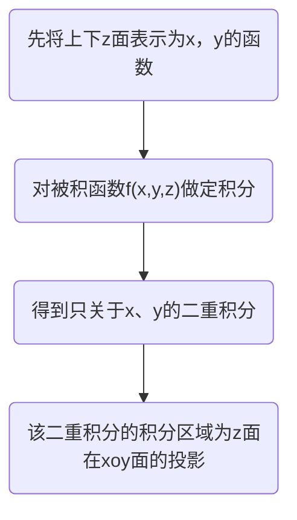
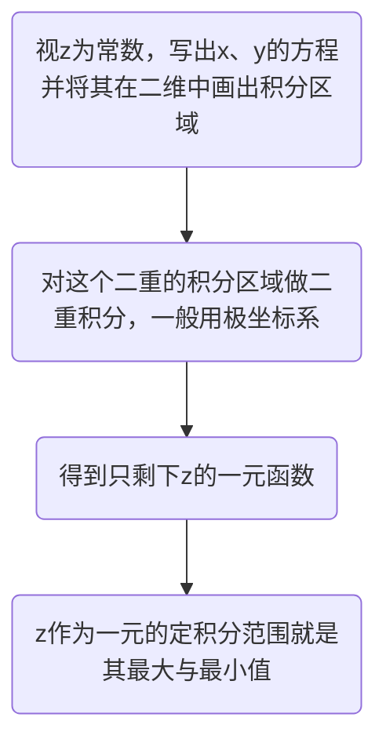

# 多元函数积分学
## 三重积分
### 对称性
#### 普通对称性
#### 轮换对称性
- 如果任意两个变量或三个对调之后，积分区域不发生改变，则替换被积函数中对应变量的变量后积分值保持不变。

### 计算
#### 直角坐标系
##### 先一后二法
先一后二的意思就是先对一个变量（一般xy组队，落z单个）进行定积分，然后对剩余两个变量做二重积分
适合场合：无侧面或者侧面为柱面

##### 先二后一法
先做二重积分，再做定积分
适用场合：积分区域为旋转体

#### 柱面坐标系
先二后一法中，对二重积分采用极坐标形式积分。就被称之为柱面坐标系
#### 球坐标系
$$
\iiint_{\Omega}f(x,y,z)dxdydz=\iiint_{\Omega}f(rsin\varphi cos\theta,rsin\varphi sin\theta,rcos\varphi)r^2sin\varphi d\theta d\varphi dr
$$
打开一扇门，手撒两白花
趁他不注意，刺他小脑瓜
(2023.4.21回顾，哈哈哈哈哈，这个是根据张宇上课讲的口诀改的)
#### 三元函数的换元法
[[1-14二重积分#二重积分的换元（记得雅可比行列式）]]
$$
\begin{align*}
&令
\begin{cases}
x=x(u,v,w)\\
y=y(u,v,w)\\
z=z(u,v,w)
\end{cases}
\\\\
&\iiint_{\Omega}f(x,y,z)dxdydz
\\
=&\iiint_{\Omega uvw}f[x(u,v,w),y(u,v,w),z(u,v,w)]
\begin{vmatrix}
\frac{\partial(x,y,z)}{\partial(u,v,w)}
\end{vmatrix}
dudvdw
\\
\\
&\frac{\partial(x,y,z)}{\partial(u,v,w)}
=\begin{vmatrix}
\frac{\partial x}{\partial u}&\frac{\partial x}{\partial v}&\frac{\partial x}{\partial w}
\\
\frac{\partial y}{\partial u}&\frac{\partial y}{\partial v}&\frac{\partial y}{\partial w}
\\
\frac{\partial z}{\partial u}&\frac{\partial z}{\partial v}&\frac{\partial z}{\partial w}
\end{vmatrix}
\end{align*}
$$
### 应用
#### 体积
$$
V=\iiint_{\Omega}dv
$$
#### 总质量
$$
m=\iiint_{\Omega}\rho(x,y,z)dv
$$
#### 重心
$$
\begin{align*}
&\overline x=\frac{\iiint_{\Omega}x\rho (x,y,z)dv}{\iiint_{\Omega}\rho (x,y,z)dv}
\\\\
&\overline y=\frac{\iiint_{\Omega}y\rho (x,y,z)dv}{\iiint_{\Omega}\rho (x,y,z)dv}
\\\\
&\overline z=\frac{\iiint_{\Omega}z\rho (x,y,z)dv}{\iiint_{\Omega}\rho (x,y,z)dv}
\end{align*}
$$
#### 转动惯量
$$
\begin{align*}
&I_{x}=\iiint_{\Omega}(y^2+z^2)\rho (x,y,z)dv
\\
\\
&I_{y}=\iiint_{\Omega}(x^2+z^2)\rho (x,y,z)dv
\\\\
&I_{z}=\iiint_{\Omega}(x^2+y^2)\rho (x,y,z)dv
\\\\
&I_{o}=\iiint_{\Omega}(x^2+y^2+z^2)\rho (x,y,z)dv
\end{align*}
$$
#### 引力
$$
\begin{align*}
&F_x=Gm\iiint_{\Omega}\frac{\rho(x,y,z)(x-x_0)}{[(x-x_0)^2+(y-y_0)^2+(z-z_0)^2]^{\frac{3}{2}}}dv
\\\\
&F_y=Gm\iiint_{\Omega}\frac{\rho(x,y,z)(y-y_0)}{[(x-x_0)^2+(y-y_0)^2+(z-z_0)^2]^{\frac{3}{2}}}dv
\\\\
&F_z=Gm\iiint_{\Omega}\frac{\rho(x,y,z)(z-z_0)}{[(x-x_0)^2+(y-y_0)^2+(z-z_0)^2]^{\frac{3}{2}}}dv
\end{align*}
$$
## 第一型曲线积分
### 对称性
#### 普通对称性
#### 轮换对称性

### 计算
#### 一投二代三计算（化为定积分）
$$
\begin{align*}
\int_{L}f(x,y)ds=&\int_{a}^{b}f[x,y(x)]\sqrt{1+(y'_x)^2}dx
\\\\
=&\int_{a}^{b}f[x(t),y(t)]\sqrt{(x'_t)^2+(y'_x)^2}dt
\\\\
=&\int_{a}^{b}f[rcos\theta,rsin\theta]\sqrt{r^2+(r')^2}d\theta
\end{align*}
$$

### 应用-曲杆
#### 曲杆长度
曲杆长度就是弧长，也就是弧微分的积分
$$
L=\int_{L}ds=\int_{a}^{b}\sqrt{1+(y')^2}dx
$$
#### 总质量
$$
m=\int_{L}\rho(x,y)ds
$$
#### 重心
$$
\begin{align*}
&\overline x=\frac{\int_{L}x\rho (x,y,z)ds}{\int_{L}\rho (x,y,z)ds}
\\\\
&\overline y=\frac{\int_{L}y\rho (x,y,z)ds}{\int_{L}\rho (x,y,z)ds}
\\\\
&\overline z=\frac{\int_{L}z\rho (x,y,z)ds}{\int_{L}\rho (x,y,z)ds}
\end{align*}
$$

#### 转动惯量
$$
\begin{align*}
&I_{x}=\int_{L}(y^2+z^2)\rho (x,y,z)ds
\\
\\
&I_{y}=\int_{L}(x^2+z^2)\rho (x,y,z)ds
\\\\
&I_{z}=\int_{L}(x^2+y^2)\rho (x,y,z)ds
\\\\
&I_{o}=\int_{L}(x^2+y^2+z^2)\rho (x,y,z)ds
\end{align*}
$$

## 第一型曲面积分
### 对称性
#### 普通对称性
#### 轮换对称性

### 计算
#### 一投二代三计算（化为二重积分）
$$
\iint_{\sum}f(x,y,z)dS=\iint_{D_{xy}}f[x,y,z(x,y)]\sqrt{1+(z'_x)^2+(z'_y)^2}dxdy
$$
### 应用-曲面薄板
#### 曲面面积
$$
S=\iint_{\sum}dS=\iint_{D_{xy}}\sqrt{1+(z'_x)^2+(z'_y)^2}dxdy
$$
#### 总质量
$$
\iint_{\sum}\rho(x,y,z)dS
$$
#### 重心
$$
\begin{align*}
&\overline x=\frac{\iint_{\sum}x\rho (x,y,z)dS}{\iint_{\sum}\rho (x,y,z)dS}
\\\\
&\overline y=\frac{\iint_{\sum}y\rho (x,y,z)dS}{\iint_{\sum}\rho (x,y,z)dS}
\\\\
&\overline z=\frac{\iint_{\sum}z\rho (x,y,z)dS}{\iint_{\sum}\rho (x,y,z)dS}
\end{align*}
$$
#### 转动惯量
$$
\begin{align*}
&I_{x}=\iint_{\sum}(y^2+z^2)\rho (x,y,z)dS
\\
\\
&I_{y}=\iint_{\sum}(x^2+z^2)\rho (x,y,z)dS
\\\\
&I_{z}=\iint_{\sum}(x^2+y^2)\rho (x,y,z)dS
\\\\
&I_{o}=\iint_{\sum}(x^2+y^2+z^2)\rho (x,y,z)dS
\end{align*}
$$

## 第二型曲线积分
$$
\begin{align*}
&\begin{cases}
\int_{L}P(x,y)dx+Q(x,y)dy
\\\\
\int_{\Gamma}P(x,y,z)dx+Q(x,y,z)dy+R(x,y,z)dz
\end{cases}
\end{align*}
$$
### 基本方法
#### 一投二代三计算（化为定积分）
$$
\begin{align*}
&有向曲线L由参数方程
\begin{cases}
x=x(t)
\\\\
y=y(t)
\end{cases} \quad (t:\alpha \to \beta)给出
\\\\
&则:\int_{L}P(x,y)dx+Q(x,y)dy=\int_{\alpha}^{\beta}\{P[x(t),y(t)]x'(t)+Q[x(t),y(t)]y'(t)\}dt
\end{align*}
$$
### 格林公式  

---

使用条件: 1.有界闭区域D由分段光滑曲线L围成 2.P(x,y)、Q(x,y)在D上具有一阶连续偏导数 3.L取正方向-人沿着这个方向走的时候，左手始终在L所围的D内部

---

#### 1.直接用

曲线封闭且无奇点在其内部 要求L为D的边界，且正向：人沿着L的这个方向走时候，左手始终在L所围成的D内

$$  
\oint_LP(x,y)dx+Q(x,y)dy=\iint_D(\frac{\partial Q}{\partial x}-\frac{\partial P}{\partial y})d\sigma  
$$

  

#### 2.封闭有奇点

如果除奇点外恒有等式:$\frac{\partial Q}{\partial x}\equiv\frac{\partial P}{\partial y}$ 则换一条封闭曲线L_1积分,通常取L_1：令分母为常数 此时不要求新路径的起点与终点与原路径重合。

理由：由于存在$\frac{\partial Q}{\partial x}\equiv\frac{\partial P}{\partial y}$所以，对该封闭曲线（除奇点外）的积分值恒为0。此时只需要考虑奇点位置的积分值。

#### 3.非封闭换积分路径

要求：$\frac{\partial Q}{\partial x}\equiv\frac{\partial P}{\partial y}$以及“原路径-新路径”所围成的闭合区域应该是一个单连通区域 单连通区域D：该区域D中没有洞，专业术语：该区域D中任意封闭曲线所围成的区域只含有D中的点

要求新路径的起点与终点和原路径相同！！！ 这是因为“原路径-新路径”恰好是一个闭合路径，由于$\frac{\partial Q}{\partial x}\equiv\frac{\partial P}{\partial y}$。所以此闭合路径的积分值为0

这个时候可以考虑换积分路径为折线段，先x不动，动y。或则先y不动，动x。 或者是原路径中含有奇点，用其他路径规避掉

#### 4.非封闭补线

补一条直线使之与原积分曲线构成满足格林公式条件的闭合区域，从而可以使用格林公式简化。

#### 5.积分与路径无关六个等价关系

前提：单连通区域D内P，Q具有一阶连续偏导数 有如下论据等价：

a.$\int_{L_{AB}}P(x,y)dx+Q(x,y)dy$ 与路径无关

b. Pdx+Qdy为某二元函数u(x,y)的全微分

c. Pdx+Qdy=0为全微分方程

d. Pi+Qj为某二元函数的梯度

e. 沿D内任意分段光滑闭曲线L都有$\oint_{L}Pdx+Qdy=0$

f. $\frac{\partial Q}{\partial x}\equiv\frac{\partial P}{\partial y}$在D内处处成立

### 两类曲线积分的关系

### 空间问题
$$
\int_{\Gamma}Pdx+Qdy+Rdz
$$
#### 1.一投二代三计算
$$
\begin{align*}
&设\Gamma:
\begin{cases}
x=x(t)
\\\\
y=y(t)
\\\\
z=z(t)
\end{cases}
\quad t:\alpha\to \beta
\\\\
&\Rightarrow \int_{\Gamma}Pdx+Qdy+Rdz=\int_{\alpha}^{\beta}\{P[x(t),y(t),z(t)]x'(t)+Q[x(t),y(t),z(t)]y'(t)+R[x(t),y(t),z(t)]z'(t)\}dt
\end{align*}
$$
#### 2.斯托克斯公式
曲线封闭且在同一平面上or投影曲线简单
$$
\begin{align*}
\oint_{\Gamma}Pdx+Qdy+Rdz
=&\iint_{\sum}
\begin{vmatrix}
 {dydz}&{dzdx} &{dxdy} \\
\frac{\partial }{\partial x} & \frac{\partial }{\partial y} &\frac{\partial }{\partial z}  \\
P &  Q& R \\
\end{vmatrix}
\\\\
=&\iint_{\sum}
\begin{vmatrix}
 {cos\alpha}&{cos\beta} &{cos\gamma} \\
\frac{\partial }{\partial x} & \frac{\partial }{\partial y} &\frac{\partial }{\partial z}  \\
P &  Q& R \\
\end{vmatrix}dS
\\\\
其中:\overrightarrow{n}=({cos\alpha},{cos\beta} ,{cos\gamma} )&为\sum的单位外法线向量
\end{align*}
$$
#### 3.无旋场可换路径
$$
\begin{align*}
&对于\int_{\Gamma}Pdx+Qdy+Rdz
\\\\
 &如果\ \mathbf rot \ F=\begin{vmatrix}
 \mathbf{i}&\mathbf{j} &\mathbf{k} \\
\frac{\partial }{\partial x} & \frac{\partial }{\partial y} &\frac{\partial }{\partial z}  \\
P &  Q& R \\
\end{vmatrix}=0
\\\\
&则可以随意更换积分路径
\end{align*}
$$
## 第二型曲面积分
### 基本方法
#### 一投二代三计算（化为二重积分）

### 转换投影法

### 高斯公式
#### 1.直接用
#### 2.封闭有奇点
#### 3.非封闭换面
#### 4.非封闭补面
#### 5.div F散度=0，建立方程

### 两类曲面积分的关系
  